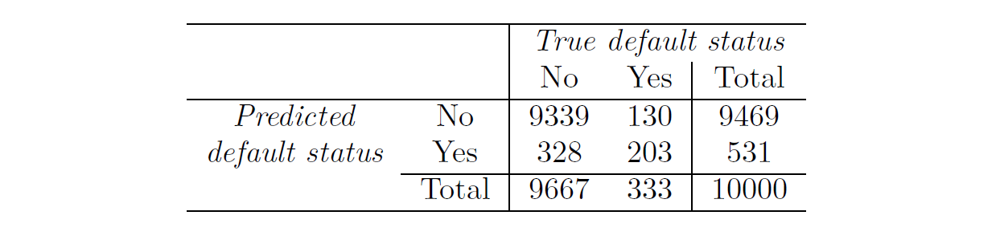

# 统计学习（Statistical Learning） 4：分类

**原书：An Introduction to Statistical Learning_with Applications in Python (Springer Texts in Statistics)-Springer (2023)**

[原书链接](https://www.statlearning.com/)

[课程配套网课（油管链接）](https://www.youtube.com/watch?v=LvySJGj-88U&list=PLoROMvodv4rPP6braWoRt5UCXYZ71GZIQ)，b站也有搬运视频可以自行搜索

**翻译：GPT，校对：Iridescence-ovo**

仅供学习交流使用。

选读部分未翻译。

--------

第 3 章讨论的线性回归模型假设响应变量 $Y$ 是定量的。然而，在许多情况下，响应变量是 **定性(qualitative)** 的。例如，眼睛的颜色就是定性的。定性变量通常也被称为 **分类变量(categorical)** ，这两个术语可以互换使用。在本章中，我们研究用于预测定性响应的方法，这一过程称为 **分类（classification）**。对一个观测值进行定性响应的预测，可以被称为对该观测值的**分类**，因为这涉及将观测值分配到某个类别或类中。

另一方面，许多用于分类的方法首先预测观测值属于每个定性变量类别的概率，并以此为基础进行分类。从这个意义上说，它们的行为也类似于回归方法。

可以用于预测定性响应的分类技术（分类器）有很多种。在第 2.1.5 节和第 2.2.3 节中，我们提到了一些分类方法。在本章中，我们讨论一些常用的分类器，包括：**逻辑回归**（logistic regression）、**线性判别分析**（linear discriminant analysis）、**二次判别分析**（quadratic discriminant analysis）、**朴素贝叶斯**（naive Bayes）、以及**K近邻法**（K-nearest neighbors）。讨论逻辑回归时，我们还引入了 **广义线性模型(generalized linear model)** 的概念，特别是 **泊松回归（Poisson regression）**。

在后续章节中，我们会讨论更多计算密集型的分类方法，包括：**广义加性模型**（第 7 章）、**决策树、随机森林和提升方法**（第 8 章）、以及**支持向量机**（第 9 章）。

## 4.1 分类概述  
分类问题经常出现，可能比回归问题更常见。一些例子包括：

1. 一个人因一组症状到急诊室就诊，这些症状可能与三种医疗状况之一有关。这个人患有哪一种状况？  
2. 一个在线银行服务需要根据用户的IP地址、过往交易记录等，判断某笔正在进行的交易是否为欺诈行为。  
3. 根据一些患有和未患有某种疾病的患者的DNA序列数据，一位生物学家希望找出哪些DNA突变是有害的（致病的），哪些不是。

与回归设置中类似，在分类设置中我们也有一组训练观测值 $(x_1, y_1), \dots, (x_n, y_n)$，可以用来构建分类器。我们希望分类器不仅在训练数据上表现良好，还能在未用于训练的测试观测值上表现出色。

**图4.1**：*`Default` 数据集。左图：若干个体的年收入和月信用卡余额。橙色表示拖欠信用卡还款的个体，蓝色表示未拖欠的个体。中图：按拖欠状态分类的余额箱线图。右图：按拖欠状态分类的收入箱线图。*

在本章中，我们将使用模拟的 `Default` 数据集来说明分类的概念。我们感兴趣的是根据年收入和月信用卡余额预测某人是否会拖欠信用卡还款。数据集如图4.1所示。在图4.1的左侧面板中，我们绘制了10,000名个体的年收入和月信用卡余额。默认（defaulted）拖欠还款的个体用橙色表示，未拖欠的用蓝色表示。（总体拖欠率约为3%，因此我们仅绘制了一部分未拖欠的个体。）看起来拖欠的个体往往有更高的信用卡余额。图4.1的中间和右侧面板展示了两组箱线图。第一组显示了按二值的 `default` 变量分组的余额分布；第二组为收入的类似分布图。

在本章中，我们将学习如何构建一个模型，根据余额（$X_1$）和收入（$X_2$）的任意给定值预测拖欠情况（$Y$）。由于 $Y$ 不是定量变量，第3章中的简单线性回归模型不是一个好的选择；我们将在第4.2节对此进一步说明。

值得注意的是，图4.1显示了预测变量 `balance` 和响应变量 `default` 之间非常显著的关系。在大多数实际应用中，预测变量和响应变量之间的关系不会如此强。然而，为了说明本章讨论的分类方法，我们使用了一个预测变量与响应变量关系较为夸张的示例。
  

## 4.2 为什么不用线性回归？  
我们提到在线性回归中，定性响应变量并不适用。那么，为什么不适用呢？

假设我们试图根据患者的症状预测急诊室患者的医疗状况。在这个简化的例子中，有三种可能的诊断：中风、药物过量和癫痫发作。我们可以考虑将这些可能的诊断值编码为一个定量响应变量 $Y$，如下所示：  

$$
Y =
\begin{cases} 
1 & \text{如果是中风}; \\
2 & \text{如果是药物过量}; \\
3 & \text{如果是癫痫发作}.
\end{cases}
$$

基于这种编码，可以使用最小二乘法拟合线性回归模型，根据一组预测变量 $X_1, \dots, X_p$ 预测 $Y$。  
然而，这种编码隐含了对结果的一种排序关系，将药物过量置于中风和癫痫发作之间，并假设中风与药物过量之间的差距与药物过量与癫痫发作之间的差距相等。而在实际中，这种假设并没有依据。例如，可以选择另一种同样合理的编码方式：  

$$
Y =
\begin{cases} 
1 & \text{如果是癫痫发作}; \\
2 & \text{如果是中风}; \\
3 & \text{如果是药物过量}.
\end{cases}
$$

这种编码会隐含一种完全不同的三种状况之间的关系。每种编码都会产生根本不同的线性模型，最终在测试数据上的预测结果也会不同。

如果响应变量的值具有自然顺序，例如“轻度”、“中度”和“重度”，并且我们认为“轻度”和“中度”之间的差距与“中度”和“重度”之间的差距相似，那么使用1、2、3的编码是合理的。然而，总体来说，当定性响应变量有两个以上的类别时，没有自然的方法将其转换为适合线性回归的定量响应变量。

对于 **二分类（两个类别, binary）** 的定性响应，情况会更好一些。例如，如果患者的医疗状况只有两种可能：中风和药物过量，那么可以使用第3.3.1节中的虚拟变量方法对响应变量进行如下编码：

$$
Y = 
\begin{cases} 
0 & \text{如果是中风}; \\
1 & \text{如果是药物过量}.
\end{cases}
$$

然后，可以对该二分类响应变量拟合线性回归模型，若预测值 $\hat{Y} > 0.5$，则预测为药物过量，否则预测为中风。在二分类情况下，即使我们交换上述编码（例如，将0表示药物过量，1表示中风），线性回归也会生成相同的最终预测。

对于如上所示使用0/1编码的二分类响应变量，通过最小二乘法进行回归并非完全不合理：实际上可以证明，使用线性回归得到的 $X\hat{\beta}$ 是 $\text{Pr(药物过量|X)}$ 的估计值。然而，若使用线性回归，有些估计值可能会超出区间 $[0, 1]$（见图4.2），因此难以被解释为概率！尽管如此，这些预测值提供了一种排序方式，可以被视为粗略的概率估计。有趣的是，如果用线性回归来预测二分类响应变量，其分类结果与我们将在4.4节中讨论的线性判别分析（LDA）方法得到的结果相同。

总结来说，有至少两个理由不使用回归方法进行分类任务：
1. 回归方法无法处理具有两个以上类别的定性响应变量；
2. 即使只有两个类别，回归方法也无法提供 $\text{Pr}(Y|X)$ 的有意义的估计值。

因此，更倾向于使用适合处理定性响应变量的分类方法。在下一节中，我们将介绍逻辑回归，它非常适合用于二分类定性响应变量；在后续章节中，我们将讨论适用于两个或更多类别的定性响应变量的分类方法。

## 4.3 逻辑回归

再次考虑 `Default` 数据集，其中响应变量 `default` 分为两类：`Yes` 或 `No`。与直接建模响应变量 $Y$ 不同，逻辑回归建模的是 $Y$ 属于特定类别的概率。

对于 `Default` 数据，逻辑回归建模的是违约（`default`）的概率。例如，给定余额（`balance`）的违约概率可以表示为：

$$
\text{Pr(default = Yes | balance)}.
$$

我们将 $\text{Pr(default = Yes | balance)}$ 简写为 $p(\text{balance})$，其值范围为 0 到 1 之间。然后，对于任何给定的 `balance` 值，都可以对违约情况进行预测。例如，对于 $p(\text{balance}) > 0.5$ 的个体，可以预测其为 `default = Yes`。

此外，如果某公司希望在预测可能违约的个体时更加保守，他们可能会选择较低的阈值，例如 $p(\text{balance}) > 0.1$。

**图4.2** *使用`Default`数据进行分类。 左：使用线性回归估算的违约概率，某些估计的概率为负值！橙色的勾表示默认编码的0/1值（否或是）。 右：使用Logistic回归预测的违约概率，所有概率都在0到1之间。*

### 4.3.1 Logistic模型

我们应该如何建模 $p(X) = \Pr(Y = 1|X)$ 和 $X$ 之间的关系？（为方便起见，我们对响应变量采用了通用的 0/1 编码。）  
在第 4.2 节中，我们考虑使用线性回归模型来表示这些概率：  
$$ p(X) = \beta_0 + \beta_1X. \tag{4.1} $$  

如果使用这种方法预测 `default=Yes`（违约）与 `balance`（信用卡余额）的关系，那么我们将得到如图 4.2 左侧面板所示的模型。这里我们可以看到这种方法的问题：当余额接近零时，预测的违约概率为负；如果预测非常大的余额，则会得到大于 1 的值。这些预测显然不合理，因为无论信用卡余额如何，真实的违约概率都必须介于 0 和 1 之间。  

这种问题并非 `Default` 数据所特有。只要对编码为 0 或 1 的二元响应变量拟合直线，就可能预测 $p(X) < 0$ 或 $p(X) > 1$，除非限制了 $X$ 的取值范围。  

为避免这个问题，我们必须使用一种函数来建模 $p(X)$，使得对任意 $X$ 值，输出都介于 0 和 1 之间。很多函数可以满足这个要求。在逻辑回归中，我们使用 **逻辑函数(logistic function)**：  
$$ p(X) = \frac{e^{\beta_0 + \beta_1X}}{1 + e^{\beta_0 + \beta_1X}}. \tag{4.2} $$  

为了拟合模型（4.2），我们使用一种称为 **最大似然估计(maximum likelihood)** 的方法，这将在下一节中讨论。图 4.2 右侧面板展示了逻辑回归模型对 `Default` 数据的拟合效果。注意，对于低余额，我们预测的违约概率接近但永远不会低于零。同样，对于高余额，我们预测的违约概率接近但永远不会高于一。逻辑函数总会生成这种 S 形曲线，因此无论 $X$ 的值如何，我们都能得到合理的预测。  

此外，与左图中的线性回归模型相比，逻辑回归模型更好地捕捉了概率的范围。在两种情况下，预测的平均概率都是 0.0333（基于训练数据的平均值），这与数据集中违约者的总体比例相同。  

经过对公式 (4.2) 的一些变形，我们可以得到：  
$$
\frac{p(X)}{1 - p(X)} = e^{\beta_0 + \beta_1 X}. \tag{4.3}
$$  

其中，${p(X)}/{1 - p(X)}$ 被称为 **odds（赔率）**，其取值范围在 0 和 ∞ 之间。赔率接近 0 表示违约概率非常低，而赔率接近 ∞ 表示违约概率非常高。例如：如果 $\text{odds} = 1/4$，意味着平均每 5 个人中有 1 人违约，因为 $p(X) = 0.2 \implies \frac{0.2}{1 - 0.2} = 1/4.$；如果 $\text{odds} = 9$，意味着平均每 10 个人中有 9 人违约，因为 $p(X) = 0.9 \implies \frac{0.9}{1 - 0.9} = 9.$。在赛马中，传统上使用赔率而不是概率，因为它们更自然地与正确的下注策略相关联。  

通过对公式 (4.3) 两边取对数，我们可以得到：  
$$
\log\left(\frac{p(X)}{1 - p(X)}\right) = \beta_0 + \beta_1 X. \tag{4.4}
$$  
左侧被称为 **log odds（对数赔率）** 或 **logit**。由此可见，逻辑回归模型 (4.2) 的 logit 是 $X$ 的线性函数。  

回顾第 3 章中的内容，在线性回归模型中，$\beta_1$ 表示 $X$ 增加一个单位时 $Y$ 的平均变化量。而在逻辑回归模型中，$X$ 增加一个单位会导致 log odds 增加 $\beta_1$（公式 4.4），等价地，会使得赔率乘以 $e^{\beta_1}$（公式 4.3）。  

然而，由于公式 (4.2) 中 $p(X)$ 和 $X$ 之间的关系并不是直线，$\beta_1$ 并不直接对应于 $X$ 增加一个单位时 $p(X)$ 的变化量。实际上，$p(X)$ 的变化量取决于 $X$ 当前的值。但无论 $X$ 的值是多少：  
- 如果 $\beta_1 > 0$，增加 $X$ 会导致 $p(X)$ 增加；  
- 如果 $\beta_1 < 0$，增加 $X$ 会导致 $p(X)$ 减少。  

从图 4.2 的右侧面板中也可以看出，$p(X)$ 和 $X$ 之间并不是直线关系，并且 $p(X)$ 随 $X$ 变化的速率取决于 $X$ 当前的值。    

### 4.3.2 Estimating the Regression Coefficients

公式 (4.2) 中的系数 $\beta_0$ 和 $\beta_1$ 是未知的，必须根据现有的训练数据进行估计。在第 3 章中，我们使用**最小二乘法**估计了线性回归中的未知系数。尽管我们可以使用（非线性的）最小二乘法来拟合公式 (4.4) 所描述的模型，但更通用的**最大似然法**（maximum likelihood）因其更优越的统计特性而被优先采用。

使用最大似然法拟合逻辑回归模型的基本直觉如下：我们希望估计出 $\beta_0$ 和 $\beta_1$，使得通过公式 (4.2) 计算出的每个个体的预测违约概率 $\hat{p}(x_i)$，尽可能接近该个体的实际违约状态。换句话说，我们希望找到估计值 $\hat{\beta}_0$ 和 $\hat{\beta}_1$，将其代入公式 (4.2) 中后，能够使所有违约的个体的预测概率接近 1，而所有未违约的个体的预测概率接近 0。

这一直觉可以通过一个称为**似然函数**（likelihood function）的数学公式形式化表示如下：

$$
\ell(\beta_0, \beta_1) = 
\prod_{i:y_i=1} p(x_i) 
\prod_{i':y_{i'}=0} (1 - p(x_{i'})).
$$

这里，$\hat{\beta}_0$ 和 $\hat{\beta}_1$ 的估计值是通过最大化该似然函数来选择的。

最大似然法是一种非常通用的方法，用于拟合许多非线性模型，包括本书中讨论的模型。在线性回归的情况下，最小二乘法实际上是最大似然法的一个特例。虽然最大似然法的数学细节超出了本书的范围，但通常逻辑回归和其他模型可以通过 R 等统计软件轻松拟合，因此我们不需要过于关心最大似然拟合过程的具体细节。

表 4.1 显示了拟合逻辑回归模型后得到的系数估计值和相关信息，该模型用于预测使用余额（balance）时违约概率为“是”（default=Yes）。我们看到 $\hat{\beta_1} = 0.0055$，这表示余额的增加与违约概率的增加相关。具体来说，余额增加一个单位会使违约的对数赔率（log odds）增加 0.0055 单位。

表 4.1 中的许多逻辑回归输出的方面与第 3 章线性回归输出类似。例如，我们可以通过计算标准误差来衡量系数估计值的准确性。表 4.1 中的 z 统计量与第 3 章中线性回归输出中的 t 统计量起着相同的作用，例如在第 77 页的表 3.1 中。举例来说，与 $\beta_1$ 相关的 z 统计量等于 $\hat{\beta_1}/SE(\hat{\beta_1})$，因此，z 统计量的绝对值越大，越能反驳零假设 $H_0 : \beta_1 = 0$。零假设意味着 $p(X) = \frac{e^{\beta_0}}{1 + e^{\beta_0}}$，换句话说，违约的概率与余额无关。

由于表 4.1 中与余额相关的 p 值非常小，我们可以拒绝零假设 $H_0$。换句话说，我们得出结论，余额与违约概率之间确实存在关联。表 4.1 中的估计截距通常不太受关注；它的主要作用是调整平均拟合概率，使其与数据中“1”的比例相匹配（在本例中，是整体违约率）。

**表 4.1**. *对于 Default 数据，使用余额预测违约概率的逻辑回归模型的估计系数。余额增加一个单位与违约的对数赔率增加 0.0055 单位相关。*

### 4.3.3 Making Predictions

一旦估计了系数，我们就可以计算任何给定信用卡余额下的违约概率。例如，使用表 4.1 中给出的系数估计，我们预测一个余额为 1,000 美元的个体的违约概率为：

$$
\hat{p}(X) = \frac{e^{\hat{\beta_0} + \hat{\beta_1}X}}{1 + e^{\hat{\beta_0} + \hat{\beta_1}X}} = \frac{e^{-10.6513 + 0.0055 \times 1,000}}{1 + e^{-10.6513 + 0.0055 \times 1,000}} = 0.00576
$$

这低于 1%。相比之下，余额为 2,000 美元的个体的预测违约概率要高得多，为 0.586 或 58.6%。

**表4.2**. *对于Default数据，使用学生身份预测违约概率的逻辑回归模型的估计系数。学生身份被编码为虚拟变量，学生的值为1，非学生的值为0，在表中由变量student[Yes]表示。*

可以使用定性预测变量与逻辑回归模型结合，方法是采用第 3.3.1 节中的虚拟变量方法。例如，Default 数据集包含定性变量 student。为了拟合一个使用学生身份作为预测变量的模型，我们只需创建一个虚拟变量，对于学生取值 1，对于非学生取值 0。预测违约概率的逻辑回归模型结果见表 4.2。与虚拟变量相关的系数为正，且相应的 p 值具有统计显著性。这表明学生的违约概率通常高于非学生：

$$
P(\text{default}= \text{Yes} | \text{student}= \text{Yes}) = \frac{e^{-3.5041 + 0.4049 \times 1}}{1 + e^{-3.5041 + 0.4049 \times 1}} = 0.0431
$$

$$
P(\text{default}= \text{Yes} | \text{student}= \text{No}) = \frac{e^{-3.5041 + 0.4049 \times 0}}{1 + e^{-3.5041 + 0.4049 \times 0}} = 0.0292
$$

### 4.3.4 Multiple Logistic Regression

现在我们考虑使用多个预测变量预测二元响应的问题。类比于第3章中从简单线性回归到多元线性回归的扩展，我们可以将（4.4）一般化为：

$$
\log \left( \frac{p(X)}{1 - p(X)} \right) = \beta_0 + \beta_1 X_1 + \cdots + \beta_p X_p, \tag{4.6}
$$

其中 $X = (X_1, \dots, X_p)$ 是 $p$ 个预测变量。方程（4.6）可以重写为：

$$
p(X) = \frac{e^{\beta_0 + \beta_1 X_1 + \cdots + \beta_p X_p}}{1 + e^{\beta_0 + \beta_1 X_1 + \cdots + \beta_p X_p}}. \tag{4.7}
$$

与第4.3.2节一样，我们使用最大似然方法来估计 $\beta_0, \beta_1, \dots, \beta_p$。

表4.3显示了一个逻辑回归模型的系数估计，该模型使用余额、收入（单位为千美元）和学生身份来预测违约概率。这里有一个令人惊讶的结果。与余额和学生身份虚拟变量相关的p值非常小，表明这些变量与违约概率有关。然而，虚拟变量的系数是负的，表明学生比非学生更不可能违约。与此相反，在表4.2中，虚拟变量的系数是正的。那么，学生身份在表4.2中与违约概率的增加有关，而在表4.3中与违约概率的减少有关，这如何可能呢？图4.3的左侧面板提供了这一表面悖论的图示。橙色和蓝色实线分别显示了学生和非学生的平均违约率与信用卡余额的关系。多元逻辑回归中学生身份的负系数表明，在固定余额和收入的情况下，学生比非学生更不可能违约。事实上，我们从图4.3的左侧面板观察到，学生的违约率在每个余额值下都在或低于非学生的违约率。但是，图中的水平虚线（显示学生和非学生在所有余额和收入值上平均的违约率）却显示出相反的效果：总体上，学生的违约率高于非学生的违约率。因此，在单变量逻辑回归输出（表4.2）中，学生的系数是正的。

**图4.3** *`Default` 数据中的混杂因素。左图：显示了学生（橙色）和非学生（蓝色）的违约率。实线表示违约率随`balance`的变化，而水平虚线表示总体违约率。右图：显示了学生（橙色）和非学生（蓝色）的`balance`的箱线图。*

图4.3的右侧面板为这一差异提供了一个解释。变量student和balance是相关的。学生往往持有较高的债务，而较高的债务又与更高的违约概率相关。换句话说，学生更可能拥有较高的信用卡余额，而从图4.3的左侧面板中我们可以知道，较高的信用卡余额通常与较高的违约率相关。因此，尽管在给定信用卡余额的情况下，个别学生的违约概率往往低于相同余额的非学生，但由于学生总体上往往拥有更高的信用卡余额，导致学生的整体违约率高于非学生。这对于信用卡公司而言是一个重要的区别，因为公司在决定向谁提供信用时，学生如果没有信用卡余额信息，会被视为比非学生更有风险。然而，如果两者的信用卡余额相同，那么学生的风险实际上低于非学生。

这个简单的例子说明了在仅使用单一预测变量进行回归时可能出现的危险和微妙之处，尤其当其他预测变量也可能相关时。如同线性回归中一样，使用单一预测变量得到的结果与使用多个预测变量得到的结果可能会有很大不同，尤其是当预测变量之间存在相关性时。通常，在图4.3中看到的现象被称为 **混杂效应（confounding）**。

通过将表4.3中的回归系数估计值代入公式(4.7)，我们可以进行预测。例如，一名信用卡余额为$1,500，收入为$40,000的学生，其违约的估计概率为：

$$
\hat{p}(X) = \frac{e^{-10.869 + 0.00574 \times 1500 + 0.003 \times 40 - 0.6468 \times 1}}{1 + e^{-10.869 + 0.00574 \times 1500 + 0.003 \times 40 - 0.6468 \times 1}} = 0.058. \tag{4.8}
$$

而一名信用卡余额和收入相同的非学生，其违约的估计概率为：

$$
\hat{p}(X) = \frac{e^{-10.869 + 0.00574 \times 1500 + 0.003 \times 40 - 0.6468 \times 0}}{1 + e^{-10.869 + 0.00574 \times 1500 + 0.003 \times 40 - 0.6468 \times 0}} = 0.105. \tag{4.9}
$$

（这里我们将表4.3中的收入系数估计值乘以40，而不是40,000，因为在该表中，模型是以单位为$1,000的收入进行拟合的。）

### 4.3.5 Multinomial Logistic Regression

有时我们希望对具有两个以上类别的响应变量进行分类。例如，在4.2节中，我们在急诊室中有三种医疗状况的类别：中风、药物过量和癫痫发作。然而，本节中介绍的逻辑回归方法仅允许响应变量具有 $K = 2$ 个类别。

事实证明，可以将二分类逻辑回归方法扩展到 $K > 2$ 类的情境。这种扩展有时称为 **多项式逻辑回归(Multinomial Logistic Regression)**。为此，我们首先选择一个类别作为**基准类别(baseline)**；在不失一般性的情况下，我们选择第 $K$ 类作为基准。然后，我们用以下模型替代模型 (4.7)：

$$
\Pr(Y = k | X = x) = \frac{e^{\beta_{k0} + \beta_{k1}x_1 + \cdots + \beta_{kp}x_p}}{1 + \sum_{l=1}^{K-1} e^{\beta_{l0} + \beta_{l1}x_1 + \cdots + \beta_{lp}x_p}} \tag{4.10}
$$
对 $k = 1, \ldots, K-1$ 成立，且
$$
\Pr(Y = K | X = x) = \frac{1}{1 + \sum_{l=1}^{K-1} e^{\beta_{l0} + \beta_{l1}x_1 + \cdots + \beta_{lp}x_p}}. \tag{4.11}
$$

可以证明，对于 $k = 1, \ldots, K-1$，有
$$
\log \left( \frac{\Pr(Y = k | X = x)}{\Pr(Y = K | X = x)} \right) = \beta_{k0} + \beta_{k1}x_1 + \cdots + \beta_{kp}x_p. \tag{4.12}
$$

注意到 (4.12) 与 (4.6) 十分相似。方程 (4.12) 表明，任意两个类别之间的对数几率依然是特征的线性函数。

事实证明，在公式 (4.10)–(4.12) 中，将第 $K$ 类作为基准的选择并不重要。例如，在将急诊室就诊分类为中风、药物过量和癫痫发作的情况下，假设我们拟合了两个多项式逻辑回归模型：一个将中风作为基准，另一个将药物过量作为基准。由于基准选择不同，两个拟合模型的系数估计会有所不同，但拟合值（预测结果）、任意两个类别之间的对数几率和其他关键模型输出将保持不变。

尽管如此，在多项式逻辑回归模型中解读系数时必须小心，因为其解读依赖于基准的选择。例如，如果我们将癫痫发作设为基准，则可以将 $\beta_{stroke0}$ 解读为中风相对于癫痫发作的对数几率（当 $x_1 = \cdots = x_p = 0$ 时）。此外，$X_j$ 增加一个单位与中风相对于癫痫发作的对数几率增加 $\beta_{strokej}$ 有关。换句话说，如果 $X_j$ 增加一个单位，则
$$
\frac{\Pr(Y = \text{stroke}|X = x)}{\Pr(Y = \text{epileptic seizure}|X = x)}
$$
会增加 $e^{\beta_{strokej}}$。

我们现在简要介绍多项式逻辑回归的一种替代编码方法，称为**softmax编码**。softmax编码在意义上等同于前面描述的编码，因为无论采用哪种编码，拟合值、任意两个类别之间的对数几率以及其他关键模型输出都将保持不变。然而，softmax编码在机器学习文献的某些领域被广泛使用（它将在第10章中再次出现），因此值得了解。在softmax编码中，我们不选择基准类别，而是对所有 $K$ 类进行对称处理，并假设对于 $k = 1, \dots, K$：

$$
\Pr(Y = k|X = x) = \frac{e^{\beta_{k0} + \beta_{k1}x_1 + \cdots + \beta_{kp}x_p}}{\sum_{l=1}^{K} e^{\beta_{l0} + \beta_{l1}x_1 + \cdots + \beta_{lp}x_p}}. \tag{4.13}
$$

因此，我们实际上估计所有 $K$ 个类别的系数，而不是只为 $K - 1$ 个类别估计系数。很容易看出，由于公式 (4.13)，类别 $k$ 和 $k'$ 之间的对数几率比等于：

$$
\log \left( \frac{\Pr(Y = k|X = x)}{\Pr(Y = k'|X = x)} \right) = (\beta_{k0} - \beta_{k'0}) + (\beta_{k1} - \beta_{k'1})x_1 + \cdots + (\beta_{kp} - \beta_{k'p})x_p. \tag{4.14}
$$

## 4.4 Generative Models for Classification

逻辑回归直接使用逻辑函数对 $\Pr(Y = k | X = x)$ 进行建模，对于两个响应类别的情况，形式如公式 (4.7) 所示。在统计学术语中，我们建模的是响应 $Y$ 在给定预测变量 $X$ 下的条件分布。现在，我们考虑另一种不那么直接的估计这些概率的方法。在这种新方法中，我们分别在每个响应类别中建模预测变量 $X$ 的分布（即，对于每个 $Y$ 的值）。然后，我们使用贝叶斯定理将这些分布反转为 $\Pr(Y = k | X = x)$ 的估计值。当假设每个类别中的 $X$ 的分布为正态分布时，该模型的形式与逻辑回归非常相似。

为什么需要另一种方法，而不直接使用逻辑回归？原因有几点：

- 当两个类别之间的分离较大时，逻辑回归模型的参数估计值可能会非常不稳定。本节中我们介绍的方法不存在该问题。
- 如果每个类别中的预测变量 $X$ 的分布近似为正态分布且样本量较小，那么本节中的方法可能比逻辑回归更准确。
- 本节中的方法可以自然地扩展到多于两个响应类别的情况。（在多于两个响应类别的情况下，我们也可以使用第 4.3.5 节中的多项式逻辑回归。）

假设我们希望将一个观测分类到 $K$ 个类别中的某一个类别，其中 $K \geq 2$。换句话说，定性响应变量 $Y$ 可以取 $K$ 个可能的不同且无序的值。令 $\pi_k$ 表示一个随机选取的观测来自第 $k$ 类的总体或先验概率。令 $f_k(X) \equiv \Pr(X|Y = k)$ 表示来自第 $k$ 类的观测的 $X$ 的密度函数。换句话说，如果观测来自第 $k$ 类且 $X \approx x$ 的概率较高，则 $f_k(x)$ 较大；如果观测来自第 $k$ 类且 $X \approx x$ 的概率很低，则 $f_k(x)$ 较小。那么，根据贝叶斯定理，

$$
\Pr(Y = k|X = x) = \frac{\pi_k f_k(x)}{\sum_{l=1}^K \pi_l f_l(x)}. \tag{4.15}
$$

根据我们之前的符号约定，我们将使用缩写 $p_k(x) = \Pr(Y = k|X = x)$；这表示观测 $X = x$ 属于第 $k$ 类的后验概率。也就是说，这表示在给定该观测的预测变量值的条件下，观测属于第 $k$ 类的概率。

公式 (4.15) 表明，与直接计算后验概率 $p_k(x)$ 不同（如在 4.3.1 节中），我们可以简单地将 $\pi_k$ 和 $f_k(x)$ 的估计值代入 (4.15) 中。通常来说，如果我们有来自总体的随机样本，那么估计 $\pi_k$ 相对简单：只需计算训练观测中属于第 $k$ 类的样本比例。然而，估计密度函数 $f_k(x)$ 则要困难得多。正如我们将看到的，为了估计 $f_k(x)$，我们通常需要做出一些简化假设。

从第 2 章我们知道，贝叶斯分类器（将观测值 $x$ 分类到使 $p_k(x)$ 最大的类别）在所有分类器中具有最低的错误率。（当然，这仅在公式 (4.15) 中所有项都被正确指定时成立。）因此，如果我们找到估计 $f_k(x)$ 的方法，就可以将其代入公式 (4.15) 中，以近似贝叶斯分类器。

在接下来的部分中，我们讨论三种使用不同 $f_k(x)$ 估计值来近似贝叶斯分类器的分类器：线性判别分析（LDA）、二次判别分析（QDA）和朴素贝叶斯。  

### 4.4.1 单变量线性判别分析（当 $p = 1$ 时）

现在，假设 $p = 1$，即我们只有一个预测变量。我们希望获得对 $f_k(x)$ 的估计，以便将其代入公式 (4.15) 来估计 $p_k(x)$。然后，我们将把观察值分类到 $p_k(x)$ 最大的类别中。为了估计 $f_k(x)$，我们首先假设其形式。

具体来说，我们假设 $f_k(x)$ 是正态分布或高斯分布。在一维情况下，正态密度的形式为：

$$
f_k(x) = \frac{1}{\sqrt{2\pi \sigma_k}} \exp \left( - \frac{1}{2\sigma_k^2} (x - \mu_k)^2 \right) \tag{4.16}
$$

其中，$\mu_k$ 和 $\sigma_k^2$ 分别是第 $k$ 类的均值和方差参数。

现在，假设 $\sigma_1^2 = \cdots = \sigma_K^2$，即所有 $K$ 个类别有一个共同的方差项，简化起见，我们用 $\sigma^2$ 来表示这个方差。将公式 (4.16) 代入公式 (4.15)，我们得到：

$$
p_k(x) = \frac{\frac{\pi_k}{\sqrt{2\pi \sigma}} \exp \left( - \frac{1}{2\sigma^2} (x - \mu_k)^2 \right)}  {\sum_{l=1}^K \frac{\pi_l}{\sqrt{2\pi \sigma}} \exp \left( - \frac{1}{2\sigma^2} (x - \mu_l)^2 \right)} \tag{4.17}
$$

（请注意，在公式 (4.17) 中，$\pi_k$ 表示观察值属于第 $k$ 类的先验概率，而不是数学常数 $\pi \approx 3.14159$。）Bayes分类器涉及将观察值 $X = x$ 分配给使得公式 (4.17) 最大的类别。对公式 (4.17) 取对数并重新排列项，不难证明这等价于将观察值分配给使得以下表达式最大的类别：

$$
\delta_k(x) = \frac{x \cdot \mu_k}{\sigma^2} - \frac{\mu_k^2}{2\sigma^2} + \log(\pi_k) \tag{4.18}
$$

例如，如果 $K = 2$ 且 $\pi_1 = \pi_2$，则当 $2x(\mu_1 - \mu_2) > \mu_1^2 - \mu_2^2$ 时，Bayes分类器将观察值分配给类别 1，否则分配给类别 2。Bayes决策边界是 $\delta_1(x) = \delta_2(x)$ 时的点；可以证明这相当于：

$$
x = \frac{\mu_1^2 - \mu_2^2}{2(\mu_1 - \mu_2)} = \frac{\mu_1 + \mu_2}{2} \tag{4.19}
$$  

一个例子如图4.4左侧面板所示。显示的两个正态密度函数 $f_1(x)$ 和 $f_2(x)$ 代表两个不同的类别。两个密度函数的均值和方差参数分别为 $\mu_1 = -1.25 $，$\mu_2 = 1.25$，和 $\sigma_1^2 = \sigma_2^2 = 1$。这两个密度函数有重叠，因此，给定 $X = x$，我们对观察值所属的类别存在一些不确定性。如果我们假设观察值同样可能来自两个类别——即 $\pi_1 = \pi_2 = 0.5$，那么根据公式 (4.19)，我们可以看出，Bayes分类器会在 $x < 0$ 时将观察值分配给类别1，否则分配给类别2。注意，在这种情况下，我们能够计算Bayes分类器，因为我们知道 $X$ 来自每个类别的高斯分布，并且我们知道所有相关的参数。

**图4.4** *左侧：显示了两个一维正态密度函数。虚线垂直线表示Bayes决策边界。右侧：从两个类别中各抽取了20个观察值，并以直方图的形式展示。Bayes决策边界再次显示为虚线垂直线。实线垂直线表示从训练数据中估计出的LDA决策边界。*

在实际情况中，我们无法计算Bayes分类器。即使我们对 $X$ 来自每个类别的高斯分布假设非常确定，为了应用Bayes分类器，我们仍然需要估计参数 $\mu_1, \dots, \mu_K, \pi_1, \dots, \pi_K$ 和 $\sigma^2$。线性判别分析（LDA）方法通过将估计的 $\pi_k $，$\mu_k$ 和 $\sigma^2$ 代入公式 (4.18) 来近似Bayes分类器。特别地，使用以下估计：

$$
\hat{\mu_k} = \frac{1}{n_k} \sum_{i : y_i = k} x_i
$$

$$
\hat{\sigma^2} = \frac{1}{n - K} \sum_{k=1}^{K} \sum_{i : y_i = k} (x_i - \hat{\mu_k})^2 \tag{4.20}
$$

其中，$n$ 是总训练样本数量，$n_k$ 是第 $k$ 类的训练样本数量。对于 $\mu_k$ 的估计，实际上是将第 $k$ 类的所有训练样本的均值求得，而 $\hat{\sigma^2}$ 可以视为每个类别的样本方差的加权平均。

有时我们知道类别成员概率 $\pi_1, \dots, \pi_K$，这些概率可以直接使用。如果没有额外信息，LDA通过训练样本中属于第 $k$ 类的比例来估计 $\pi_k$。换句话说：

$$
\hat{\pi_k} = \frac{n_k}{n} \tag{4.21}
$$

LDA分类器将(4.20)和(4.21)中给出的估计值代入(4.18)，并将观察值 $X = x$ 分配给使得以下公式最大化的类别：

$$
\hat{\delta}_k(x) = \frac{x \cdot \hat{\mu}_k}{\hat{\sigma}^2} - \frac{\hat{\mu}_k^2}{2\hat{\sigma}^2} + \log(\hat{\pi}_k) \tag{4.22}
$$

分类器名称中的“线性”一词源于该分类器的判别函数$\hat{\delta}_k(x)$是$x$的线性函数（与$x$的更复杂函数形式相对）。

图4.4的右侧面板显示了从每个类别中随机抽取的20个观察值的直方图。为了实现LDA，我们首先使用(4.20)和(4.21)估计了$\pi_k$、$\mu_k$和$\sigma^2$。然后，我们计算了决策边界（以黑色实线表示），该边界是通过将观察值分配给使得(4.22)最大化的类别得到的。所有位于此线左侧的点将被分配给绿色类别，而位于此线右侧的点将被分配给紫色类别。在这种情况下，由于$n_1 = n_2 = 20$，因此$\hat{\pi}_1 = \hat{\pi}_2$。因此，决策边界对应于两个类别样本均值的中点$\frac{\hat{\mu}_1 + \hat{\mu}_2}{2}$。图中显示LDA决策边界稍微偏左于最优的Bayes决策边界，后者等于$\frac{\mu_1 + \mu_2}{2} = 0$。那么，LDA分类器在这个数据集上的表现如何呢？由于这是模拟数据，我们可以生成大量的测试观察值，以计算Bayes误差率和LDA测试误差率。它们分别为10.6%和11.1%。换句话说，LDA分类器的误差率仅比最小可能的误差率高出0.5%！这表明LDA在这个数据集上的表现相当不错。

重申一下，LDA分类器是通过假设每个类别内的观察值来自具有类别特定均值和公共方差$\sigma^2$的正态分布，并将这些参数的估计值代入Bayes分类器得到的。在4.4.3节中，我们将考虑一组较不严格的假设，通过允许第$k$类中的观察值具有类别特定的方差$\sigma_k^2$。

### 4.4.2 $p > 1$ 的线性判别分析

我们现在将LDA分类器扩展到多个预测变量的情况。为此，我们假设 $X = (X_1, X_2, \dots, X_p)$ 来自一个多元高斯（或多元正态）分布，具有类特定的均值向量和共同的协方差矩阵。我们首先简要回顾一下这种分布。

  

**图4.5** *展示了两个多元高斯密度函数，且 $p = 2$。左侧：两个预测变量不相关。右侧：两个变量的相关系数为 0.7。*

多元高斯分布假设每个单独的预测变量都遵循一维正态分布，如公式（4.16）所示，并且各预测变量之间存在某种相关性。图4.5展示了 $p = 2$ 时的两个多元高斯分布示例。在每个特定点，表面高度表示 $X_1$ 和 $X_2$ 都落在该点周围小区域的概率。在任一面板中，如果沿着 $X_1$ 轴或 $X_2$ 轴切割表面，得到的横截面将呈现一维正态分布的形状。图4.5的左面板展示了一个例子，其中 $\text{Var}(X_1) = \text{Var}(X_2)$ 且 $\text{Cor}(X_1, X_2) = 0$; 这种表面具有典型的钟形状。然而，如果预测变量之间相关或具有不等方差，如图4.5右面板所示，钟形将被扭曲。在这种情况下，钟形的底部将呈椭圆形，而非圆形。为了表示一个 $p$ 维随机变量 $X$ 具有多元高斯分布，我们写作 $X \sim N(\mu, \Sigma)$。其中 $E(X) = \mu$ 是 $X$ 的均值（一个具有 $p$ 个分量的向量），而 $\text{Cov}(X) = \Sigma$ 是 $X$ 的 $p \times p$ 协方差矩阵。严格来说，多元高斯密度定义为：

$$
f(x) = \frac{1}{(2\pi)^{p/2}|\Sigma|^{1/2}} \exp \left( -\frac{1}{2} (x - \mu)^T \Sigma^{-1} (x - \mu) \right) \tag{4.23}
$$

在 $p > 1$ 个预测变量的情况下，LDA 分类器假设第 $k$ 类的观察值来自一个多元高斯分布 $N(\mu_k, \Sigma)$，其中 $\mu_k$ 是类特定的均值向量，而 $\Sigma$ 是所有 $K$ 类共有的协方差矩阵。将第 $k$ 类的密度函数 $f_k(X = x)$ 代入公式 (4.15) 并进行一些代数运算，可以得出 Bayes 分类器将一个观察值 $X = x$ 分类到以下类：

$$
\delta_k(x) = x^T \Sigma^{-1} \mu_k - \frac{1}{2} \mu_k^T \Sigma^{-1} \mu_k + \log \pi_k \tag{4.24}
$$

这是公式 (4.18) 的向量/矩阵版本。

**图4.6** *一个包含三个类的示例。每个类的观察值来自一个多元高斯分布，具有 $p = 2$，每个类有特定的均值向量和共同的协方差矩阵。左侧：显示了包含每个类 95% 概率的椭圆。虚线表示 Bayes 决策边界。右侧：从每个类生成了 20 个观察值，并使用实线黑色线条标出了相应的 LDA 决策边界。Bayes 决策边界再次以虚线显示。*

图4.6 的左侧面板展示了一个示例。显示了三个大小相等的高斯类，每个类具有类特定的均值向量和共同的协方差矩阵。三个椭圆表示每个类包含 95% 概率的区域。虚线表示 Bayes 决策边界。换句话说，它们表示满足 $\delta_k(x) = \delta_l(x)$ 的值 $x$ 的集合；即

$$
x^T \Sigma^{-1} \mu_k - \frac{1}{2} \mu_k^T \Sigma^{-1} \mu_k = x^T \Sigma^{-1} \mu_l - \frac{1}{2} \mu_l^T \Sigma^{-1} \mu_l \tag{4.25}
$$

对于 $k \neq l$。（公式 (4.24) 中的 $\log \pi_k$ 项消失了，因为每个类的训练样本数量相同；即 $\pi_k$ 对每个类都是相同的。）请注意，由于三个类之间有三对类，因此有三条线表示 Bayes 决策边界。即，一条边界将类 1 和类 2 分开，一条将类 1 和类 3 分开，另一条将类 2 和类 3 分开。这三条 Bayes 决策边界将预测变量空间划分为三个区域。Bayes 分类器将根据观察值所在的区域进行分类。

再次，我们需要估计未知的参数 $\mu_1, \dots, \mu_K$，$\pi_1, \dots, \pi_K$，和 $\Sigma$；这些公式与一维情况下给出的 (4.20) 类似。为了对新的观察值 $X = x$ 进行分类，LDA 将这些估计值代入 (4.24) 中，得到 $\hat{\delta}_k(x)$，并将观察值分类到 $\hat{\delta}_k(x)$ 最大的类中。请注意，在 (4.24) 中，$\delta_k(x)$ 是 $x$ 的线性函数；也就是说，LDA 决策规则仅通过其元素的线性组合来依赖于 $x$。正如之前所讨论的，这就是 LDA 中包含“线性”一词的原因。

在图 4.6 的右侧面板中，显示了从三个类中抽取的 20 个观察值，并且相应的 LDA 决策边界用实线黑色线条表示。总体来说，LDA 决策边界与 Bayes 决策边界非常接近，后者再次以虚线显示。Bayes 和 LDA 分类器的测试错误率分别为 0.0746 和 0.0770。这表明 LDA 在此数据集上的表现良好。

我们可以在 `Default` 数据集上执行 LDA，以根据信用卡余额和学生身份预测个体是否违约。对 10,000 个训练样本拟合的 LDA 模型得出的训练错误率为 2.75%。这看起来是一个低错误率，但需要注意两个警告：

- 首先，训练错误率通常会低于测试错误率，后者才是实际关注的指标。换句话说，如果我们用它来预测新的个体是否违约，可能会发现这个分类器表现更差。原因在于，我们专门调整了模型的参数，以便在训练数据上表现良好。参数 $p$ 与样本数量 $n$ 的比率越高，我们越可能看到过拟合的情况。然而在这些数据上，这不成一个问题，因为 $p = 2$ 且 $n = 10,000$。

- 其次，由于训练样本中只有 3.33% 的个体违约，一个简单但无用的分类器，如果总是预测某个个体不会违约（无论其信用卡余额和学生身份如何），将会得到 3.33% 的错误率。换句话说，平凡的空缺分类器将达到仅比 LDA 训练集错误率稍高的错误率。

在实际操作中，像这样的二元分类器可能会犯两种类型的错误：它可能会错误地将一个违约的个体分配到非违约类别，或者错误地将一个非违约的个体分配到违约类别。通常，我们感兴趣的是确定这两种错误类型的发生情况。如表 4.4 所示，混淆矩阵是显示这些信息的一个便捷方式。该表揭示了 LDA 预测总共有 104 人会违约。在这些人中，81 人实际上违约了，23 人没有。因此，只有 23 个没有违约的个体（共 9667 人）被错误标记为违约。这看起来是一个相当低的错误率！然而，在 333 个违约的个体中，LDA 错过了其中 252 个（即 75.7%）。因此，尽管整体错误率较低，但违约个体的错误率非常高。从信用卡公司试图识别高风险个体的角度来看，违约个体的 252/333 = 75.7% 错误率可能是不可接受的。

**表4.4** *混淆矩阵将 LDA 的预测结果与 Default 数据集中 10,000 个训练观测值的真实违约状态进行了比较。矩阵对角线上的元素表示违约状态预测正确的个体，而非对角线元素表示被误分类的个体。LDA 对 23 名未违约的个体和 252 名已违约的个体进行了错误预测。*

在医学和生物学中，类特定的表现也非常重要，其中“**灵敏度(sensitivity)**”和“**特异性(specificity)**”用于描述分类器或筛查测试的表现。在这种情况下，灵敏度是正确识别的真实违约者的百分比；它等于 24.3%。特异性是正确识别的非违约者的百分比；它等于 $1 - {23}/{9667} = 99.8\%$。

为什么 LDA 对于分类违约的客户表现得如此糟糕？换句话说，为什么它的灵敏度如此低？正如我们所看到的，LDA 正在尝试逼近 Bayes 分类器，后者具有所有分类器中最低的总错误率。也就是说，Bayes 分类器将产生最小的错误分类观察值总数，无论错误来自哪个类。一些错误分类将是将一个非违约的客户错误地分配到违约类别，而另一些则是将一个违约的客户错误地分配到非违约类别。与此相反，信用卡公司可能特别希望避免错误地分类一个将违约的个体，而错误分类一个不会违约的个体，虽然也应该避免，但问题较小。接下来我们将看到，确实可以修改 LDA，以便开发出一个更符合信用卡公司需求的分类器。

贝叶斯分类器通过将观测值分配到后验概率 $p_k(X)$ 最大的类别来工作。在二分类情况下，这相当于将观测值分配到违约类别，如果满足条件

$$
\Pr(\text{default} = \text{Yes} | X = x) > 0.5 \tag{4.26}
$$

因此，贝叶斯分类器以及 LDA 使用 50% 的后验违约概率阈值来将观测值分配到违约类别。然而，如果我们关注错误地预测实际违约的个体的违约状态，那么可以考虑降低该阈值。例如，我们可以将任何后验违约概率高于 20% 的客户标记为违约类别。换句话说，不再是仅当满足条件(4.26)才将观测值分配到违约类别，而是当

$$
\Pr(\text{default} = \text{Yes} | X = x) > 0.2 \tag{4.27}
$$

时也将其分配到违约类别。使用该方法所得到的错误率如表 4.5 所示。现在 LDA 预测 430 名个体将违约。在实际违约的 333 名个体中，LDA 正确预测了所有人，除了 138 人，准确率达到了 41.4%。这相比使用 50% 阈值时 75.7% 的错误率有了极大的改善。但这种改善是有代价的：现在有 235 名未违约的个体被错误分类。因此，总体错误率略微上升到了 3.73%。不过，信用卡公司可能会认为这点总体错误率的增加，是为更准确地识别确实违约的个体而付出的合理代价。

**表 4.5** *混淆矩阵对比了 LDA 预测结果与 Default 数据集中 10,000 个训练观测值的实际违约状态，使用了修改后的阈值，对任何后验违约概率超过 20% 的个体预测为违约。*

**图 4.7** *对于 `Default` 数据集，展示了用于分配的后验概率阈值与错误率的关系。黑色实线表示总体错误率，蓝色虚线表示被错误分类的违约客户比例，橙色点线表示非违约客户中的错误比例。*

图 4.7 展示了修改违约后验概率阈值带来的权衡。各种错误率以阈值的函数形式显示。使用 0.5 的阈值（如 (4.26) 中）最小化了总体错误率（黑色实线）。这是预期的结果，因为贝叶斯分类器使用 0.5 的阈值并且已知其具有最低的总体错误率。但是，当使用 0.5 的阈值时，违约个体的错误率非常高（蓝色虚线）。随着阈值的降低，违约个体的错误率逐步降低，但未违约个体的错误率增加。我们该如何决定最佳的阈值？此决策必须基于领域知识，比如与违约相关的成本的详细信息。

**图4.8** *用于 `Default` 数据的 LDA 分类器的 ROC 曲线。该曲线描绘了当我们调整违约后验概率的阈值时，两种错误率的变化。实际的阈值未显示。真正率（true positive rate）即敏感性（sensitivity），表示在给定阈值下正确识别的违约者比例。假正率（false positive rate）是 1 $-$ 特异性（specificity），表示在同一阈值下被错误分类为违约者的非违约者比例。理想的 ROC 曲线贴近左上角，表明高真正率和低假正率。虚线代表“无信息”分类器，即在学生身份和信用卡余额与违约概率无关时的期望表现。*

ROC 曲线是一种常用图形，用于同时显示在所有可能阈值下的两类错误。ROC 的名称源于通讯理论，是接收者操作特性（receiver operating characteristics）的缩写。图 4.8 展示了训练数据中 LDA 分类器的 ROC 曲线。分类器在所有可能阈值上的总体性能可通过曲线下面积（area under curve, AUC）来总结。理想的 ROC 曲线应贴近左上角，因此 AUC 越大，分类器性能越好。对于该数据集，AUC 值为 0.95，接近最大值 1.0，因此可认为表现非常好。我们预计一个仅表现为随机的分类器的 AUC 值为 0.5（在未用于模型训练的独立测试集上评估时）。ROC 曲线对比不同分类器非常有用，因为它们考虑了所有可能的阈值。实际上，对于本节 4.3.4 中拟合的逻辑回归模型，其 ROC 曲线几乎与 LDA 模型一致，因此这里不展示该曲线。

**表 4.6** *将分类器或诊断测试应用于总体时可能的结果。*

**表 4.7** *基于表 4.6 中的数值，分类和诊断测试的重要指标。*

如上所述，改变分类器的阈值会影响其真阳性率和假阳性率。这两者也被称为分类器的敏感性（sensitivity）和 1减去特异性（specificity）。由于在该上下文中有大量术语，为便于理解，我们给出总结。表 4.6 显示了将分类器（或诊断测试）应用于一个总体时的可能结果。为与流行病学文献建立联系，我们将“+”视为要检测的“疾病”，将“−”视为“无病”状态。为与经典假设检验文献建立联系，我们将“−”视为原假设，将“+”视为备择（非原）假设。在 Default 数据集中，“+”表示违约的个体，“−”表示未违约的个体。表 4.7 列出了该领域中常用的多种性能指标。假阳性率和真阳性率的分母是每个类别中的实际总体数，而阳性预测值和阴性预测值的分母是每个类别的总预测数。

### 4.4.3 二次判别分析 Quadratic Discriminant Analysis
正如我们所讨论的，LDA假设每个类别内的观察值来自一个多元高斯分布，具有特定于类别的均值向量和所有K个类别共享的协方差矩阵。二次判别分析（QDA）提供了一种替代方法。

与LDA类似，QDA分类器也假设每个类别的观察值来自高斯分布，并将参数的估计值代入贝叶斯定理进行预测。然而，与LDA不同，QDA假设每个类别都有自己的协方差矩阵。也就是说，它假设来自第k类的观察值的形式为 $X \sim N(\mu_k, \Sigma_k)$，其中 $\Sigma_k$ 是第k类的协方差矩阵。在这一假设下，贝叶斯分类器将观察值 $X = x$ 分配给使得以下量最大化的类别：

$$
\delta_k(x) = -\frac{1}{2}(x - \mu_k)^T \Sigma_k^{-1} (x - \mu_k) - \frac{1}{2} \log |\Sigma_k| + \log \pi_k \\
= -\frac{1}{2} x^T \Sigma_k^{-1} x + x^T \Sigma_k^{-1} \mu_k - \frac{1}{2} \mu_k^T \Sigma_k^{-1} \mu_k - \frac{1}{2} \log |\Sigma_k| + \log \pi_k \tag{4.28}
$$

因此，QDA分类器的过程包括将 $\Sigma_k$、$\mu_k$ 和 $\pi_k$ 的估计值代入式 (4.28)，然后将观察值 $X = x$ 分配给使得该量最大的类别。与 (4.24) 中的公式不同，式 (4.28) 中的 $x$ 作为二次函数出现。这就是QDA得名的原因。

为什么假设K个类别共享一个共同的协方差矩阵很重要？换句话说，为什么有时我们会选择LDA而不是QDA，或者反之？答案在于偏差-方差权衡。当有p个预测变量时，估计协方差矩阵需要估计 ${p(p+1)}/{2}$ 个参数。QDA为每个类别估计一个单独的协方差矩阵，总共需要估计 $K \times {p(p+1)}/{2}$ 个参数。如果有50个预测变量，这将是1,275的倍数，这是非常多的参数。通过假设 $K$ 个类别共享一个共同的协方差矩阵，LDA模型变得在 $x$ 上是线性的，这意味着只需要估计 $Kp$ 个线性系数。因此，LDA是比QDA更不灵活的分类器，具有显著较低的方差。这可能导致更好的预测表现。但这也有权衡：如果LDA假设K个类别共享一个共同的协方差矩阵的假设偏差很大，那么LDA可能会遭受较高的偏差。大致来说，如果训练样本相对较少，且减少方差至关重要，LDA往往是比QDA更好的选择。相反，如果训练集非常大，以至于分类器的方差不是主要问题，或者K个类别共享共同协方差矩阵的假设显然站不住脚，那么QDA更为推荐。

图4.9展示了LDA和QDA在两种情形下的表现。在左侧面板中，两个高斯类别之间的X1和X2有0.7的相关性。因此，贝叶斯决策边界是线性的，且LDA决策边界能够准确地逼近这个边界。QDA决策边界较差，因为它由于方差较大而无法减少偏差。相比之下，右侧面板展示了一个情况，其中橙色类别的变量之间有0.7的相关性，而蓝色类别则有-0.7的相关性。此时，贝叶斯决策边界是二次的，因此QDA比LDA更准确地逼近这个决策边界。

**图4.9** *左：对于一个两类问题，$\Sigma_1 = \Sigma_2$ 的贝叶斯（紫色虚线）、LDA（黑色点线）和QDA（绿色实线）决策边界。阴影区域表示QDA的决策规则。由于贝叶斯决策边界是线性的，因此LDA比QDA更准确地逼近该边界。右：与左侧面板相同，但 $\Sigma_1 \neq \Sigma_2$。由于贝叶斯决策边界是非线性的，因此QDA比LDA更准确地逼近该边界。*

### 4.4.4 单纯贝叶斯 Naive Bayes
在前几节中，我们利用贝叶斯定理（公式4.15）开发了LDA和QDA分类器。这里，我们使用贝叶斯定理来引出一种流行的分类器，即朴素贝叶斯分类器。

回想一下，贝叶斯定理（公式4.15）提供了后验概率 $p_k(x) = \Pr(Y = k|X = x)$ 的表达式，基于先验概率 $\pi_1, \ldots, \pi_K$ 和密度函数 $f_1(x), \ldots, f_K(x)$。在实践中使用公式（4.15）时，我们需要对 $\pi_1, \ldots, \pi_K$ 和 $f_1(x), \ldots, f_K(x)$ 进行估计。如前所述，估计先验概率 $\pi_1, \ldots, \pi_K$ 通常相对简单：例如，我们可以将属于第 $k$ 类的训练样本比例作为 $\hat{\pi}_k$ 的估计值，对于 $k = 1, \ldots, K$。

然而，估计 $f_1(x), \ldots, f_K(x)$ 则更为复杂。回忆一下，$f_k(x)$ 是第 $k$ 类中观测值的 $p$ 维密度函数，对于 $k = 1, \ldots, K$。通常来说，估计一个 $p$ 维密度函数是具有挑战性的。在LDA中，我们做了一个非常强的假设，从而极大地简化了任务：我们假设 $f_k$ 是多变量正态分布的密度函数，具有类特定的均值 $\mu_k$ 和共同的协方差矩阵 $\Sigma$。相较之下，在QDA中，我们假设 $f_k$ 是多变量正态分布的密度函数，具有类特定的均值 $\mu_k$ 和类特定的协方差矩阵 $\Sigma_k$。通过做出这些强假设，我们能够将估计 $K$ 个 $p$ 维密度函数的困难问题，简化为估计 $K$ 个 $p$ 维均值向量和一个（在LDA的情况下）或 $K$ 个（在QDA的情况下）$p \times p$ 维协方差矩阵的简单问题。

朴素贝叶斯分类器在估计 $f_1(x), \ldots, f_K(x)$ 时采用了不同的方法。与假设这些函数属于某个特定分布族（如多变量正态分布）不同，我们只做出一个假设：
在第 $k$ 类中，$p$ 个预测变量是相互独立的。
数学上，该假设意味着对于 $k = 1, \ldots, K$，
$$
f_k(x) = f_{k1}(x_1) \times f_{k2}(x_2) \times \cdots \times f_{kp}(x_p) \tag{4.29}
$$
其中 $f_{kj}$ 是第 $k$ 类中第 $j$ 个预测变量的密度函数。

为什么这一假设如此强大？本质上，估计一个 $p$ 维的密度函数具有挑战性，因为我们不仅需要考虑每个预测变量的边际分布（即每个预测变量自身的分布），还需要考虑预测变量的联合分布（即不同预测变量之间的关联）。在多变量正态分布的情况下，不同预测变量之间的关联通过协方差矩阵的非对角元素来概括。然而，通常情况下，这种关联很难具体描述，且极难估计。但通过假设每一类中的 $p$ 个协变量是独立的，我们完全无需担心 $p$ 个预测变量之间的关联，因为我们简单地假设它们之间没有关联！

我们是否真的相信在每一类中 $p$ 个协变量是独立的这一朴素贝叶斯假设呢？大多数情况下，我们并不相信这一假设。然而，即使该建模假设是为了方便，通常也能产生相当不错的结果，尤其是在 $n$ 相对于 $p$ 不够大时，使我们无法有效地估计每一类中预测变量的联合分布。事实上，由于估计联合分布需要大量数据，朴素贝叶斯在许多情况下是一个不错的选择。本质上，朴素贝叶斯假设引入了一些偏差，但降低了方差，基于偏差-方差权衡，这使得朴素贝叶斯分类器在实际中表现良好。

在做出朴素贝叶斯假设后，我们可以将公式（4.29）代入公式（4.15），得到后验概率的表达式：
$$
\Pr(Y = k|X = x) = \frac{\pi_k \times f_{k1}(x_1) \times f_{k2}(x_2) \times \cdots \times f_{kp}(x_p)}{\sum_{l=1}^{K} \pi_l \times f_{l1}(x_1) \times f_{l2}(x_2) \times \cdots \times f_{lp}(x_p)} \tag{4.30}
$$
其中 $k = 1, \ldots, K$。

为了使用训练数据 $x_{1j}, \ldots, x_{nj}$ 来估计一维密度函数 $f_{kj}$，我们有几种方法：

- 如果 $X_j$ 是定量的，那么可以假设 $X_j | Y = k \sim N(\mu_{jk}, \sigma_{jk}^2)$。换句话说，我们假设在每一类中，第 $j$ 个预测变量是从（单变量）正态分布中抽取的。这听起来可能与 QDA 类似，但有一个关键区别：我们假设预测变量是独立的；这相当于 QDA 再加上类特定协方差矩阵为对角矩阵的假设。
  
- 如果 $X_j$ 是定量的，另一种选择是对 $f_{kj}$ 进行非参数估计。一种简单的方式是在每一类中，为第 $j$ 个预测变量生成直方图。然后可以将 $f_{kj}(x_j)$ 估计为第 $k$ 类中训练观测中与 $x_j$ 处于同一直方图区间的比例。或者，我们可以使用核密度估计器，这基本上是直方图的平滑版本。

- 如果 $X_j$ 是定性的，那么可以简单地统计属于每一类的第 $j$ 个预测变量的训练观测比例。例如，假设 $X_j \in \{1, 2, 3\}$，且在第 $k$ 类中有 100 个观测。假设第 $j$ 个预测变量在这些观测中分别有 32、55 和 13 个观测取值为 1、2 和 3。那么我们可以估计 $f_{kj}$ 为：
  $$
  \hat{f}_{kj}(x_j) =
  \begin{cases}
    0.32 & \text{if } x_j = 1 \\
    0.55 & \text{if } x_j = 2 \\
    0.13 & \text{if } x_j = 3.
  \end{cases}
  $$

现在我们在一个具有 $p = 3$ 个预测变量和 $K = 2$ 类的简单例子中考虑朴素贝叶斯分类器。前两个预测变量是定量的，第三个预测变量是具有三个水平的定性变量。进一步假设 $\hat{\pi_1} = \hat{\pi_2} = 0.5$。估计密度函数 $\hat{f_{kj}}$ 对于 $k = 1, 2$ 和 $j = 1, 2, 3$ 如图 4.10 所示。现在假设我们希望对新观测 $x^* = (0.4, 1.5, 1)^T$ 进行分类。在这个例子中，$\hat{f_{11}}(0.4) = 0.368$、$\hat{f_{12}}(1.5) = 0.484$、$\hat{f_{13}}(1) = 0.226$，以及 $\hat{f_{21}}(0.4) = 0.030$、$\hat{f_{22}}(1.5) = 0.130$、$\hat{f}_{23}(1) = 0.616$。将这些估计代入公式（4.30）可以得到后验概率估计 $\Pr(Y = 1 | X = x^*) = 0.944$ 和 $\Pr(Y = 2 | X = x^*) = 0.056$。

**图 4.10** *在第 4.4.4 节的示例中，我们生成了具有 $p = 3$ 个预测变量和 $K = 2$ 个类别的数据。前两个预测变量是定量的，第三个预测变量是具有三个水平的定性变量。在每个类别中，显示了三个预测变量的估计密度。如果两个类别的先验概率相等，那么观测值 $x^* = (0.4, 1.5, 1)^T$ 具有属于第一个类别的 94.4% 后验概率。*

**表 4.8** *在 `Default` 数据集中，当 $P(Y = \text{default}|X = x) > 0.5$ 时，对 10,000 个训练观测值进行违约预测的朴素贝叶斯预测与真实违约状态的对比。*

表 4.8 显示了将朴素贝叶斯分类器应用于 Default 数据集所得到的混淆矩阵。在此预测中，当违约的后验概率，即 $P(Y = \text{default}|X = x)$ 超过 0.5 时，我们预测违约。与表 4.4 中的 LDA 结果相比，结果呈现出混合情况。尽管 LDA 的总体错误率略低，但朴素贝叶斯正确预测了更多真实违约者。在该朴素贝叶斯实现中，我们假设每个定量预测变量服从高斯分布（并且在每个类别中，每个预测变量相互独立）。

与 LDA 一样，我们可以轻松调整预测违约的概率阈值。例如，表 4.9 显示了在预测违约的概率阈值设为 $P(Y = \text{default}|X = x) > 0.2$ 时得到的混淆矩阵。同样，相对于 LDA 在相同阈值下的结果（见表 4.5），结果呈现出混合情况。朴素贝叶斯的错误率较高，但正确预测了将近三分之二的真实违约者。

**表 4.9** *对比了 Default 数据集中 10,000 个训练观测值的朴素贝叶斯预测结果与真实的违约状态，当违约的后验概率 $P(Y = \text{default}|X = x) > 0.2$ 时，预测为违约。*

在本例中，朴素贝叶斯未能显著优于 LDA 这一点并不令人意外：该数据集的观测值数量 $n = 10,000$，变量数量 $p = 2$，因此通过朴素贝叶斯假设减少方差的好处并不一定值得。我们预期在 $p$ 较大或 $n$ 较小的情况下，朴素贝叶斯相较于 LDA 或 QDA 会有更大的收益，因为此时减少方差尤为重要。

## 4.5 几种分类方法的比较
### 4.5.1 分析性比较
我们现在对LDA、QDA、朴素贝叶斯和逻辑回归进行分析（或数学）比较。我们在一个有 $K$ 类的设定中考虑这些方法，以便将一个观测值分配给使 $\Pr(Y = k|X = x)$ 最大的类别。等价地，我们可以将 $K$ 设置为基准类，并将观测值分配给使以下值最大的类别：

$$
\log \left( \frac{\Pr(Y = k|X = x)}{\Pr(Y = K|X = x)} \right) \tag{4.31}
$$

对每种方法具体形式的(4.31)进行检查可以清楚地理解它们的相似性和差异性。

首先，对于LDA，我们可以利用贝叶斯定理(4.15)以及假设每个类别内的预测变量来自具有类别特定均值和共享协方差矩阵的多元正态分布(4.23)，从而得到：

$$
\begin{aligned}
\log \left( \frac{\Pr(Y = k|X = x)}{\Pr(Y = K|X = x)} \right) &= \log \left( \frac{\pi_k f_k(x)}{\pi_K f_K(x)} \right) \\
&= \log \left( \frac{\pi_k \exp \left( -\frac{1}{2} (x - \mu_k)^T \Sigma^{-1}(x - \mu_k) \right)}{\pi_K \exp \left( -\frac{1}{2} (x - \mu_K)^T \Sigma^{-1}(x - \mu_K) \right)} \right) \\
&= \log \left( \frac{\pi_k}{\pi_K} \right) - \frac{1}{2} (x - \mu_k)^T \Sigma^{-1} (x - \mu_k) + \frac{1}{2} (x - \mu_K)^T \Sigma^{-1} (x - \mu_K) \\
&= \log \left( \frac{\pi_k}{\pi_K} \right) - \frac{1}{2} (\mu_k + \mu_K)^T \Sigma^{-1} (\mu_k - \mu_K) + x^T \Sigma^{-1} (\mu_k - \mu_K) \\
&= a_k + \sum_{j=1}^p b_{kj} x_j, \quad (4.32)
\end{aligned}
$$

其中，$a_k = \log \left( \frac{\pi_k}{\pi_K} \right) - \frac{1}{2} (\mu_k + \mu_K)^T \Sigma^{-1} (\mu_k - \mu_K)$ 并且 $b_{kj}$ 是 $\Sigma^{-1} (\mu_k - \mu_K)$ 的第 $j$ 个分量。因此，LDA和逻辑回归一样，假设后验概率的对数几率在 $x$ 上是线性的。

通过类似的计算，在QDA的情况下，(4.31)变为：

$$
\log \left( \frac{\Pr(Y = k|X = x)}{\Pr(Y = K|X = x)} \right) = a_k + \sum_{j=1}^p b_{kj} x_j + \sum_{j=1}^p \sum_{l=1}^p c_{kjl} x_j x_l, \tag{4.33}
$$

其中 $a_k$、$b_{kj}$ 和 $c_{kjl}$ 是 $\pi_k$、$\pi_K$、$\mu_k$、$\mu_K$、$\Sigma_k$ 和 $\Sigma_K$ 的函数。同样，如其名称所示，QDA假设后验概率的对数几率在 $x$ 上是二次的。

最后，我们在朴素贝叶斯设置中考察(4.31)。回想一下，在这个设置中，$f_k(x)$ 被建模为 $p$ 个一维函数 $f_{kj}(x_j)$ 的乘积，其中 $j = 1, \dots, p$。因此：
$$
\begin{aligned}
    \log \left( \frac{\Pr(Y = k|X = x)}{\Pr(Y = K|X = x)} \right) &= \log \left( \frac{\pi_k f_k(x)}{\pi_K f_K(x)} \right) \\
    &= \log \left( \frac{\pi_k \prod_{j=1}^{p}f_{kj}(x_j)}{\pi_K \prod_{j=1}^{p}f_{Kj}(x_j)} \right) \\
    &= log \left(\frac{\pi_k}{\pi_K} \right)+\sum_{j=1}^p log \left(\frac{f_{kj}(x_j)}{f_{Kj}(x_j)} \right) \\
    &= a_k + \sum_{j=1}^p g_{kj}(x_j), \quad (4.34)
\end{aligned}
$$

其中，$a_k = \log \left( \frac{\pi_k}{\pi_K} \right)$ 并且 $g_{kj}(x_j) = log \left(\frac{f_{kj}(x_j)}{f_{Kj}(x_j)} \right)$。因此，(4.34) 右侧的形式是一个广义加法模型，这是第7章进一步讨论的内容。

检查 $(4.32), (4.33)$ 和 $(4.34)$ 后，我们可以得出以下关于 LDA、QDA 和朴素贝叶斯的观察：

- LDA 是 QDA 的一个特例，其中对于所有的 $j = 1, ..., p$，$l = 1, ..., p$，$k = 1, ..., K$，$c_{kjl} = 0$。（当然，这并不令人惊讶，因为 LDA 只是 QDA 的一个限制版本，其中 $\Sigma_1 = \dots = \Sigma_K = \Sigma$。）
- 任何具有线性决策边界的分类器都是朴素贝叶斯的一个特例，其中 $g_{kj}(x_j) = b_{kj} x_j$。特别地，这意味着 LDA 是朴素贝叶斯的一个特例！这在本章之前对 LDA 和朴素贝叶斯的描述中并不显而易见，因为这两种方法做出了非常不同的假设：LDA 假设特征是正态分布的，且具有共同的类内协方差矩阵，而朴素贝叶斯则假设特征之间相互独立。
- 如果我们在朴素贝叶斯分类器中将 $f_{kj}(x_j)$ 模型化为一维高斯分布 $N(\mu_{kj}, \sigma_j^2)$，那么我们最终得到 $g_{kj}(x_j) = b_{kj} x_j$，其中 $b_{kj} = \frac{\mu_{kj} - \mu_{Kj}}{\sigma_j^2}$。在这种情况下，朴素贝叶斯实际上是 LDA 的一个特例，其中 $\Sigma$ 被限制为对角矩阵，且第 $j$ 个对角元素等于 $\sigma_j^2$。
- QDA 和朴素贝叶斯都不是对方的特例。朴素贝叶斯可以产生更灵活的拟合，因为可以为 $g_{kj}(x_j)$ 选择任何函数。然而，它被限制为纯粹的加性拟合，在 $(4.34)$  中，$x_j$ 的函数与 $x_l$ 的函数相加，但这些项从未相乘。相比之下，QDA 包括了形如 $c_{kjl} x_j x_l$ 的乘法项。因此，QDA 在预测器之间的交互在区分类别时很重要的情况下，可能会更准确。

这些方法没有一个能在所有情况下统一地优于其他方法：在任何设置下，方法的选择将取决于每个 $K$ 类别中预测变量的真实分布，以及其他因素，如 $n$ 和 $p$ 的值。后者涉及到偏差-方差权衡。

逻辑回归在这个故事中是如何相关的呢？回忆一下公式 $(4.12)$ 中，多项式逻辑回归的形式为：

$$
\log \left( \frac{P(Y = k|X = x)}{P(Y = K|X = x)} \right) = \beta_{k0} + \sum_{j=1}^p \beta_{kj} x_j \tag{4.5}
$$

这与 LDA 的线性形式 $(4.32)$ 完全相同：在两种情况下，$\log \left( \frac{P(Y = k|X = x)}{P(Y = K|X = x)} \right)$ 都是预测变量的线性函数。在 LDA 中，这个线性函数中的系数是通过假设 $X_1, ..., X_p$ 在每个类中服从正态分布，从而得到对 $\pi_k, \pi_K, \mu_k, \mu_K, \Sigma$ 的估计。相比之下，在逻辑回归中，系数是通过最大化似然函数（公式 $(4.5)$）来选择的。因此，我们预计当正态性假设（大致上）成立时，LDA 会优于逻辑回归；而当该假设不成立时，我们预计逻辑回归会表现得更好。

最后，我们简要讨论一下 K 最近邻（KNN），它在第 2 章中已经介绍过。回顾一下，KNN 与本章介绍的分类器采取了完全不同的方法。为了对观测值 $X = x$ 进行预测，我们首先找到与 $x$ 最近的训练样本。然后将 $X$ 分配给这些样本所属类别中最多数的类别。因此，KNN 是一种完全非参数化的方法：它没有对决策边界的形状做任何假设。关于 KNN，我们做出以下观察：
- 由于 KNN 完全是非参数化的，当决策边界高度非线性时，我们可以预期在 $n$ 很大且 $p$ 很小时，KNN 会优于 LDA 和逻辑回归。
- 为了提供准确的分类，KNN 相对于预测变量的数量需要大量的样本数——即 $n$ 必须远大于 $p$。这是因为 KNN 是非参数化的，因此它倾向于减少偏差，但会带来较大的方差。
- 在决策边界非线性但 $n$ 仅适中，或者 $p$ 并不很小的情况下，QDA 可能优于 KNN。这是因为 QDA 可以提供非线性的决策边界，同时利用参数化的形式，这意味着相对于 KNN，它需要更小的样本量来实现准确分类。
- 与逻辑回归不同，KNN 并不会告诉我们哪些预测变量很重要：我们不会像表 4.3 中那样得到系数表。

### 4.5.2 经验比较

现在我们比较逻辑回归、LDA、QDA、朴素贝叶斯和KNN的实际表现。我们从六种不同场景中生成数据，每种场景涉及二分类问题。在其中三种场景中，贝叶斯决策边界是线性的，其余三种场景则是非线性的。对于每种场景，我们生成了100个随机训练数据集。在每个训练集上，我们拟合了各方法并在一个大型测试集上计算得到的测试错误率。线性场景的结果如图4.11所示，非线性场景的结果在图4.12中。

KNN方法需要选择邻居数 $K$（不要与本章前面讨论的类别数量混淆）。我们使用了两种 $K$ 值进行KNN： $K = 1$ 和通过一种称为交叉验证的方法自动选择的 $K$ 值，交叉验证将在第5章中进一步讨论。我们应用了朴素贝叶斯假设每个类别内特征具有一维高斯分布（当然，由于这是朴素贝叶斯的关键特性，还假设特征相互独立）。

在六种场景中的每一种情况，我们都有 $p = 2$ 个定量预测变量。场景如下：

**图4.11** *每个线性场景的测试错误率的箱线图(场景1-3)。*

**场景 1**：每个类别有 20 个训练观测值。每个类别中的观测值是不同均值的无相关随机正态变量。图 4.11 的左侧面板显示，在此情形下，LDA 表现良好，这与 LDA 模型假设一致。逻辑回归也表现较好，因为它假设线性决策边界。KNN 表现较差，因为在方差方面付出的代价未被偏差的减少所抵消。QDA 由于拟合了比必要更灵活的分类器，表现不如 LDA。朴素贝叶斯的表现略好于 QDA，因为朴素贝叶斯的独立性假设是正确的。

**场景 2**：除每个类别中两个预测变量的相关性为 -0.5 外，其他设置与场景 1 相同。图 4.11 的中间面板表明，大多数方法的表现与前一场景相似。值得注意的是，朴素贝叶斯在此情形下表现非常差，因为朴素贝叶斯的独立性假设被违反。

**场景 3**：与前一个场景类似，每个类别中的预测变量之间有显著的负相关。然而，这次我们从 t 分布生成了 $X_1$ 和 $X_2$，每个类别有 50 个观测值。t 分布的形状与正态分布相似，但其倾向于产生更多的极端点，即离均值较远的点。在此情形下，决策边界仍然是线性的，因此适用于逻辑回归框架。此设置违反了 LDA 的假设，因为观测值并非来自正态分布。图 4.11 的右侧面板显示，逻辑回归表现优于 LDA，尽管这两种方法都优于其他方法。特别是，由于非正态性，QDA 的结果显著恶化。朴素贝叶斯表现非常差，因为独立性假设被违反。

**图 4.12** *主文本中描述的各非线性情境的测试错误率箱线图。(场景4-6)*

**场景 4**：数据来自正态分布，第一类中预测变量的相关性为 0.5，第二类中为 -0.5。这种设置符合 QDA 假设，产生了二次决策边界。图 4.12 的左侧面板显示，QDA 优于所有其他方法。朴素贝叶斯的独立性假设被违反，因此表现较差。

**场景 5**：数据从一个正态分布中生成，预测变量之间无相关性。然后，响应变量由应用于预测变量的复杂非线性函数的逻辑函数采样而得。图 4.12 的中间面板显示，QDA 和朴素贝叶斯的结果稍好于线性方法，而更为灵活的 KNN-CV 方法取得了最佳结果。但是 K 值为 1 的 KNN 得到了所有方法中最差的结果。这突显了一个事实，即使数据展示复杂的非线性关系，如果非参数方法（如 KNN）的平滑度选择不当，仍可能会产生较差的结果。

**场景 6**：观察值来自正态分布，每个类别有不同的对角协方差矩阵。但样本量非常小：每个类别仅有 $n = 6$。由于符合其假设，朴素贝叶斯表现非常好。LDA 和逻辑回归表现不佳，因为由于不等协方差矩阵的存在，真实的决策边界为非线性。QDA 表现略逊于朴素贝叶斯，因为在样本量极小的情况下，前者在估计每个类别中预测变量的相关性时引入了过多的方差。由于样本量非常小，KNN 的表现也受到影响。

这六个示例表明，任何单一方法都不会在所有情境中占据主导地位。当真实决策边界是线性时，LDA 和逻辑回归方法往往表现良好。当边界呈中等程度的非线性时，QDA 或朴素贝叶斯可能会给出更好的结果。最后，对于复杂度更高的决策边界，非参数方法如 KNN 可能更优。但非参数方法的平滑度需谨慎选择。下一章我们将探讨多种选择合适平滑度以及最佳总体方法的手段。

最后，回忆第 3 章中提到的，在回归设置中，我们可以通过对预测变量进行变换来适应预测变量和响应变量之间的非线性关系。在分类设置中也可以采取类似的方法。例如，我们可以通过将 $X^2$、$X^3$，甚至 $X^4$ 作为预测变量，来创建更灵活的逻辑回归模型。这可能会或不会提高逻辑回归的表现，取决于增加的灵活性带来的方差上升是否能被足够大的偏差降低所抵消。同样的手段也可以应用于 LDA。如果我们将所有可能的二次项和交叉项加入到 LDA 中，模型形式将与 QDA 模型相同，尽管参数估计会有所不同。这种方法让我们可以在 LDA 和 QDA 模型之间进行灵活调整。

## 4.6 广义线性模型
在第3章中，我们假设响应变量Y是定量的，并探讨了使用最小二乘线性回归来预测Y。到目前为止，在本章中我们假设Y是定性的。然而，我们有时可能会遇到这样的情况：Y既不是定性也不是定量的，因此第3章中的线性回归方法和本章中的分类方法都不适用。

作为一个具体的例子，我们考虑`Bikeshare`数据集。响应变量是骑行人数，即华盛顿特区共享单车项目的每小时用户数量。这个响应值既不是定性的，也不是定量的：它取的是非负整数值，或者称为计数。我们将考虑使用协变量来预测骑行人数，这些协变量包括：`mnth`（月份），`hr`（小时，范围从0到23），`workingday`（一个指示变量，如果不是周末或假期则为1），`temp`（温度的标准化值，以摄氏度表示），以及`weathersit`（一个定性变量，取以下四个可能值之一：晴天；有雾或多云；小雨或小雪；大雨或大雪）。

在接下来的分析中，我们将把`mnth`、`hr`和`weathersit`视为定性变量。

### 4.6.1 Linear Regression on the Bikeshare Data

首先，我们考虑使用线性回归来预测`bikers`。结果见表4.10。

**表 4.10** *使用最小二乘线性模型拟合`Bikeshare`数据以预测骑行人数`bikers`的结果。由于篇幅限制，预测变量`mnth`和`hr`未在此表中显示，具体内容见图4.13。对于定性变量`weathersit`，基准水平对应晴天。*

例如，我们可以看到，天气从晴天变为多云时，每小时平均减少12.89位骑行者；而如果天气进一步恶化为下雨或下雪，则每小时平均减少53.60位骑行者。图4.13展示了与`mnth`和`hr`相关的系数。我们可以看到，骑行使用率在春季和秋季最高，而在冬季最低。此外，骑行使用率在高峰时间（上午9点和下午6点）最高，而在深夜最低。因此，乍一看，将线性回归模型拟合到`Bikeshare`数据集上似乎提供了合理且直观的结果。

**图 4.13.** *一个最小二乘线性回归模型被拟合来预测`Bikeshare`数据集中的骑行者。左图：与一年中的月份相关的系数。自行车使用量在春季和秋季最高，在冬季最低。右图：与一天中的小时相关的系数。自行车使用量在高峰通勤时间最高，在夜间最低。*

但是，经过更仔细的检查，一些问题变得显而易见。例如，在`Bikeshare`数据集中，有9.6%的拟合值为负数：即线性回归模型在数据集中9.6%的小时内预测了负的用户数量。这对我们在数据上进行有意义的预测能力提出了质疑，也引发了对回归模型的系数估计、置信区间以及其他输出准确性的担忧。

此外，可以合理地认为，当预期的`bikers`值较小时，`bikers`的方差也应该较小。例如，在12月的暴风雪夜晚的凌晨2点，我们预期会有极少数人使用自行车，并且在这些条件下使用人数的方差也应该较小。数据也证实了这一点：在12月、1月和2月的凌晨1点至4点之间，在下雨天的情况下，平均有5.05位用户，标准差为3.73。相比之下，在4月、5月和6月的上午7点至10点之间，天空晴朗的情况下，平均有243.59位用户，标准差为131.7。左侧图4.14展示了均值与方差的关系。这严重违反了线性模型的假设，即 $Y = \sum_{j=1}^p X_j\beta_j + ϵ$，其中 $ϵ$ 是方差为 $σ^2$ 的均值为零的误差项，并且该方差是常数，与协变量无关。因此，数据的异方差性质对线性回归模型的适用性提出了质疑。

最后，响应变量`bikers`是整数值。而在线性模型中，$Y = β_0 + \sum_{j=1}^p X_j\beta_j + ϵ$，其中 $ϵ$ 是一个连续值的误差项。这意味着在线性模型中，响应变量 $Y$ 必然是连续值的（即定量的）。因此，响应变量`bikers`的整数性质表明，线性回归模型并不完全适用于该数据集。

对``Bikeshare``数据进行线性回归模型拟合时出现的一些问题可以通过转换响应变量来克服。例如，我们可以拟合如下模型：

$$\log(Y) = \sum_{j=1}^p X_j\beta_j + ϵ$$

转换响应变量避免了负预测的可能性，并在很大程度上克服了未转换数据的异方差性，如图4.14右侧所示。然而，这并不是一个完全令人满意的解决方案，因为预测和推断是基于响应变量的对数而非其本身的，这在解释上带来了挑战，例如“ $X_j$ 增加一个单位与 $\log(Y)$ 的均值增加 $\beta_j$ 的量有关”。此外，响应变量的对数转换在响应变量可能为0的情况下无法应用。因此，虽然对响应变量进行转换并拟合线性模型对某些计数值数据集可能是一个适当的方法，但往往仍有所不足。我们将在下一节看到，泊松回归模型为该任务提供了一个更自然且优雅的方法。

**图4.14** *左图：在``Bikeshare``数据集中，纵轴显示骑行人数，横轴显示一天中的小时。为便于可视化，进行了抖动处理。通常情况下，骑行人数的均值增加时，骑行人数的方差也增加。绿色曲线显示了平滑样条拟合结果。右图：纵轴现在显示的是骑行人数的对数。*

### 4.6.2 Poisson Regression on the Bikeshare Data(选)

### 4.6.3 Generalized Linear Models in Greater Generality (选)

