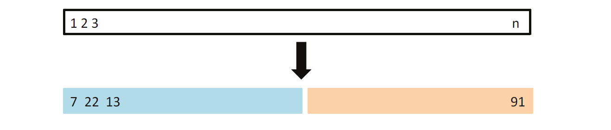

# 5 Resampling Methods 重采样方法

**原书：An Introduction to Statistical Learning_ with Applications in Python (Springer Texts in Statistics)-Springer (2023)**

[原书链接](https://www.statlearning.com/)

[课程配套网课（油管链接）](https://www.youtube.com/watch?v=LvySJGj-88U&list=PLoROMvodv4rPP6braWoRt5UCXYZ71GZIQ)，b站也有搬运视频可以自行搜索

**翻译：GPT，校对：Iridescence-ovo**

---

重抽样方法是现代统计学中不可或缺的工具。它们涉及从训练集中反复抽取样本，并在每个样本上重新拟合感兴趣的模型，以获取关于拟合模型的额外信息。例如，为了估计线性回归拟合的变异性，我们可以反复从训练数据中抽取不同的样本，对每个新样本进行线性回归拟合，然后检查结果拟合之间的差异程度。这种方法可能使我们获得仅通过使用原始训练样本一次拟合模型所无法获得的信息。

重抽样方法可能计算开销较大，因为它们涉及在不同的训练数据子集上多次拟合相同的统计方法。然而，由于计算能力的最新进展，重抽样方法的计算需求通常并不高昂。在本章中，我们讨论了两种最常用的重抽样方法：交叉验证和自助法（bootstrap）。这两种方法在许多统计学习程序的实际应用中都是重要工具。例如，交叉验证可用于估计与给定统计学习方法相关的测试误差，以评估其性能或选择适当的灵活性水平。评估模型性能的过程称为 **模型评估(model assessment)**，而选择模型的适当灵活性水平的过程称为 **模型选择(model selection.)**。自助法在几个上下文中使用，最常见的是提供参数估计或给定统计学习方法的准确性度量。

## 5.1 交叉验证（Cross-Validation）

在第二章中，我们讨论了测试误差率和训练误差率之间的区别。测试误差是使用统计学习方法对新观察（即未用于训练该方法的测量）进行预测所产生的平均误差。给定一个数据集，如果某种特定的统计学习方法能导致低测试误差，则该方法的使用是合理的。如果有指定的测试集，测试误差可以很容易地计算。然而，通常并非如此。

相比之下，训练误差可以通过将统计学习方法应用于用于训练的观察值轻松计算。但正如我们在第二章中看到的，训练误差率通常与测试误差率大相径庭，特别是前者可能严重低估后者。

在缺乏非常大的指定测试集以直接估计测试误差率的情况下，可以使用多种技术通过可用的训练数据来估计这一量。一些方法通过对训练误差率进行数学调整来估计测试误差率。这些方法在第六章中讨论。在本节中，我们考虑一类方法，通过将一部分训练观察值从拟合过程中保留出来，然后将统计学习方法应用于这些保留的观察值，以估计测试误差率。

在5.1.1至5.1.4节中，为了简化起见，我们假设关注的是具有定量响应的回归。在5.1.5节中，我们考虑具有定性响应的分类情况。正如我们将看到的，无论响应是定量还是定性，关键概念保持不变。  

### 5.1.1 The Validation Set Approach

假设我们想要估计与在一组观察值上拟合特定统计学习方法相关的测试误差。验证集方法，如图 5.1 所示，是一种非常简单的策略。它涉及将可用的观察值随机分为两部分：训练集和验证集（或保留集）。在训练集上拟合模型，然后使用拟合的模型预测验证集中的观察响应。由此产生的验证集误差率——通常在定量响应的情况下使用均方误差（MSE）进行评估——提供了测试误差率的估计。

**图5.1** *验证集方法的示意图显示。一组包含  $n$  个观测值的数据被随机分为训练集（用蓝色表示，包括观测值7、22和13等）和验证集（用米色表示，包括观测值91等）。统计学习方法在训练集上拟合，并在验证集上评估其性能。*

我们在汽车数据集上说明验证集方法。回顾第三章，发现 mpg（每加仑英里数）与马力之间似乎存在非线性关系，使用马力和马力的平方项来预测 mpg 的模型效果优于仅使用线性项的模型。自然会想知道立方或更高阶拟合是否会提供更好的结果。我们在第三章中通过查看线性回归中与立方项和更高阶多项式项相关的 p 值来回答这个问题。但我们也可以使用验证方法来回答这个问题。我们随机将 392 个观察值分为两个集，训练集包含 196 个数据点，验证集包含剩余的 196 个观察值。通过在训练样本上拟合各种回归模型并使用 MSE 作为验证集误差的度量，评估它们在验证样本中的性能，得到的验证集误差率显示在图 5.2 的左侧面板中。二次拟合的验证集 MSE 显著小于线性拟合的验证集 MSE。然而，立方拟合的验证集 MSE 实际上略大于二次拟合的验证集 MSE。这意味着在回归中加入立方项并未比简单使用二次项提供更好的预测。

**图5.2**. *使用验证集方法对Auto数据集进行测试误差的估计，该误差源于使用马力（horsepower）的多项式函数预测每加仑里程数（mpg）。左图：对训练集和验证集的一次随机划分得到的验证误差估计。右图：将验证方法重复了10次，每次随机将观测值分为一个不同的训练集和验证集。这展示了该方法在估计测试MSE时的变异性。*

回顾一下，为了创建图5.2的左侧图，我们将数据集随机分为两部分：训练集和验证集。如果我们重复将样本集随机分成两部分的过程，将会得到稍微不同的测试MSE估计值。作为示例，图5.2右侧图展示了从Auto数据集中生成的10条不同验证集MSE曲线，这些曲线是通过将观测值随机分成训练集和验证集的10种不同方式得到的。所有10条曲线都表明，包含二次项的模型的验证集MSE显著小于仅包含线性项的模型。此外，这些曲线还显示，将三次或更高次多项式项包括在模型中并没有明显的益处。然而需要注意的是，这10条曲线对于每个回归模型的测试MSE估计值都有所不同，且关于哪个模型能得到最小的验证集MSE，曲线之间并未达成一致意见。基于这些曲线的变化，我们唯一可以确信的结论是，线性拟合对于该数据是不够的。

验证集方法概念上简单，且易于实现，但存在两个潜在缺点：  
1. 如图5.2右侧图所示，验证集的测试误差率估计可能具有很高的变异性，这取决于哪些观测值被包含在训练集中，哪些被包含在验证集中。
2. 在验证方法中，只有一部分观测值——即那些包含在训练集中而非验证集中的观测值——被用来拟合模型。由于统计方法在使用较少观测值进行训练时通常表现较差，这表明验证集误差率可能倾向于高估在整个数据集上拟合模型的测试误差率。

在接下来的小节中，我们将介绍交叉验证，这是一种验证集方法的改进版本，用以解决上述两个问题。

### 5.1.2 Leave-One-Out Cross-Validation
**留一法交叉验证（Leave-One-Out Cross-Validation, LOOCV）** 与第5.1.1节的验证集方法密切相关，但它试图解决该方法的缺点。  
与验证集方法类似，LOOCV也涉及将观测集分成两部分。然而，不同的是，LOOCV并不将数据集划分为两个大小相当的子集，而是将单个观测值 $(x_1, y_1)$ 用作验证集，其余的观测值 $\{(x_2, y_2), \dots, (x_n, y_n)\}$ 作为训练集。  
在 $n-1$ 个训练观测值上拟合统计学习方法后，利用验证观测值的特征值 $x_1$ 对其进行预测，得到预测值 $\hat{y}_1$ 。  
由于 $(x_1, y_1)$ 没有参与拟合过程， $\text{MSE}_1 = (y_1 - \hat{y}_1)^2$ 提供了一个对测试误差的近似无偏估计。  
但是，尽管 $\text{MSE}_1$ 是测试误差的无偏估计，它却是一个较差的估计值，因为它仅基于单个观测值 $(x_1, y_1)$ ，因而具有较高的变异性。

我们可以通过选择 $(x_2, y_2)$ 作为验证数据重复这一过程，在 $(n-1)$ 个观测值 $\{(x_1, y_1), (x_3, y_3), \dots, (x_n, y_n)\}$ 上训练统计学习方法，并计算 $\text{MSE}_2 = (y_2 - \hat{y}_2)^2$ 。  
重复这一过程 $n$ 次，会产生 $n$ 个平方误差 $\text{MSE}_1, \dots, \text{MSE}_n$ 。  
LOOCV对测试MSE的估计值是这些 $n$ 个测试误差估计值的平均值：  
$$
\text{CV}(n) = \frac{1}{n} \sum_{i=1}^n \text{MSE}_i. \tag{5.1}
$$  
LOOCV方法的示意图见图5.3。

**图5.3**：*留一法交叉验证（LOOCV）的示意图。将包含 $n$ 个数据点的数据集反复分为训练集（蓝色部分）和验证集（米色部分）。训练集包含除了一个观测值外的所有数据点，验证集则只包含该观测值。测试误差通过对这 $n$ 个所得均方误差（MSE）的平均值进行估计。第一个训练集包含除观测值1以外的所有数据，第二个训练集包含除观测值2以外的所有数据，依此类推。*

与验证集方法相比，LOOCV具有两个主要优势：  
1. **偏差更小**：在LOOCV中，我们反复使用包含 $n-1$ 个观测值的训练集进行拟合，这几乎与整个数据集的大小一样多。这与验证集方法不同，后者的训练集通常只有原始数据集的一半大小。因此，LOOCV方法不太可能像验证集方法那样高估测试误差率。  
2. **结果确定性强**：与验证集方法因训练集和验证集划分的随机性而导致多次应用时结果不同相比，LOOCV的训练/验证集划分是固定的，因此多次执行LOOCV会始终产生相同的结果，没有随机性。

我们在 Auto 数据集上使用留一法交叉验证（LOOCV），以估计使用马力的多项式函数拟合线性回归模型预测每加仑英里数（mpg）时的测试集均方误差（MSE）。结果如图 5.4 的左侧面板所示。  

LOOCV 的实现可能会非常耗时，因为模型需要拟合  $n$  次。如果  $n$  很大，并且每个单独的模型拟合都较慢，则这种方法可能耗费大量时间。然而，对于最小二乘线性回归或多项式回归，有一个非常巧妙的捷径可以让 LOOCV 的计算成本与单次模型拟合相同！以下公式适用：  

$$
CV(n) = \frac{1}{n} \sum_{i=1}^n \left( \frac{y_i - \hat{y}_i}{1 - h_i} \right)^2 \tag{5.2}
$$  

其中， $\hat{y}_i$  是原始最小二乘拟合中第  $i$  个预测值，而  $h_i$  是第  $i$  个观测值的杠杆值（leverage），如第 105 页的公式 (3.37) 所定义。杠杆值介于  $1/n$  和 1 之间，反映了某一观测值对其自身拟合的影响。在该公式中，高杠杆值点的残差会被适当地放大，从而使等式成立。  

LOOCV 是一种非常通用的方法，可用于任何类型的预测建模。例如，我们可以将其用于逻辑回归、线性判别分析或本书后续章节讨论的任何方法。然而，“魔法公式” (5.2) 并不适用于所有情况。在这些情况下，模型需要重新拟合  $n$  次。

**图 5.4**. *在 `Auto` 数据集上使用交叉验证估计通过马力的多项式函数预测每加仑英里数（mpg）时的测试误差。左图：留一法交叉验证（LOOCV）的误差曲线。右图：进行了 10 折交叉验证（10-fold CV），每次将数据随机分成十部分，总共运行了九次。图中显示了九条略有不同的交叉验证误差曲线。*

### 5.1.3 k-Fold Cross-Validation
**k 折交叉验证（k-fold CV）** 是 LOOCV 的一种替代方法。该方法将观测数据集随机分成 k 组或折（folds），每组的大小大致相等。第一个折被用作验证集，其余的 k − 1 折被用作训练集。然后在保留的验证集上计算均方误差（$MSE_1$）。该过程重复 k 次，每次使用不同的折作为验证集。这一过程会产生 k 个测试误差估计值，分别为 $MSE_1, MSE_2, ... , MSE_k$。k 折交叉验证的估计值通过这些误差的平均值计算得出：

$$
CV(k) = \frac{1}{k} \sum_{i=1}^{k} MSE_i \tag{5.3}
$$

图 5.5 展示了 k 折交叉验证的过程。  

**图 5.5**：*5 折交叉验证的示意图。将 n 个观测值随机分成五组互不重叠的子集。每一组依次作为验证集（图中米色部分），其余部分作为训练集（图中蓝色部分）。通过对五次得到的均方误差（MSE）估计值取平均来估计测试误差。*

不难看出，LOOCV 是 k 折交叉验证的一种特殊情况，其中 k 设置为等于 n。在实践中，通常选择 k = 5 或 k = 10 来进行交叉验证。为什么使用 k = 5 或 k = 10 而不是 k = n 呢？最明显的优势在于计算效率。LOOCV 需要拟合统计学习方法 n 次，这可能会导致计算成本过高（除了通过最小二乘法拟合的线性模型，此时可以使用公式 (5.2) 提高效率）。然而，交叉验证是一种非常通用的方法，可以应用于几乎任何统计学习方法。一些统计学习方法的拟合过程计算量较大，因此执行 LOOCV 可能会面临计算问题，特别是当 n 非常大时。相比之下，10 折交叉验证只需要拟合学习方法 10 次，这可能更加可行。  

如 5.1.4 节所述，执行 5 折或 10 折交叉验证在偏差-方差权衡方面也可能具有其他非计算优势。  

图 5.4 的右图展示了 `Auto` 数据集的 9 次 10 折交叉验证估计值，每次使用不同的随机分组方式将观测值分为 10 折。从图中可以看出，由于观测值被分为 10 折的随机方式不同，交叉验证估计值存在一定的变化。但这种变化通常比验证集方法（图 5.2 的右图）导致的测试误差估计值的变化小得多。

当我们检查实际数据时，我们并不知道真实的测试均方误差（MSE），因此很难确定交叉验证估计值的准确性。然而，如果我们检查模拟数据，则可以计算真实的测试 MSE，从而评估交叉验证结果的准确性。在图 5.6 中，我们绘制了应用平滑样条（smoothing splines）到模拟数据集（如第 2 章图 2.9–2.11 所示）时得到的交叉验证估计值和真实测试误差率。真实的测试 MSE 以蓝色显示。黑色虚线和橙色实线分别表示估计的 LOOCV 和 10 折交叉验证估计值。在所有三个图中，这两个交叉验证估计值非常相似。在图 5.6 的右侧面板中，真实的测试 MSE 和交叉验证曲线几乎完全相同。在图 5.6 的中间面板中，在较低的灵活度下，两个曲线集是相似的，而在较高灵活度下，交叉验证曲线会高估测试集 MSE。在图 5.6 的左侧面板中，交叉验证曲线具有正确的一般形状，但它们低估了真实的测试 MSE。

当我们进行交叉验证时，我们的目标可能是确定给定统计学习方法在独立数据上的表现如何；在这种情况下，我们关心的是测试 MSE 的实际估计值。但在其他时候，我们只关心估计测试 MSE 曲线中最小点的位置。这是因为我们可能会对多种统计学习方法进行交叉验证，或对单一方法使用不同的灵活度，以确定导致最小测试误差的方法。为此，估计测试 MSE 曲线中最小点的位置很重要，但估计测试 MSE 的实际值并不重要。我们在图 5.6 中发现，尽管交叉验证曲线有时会低估真实测试 MSE，但它们都接近确定正确的灵活度水平——即对应于最小测试 MSE 的灵活度水平。

**图 5.6**. *对于图 2.9（左）、2.10（中）和 2.11（右）中的模拟数据集，展示了真实的和估计的测试 MSE。真实的测试 MSE 以蓝色显示，LOOCV 估计值以黑色虚线显示，10 折交叉验证估计值以橙色显示。交叉点表示每个 MSE 曲线的最小值。*

### 5.1.4 Bias-Variance Trade-Off for k-Fold Cross-Validation
我们在第 5.1.3 节中提到，k 折交叉验证（k < n）在计算上相对于 LOOCV 有优势。但是，抛开计算问题不谈，k 折交叉验证一个不太明显但潜在更重要的优势是，它通常比 LOOCV 给出更准确的测试误差率估计。这与偏差-方差权衡有关。

在第 5.1.1 节中提到，验证集方法可能导致测试误差率的高估，因为在这种方法中，用于拟合统计学习方法的训练集仅包含整个数据集一半的观测值。根据这个逻辑，我们不难看出，LOOCV 会给出大致无偏的测试误差估计，因为每个训练集包含 n-1 个观测值，几乎与整个数据集的观测值数量相同。而进行 k 折交叉验证（例如，k = 5 或 k = 10）将导致一个中等偏差水平，因为每个训练集大约包含 (k - 1)n/k 个观测值——比 LOOCV 方法少，但比验证集方法多。因此，从减少偏差的角度来看，很明显 LOOCV 优于 k 折交叉验证。

然而，我们知道偏差并不是估计过程中的唯一关注点；我们还必须考虑过程的方差。事实证明，LOOCV 的方差比 k 折交叉验证（k < n）高。为什么会这样呢？当我们执行 LOOCV 时，实际上是在对 n 个拟合模型的输出取平均，每个模型都是在几乎相同的观测集上训练的；因此，这些输出彼此之间高度（正相关）相关。相比之下，当我们执行 k 折交叉验证（k < n）时，我们是在对 k 个拟合模型的输出取平均，而这些输出彼此之间的相关性较小，因为每个模型的训练集之间的重叠较小。由于许多高度相关的量的平均值比许多不那么相关的量的平均值具有更高的方差，LOOCV 得到的测试误差估计往往比 k 折交叉验证得到的测试误差估计方差更大。

总结来说，k 折交叉验证中 k 的选择涉及偏差-方差权衡。通常，考虑到这些因素，人们会使用 k = 5 或 k = 10 进行 k 折交叉验证，因为这些值在经验上已被证明能提供既没有过高偏差也没有过高方差的测试误差率估计。

### 5.1.5 Cross-Validation on Classification Problems
在本章迄今为止，我们已展示了在回归设置中使用交叉验证的情况，其中因变量 Y 是定量的，因此我们使用均方误差（MSE）来量化测试误差。但交叉验证在分类设置中也可以是一个非常有用的方法，当 Y 是定性的。在这种情况下，交叉验证的工作原理与本章前面描述的一样，只是我们不再使用 MSE 来量化测试误差，而是使用误分类的观测数。例如，在分类设置中，LOOCV 的误差率表现为：

$$
CV(n) = \frac{1}{n} \sum_{i=1}^{n} \text{Err}_i, \quad (5.4)
$$

其中  $\text{Err}_i = I(y_i \neq \hat{y}_i)$ 。k 折交叉验证误差率和验证集误差率也以类似方式定义。

作为一个例子，我们在图 2.13 中展示的二维分类数据上拟合了不同的逻辑回归模型。在图 5.7 的左上面板中，黑色实线表示通过拟合标准逻辑回归模型得到的决策边界。由于这是模拟数据，我们可以计算出真实的测试误差率，其值为 0.201，明显大于贝叶斯误差率 0.133。显然，在这种情况下，逻辑回归的灵活性不足以拟合贝叶斯决策边界。我们可以通过使用预测变量的多项式函数轻松扩展逻辑回归，从而得到一个非线性决策边界，正如我们在第 3.3.2 节回归设置中所做的那样。例如，我们可以拟合一个二次逻辑回归模型，表示为：

$$
\log\left(\frac{p}{1 - p}\right) = \beta_0 + \beta_1 X_1 + \beta_2 X_2 + \beta_3 X_2^2 + \beta_4 X_2^2. \quad (5.5)
$$

图 5.7 的右上面板显示了结果的决策边界，现在它是曲线形的。然而，测试误差率仅略有改善，降至 0.197。在图 5.7 的左下面板中，显示了一个涉及预测变量三次多项式的逻辑回归模型。此时，测试误差率降至 0.160。在右下面板中，使用四次多项式略微增加了测试误差。

**图 5.7**. *在图 2.13 中展示的二维分类数据上进行的逻辑回归拟合。贝叶斯决策边界用紫色虚线表示。来自线性、二次、三次和四次（1 到 4 次）逻辑回归的估计决策边界用黑色显示。四个逻辑回归拟合的测试误差率分别为 0.201、0.197、0.160 和 0.162，而贝叶斯误差率为 0.133。*

在实际应用中，对于真实数据，贝叶斯决策边界和测试误差率是未知的。那么我们如何在图 5.7 中展示的四个逻辑回归模型之间做出选择呢？我们可以使用交叉验证来做出这个决定。图 5.8 的左侧面板显示了通过使用多项式函数（最高达到十次方）拟合十个逻辑回归模型得到的 10 折交叉验证误差率，误差率用黑色表示。真实的测试误差以棕色显示，训练误差以蓝色显示。正如我们之前所看到的，训练误差通常随着拟合灵活性的增加而减小。（图中表明，虽然训练误差率并不完全单调下降，但通常随着模型复杂度的增加而减少。）相反，测试误差呈现出典型的 U 形。10 折交叉验证误差率提供了对测试误差率的良好近似。虽然它稍微低估了误差率，但当使用四次多项式时，它达到了最小值，这非常接近测试曲线的最小值，而测试曲线的最小值出现在使用三次多项式时。事实上，使用四次多项式可能会导致良好的测试集表现，因为真实的测试误差率在三次、四次、五次和六次多项式之间大致相同。

图 5.8 的右侧面板显示了使用 KNN 分类方法的相同三条曲线，作为 K 值的函数（在此背景下，K 表示 KNN 分类器中使用的邻居数量，而不是使用的交叉验证折数）。同样，随着方法的灵活性增加，训练误差率下降，因此我们看到训练误差率不能用于选择 K 的最佳值。尽管交叉验证误差曲线略微低估了测试误差率，但它的最小值非常接近 K 的最佳值。

**图 5.8**. *测试误差（棕色）、训练误差（蓝色）和 10 折交叉验证误差（黑色）在图 5.7 中展示的二维分类数据上的表现。左侧：使用预测变量的多项式函数的逻辑回归。多项式的阶数显示在 x 轴上。右侧：使用不同 K 值的 KNN 分类器，其中 K 表示 KNN 分类器中使用的邻居数量。*

## 5.2 The Bootstrap 自助法

**自助法（Bootstrap）** 是一种广泛适用且极为强大的统计工具，可用于量化与特定估计量或统计学习方法相关的不确定性。举一个简单的例子，自助法可以用来估计线性回归拟合中系数的标准误差。在线性回归的特定情境下，这可能并不特别有用，因为我们在第 3 章中已经看到，像 R 这样的标准统计软件会自动输出这些标准误差。然而，自助法的强大之处在于它能够轻松应用于广泛的统计学习方法，包括一些难以获得变量测量或没有统计软件自动提供的情况下。

本节我们通过一个简单的示例来说明自助法的应用。在这个例子中，我们希望在一个简单的模型下确定最佳投资分配。在第 5.3 节中，我们还将探索如何使用自助法评估线性模型拟合中回归系数的变异性。

假设我们希望将一笔固定金额投资于两个金融资产，其收益率分别为  $X$  和  $Y$ 。 $X$  和  $Y$  是随机变量。我们将总资金的比例  $\alpha$  投资于  $X$ ，而剩余的  $1-\alpha$  投资于  $Y$ 。由于这两种资产的收益存在波动性，我们希望选择  $\alpha$  来最小化总投资的风险，即最小化投资的方差  $\text{Var}(\alpha X + (1-\alpha)Y)$ 。可以证明，最小化风险的  $\alpha$  值为：

$$
\alpha = \frac{\sigma_Y^2 - \sigma_{XY}}{\sigma_X^2 + \sigma_Y^2 - 2\sigma_{XY}}, \tag{5.6}
$$

其中， $\sigma_X^2 = \text{Var}(X)$ ， $\sigma_Y^2 = \text{Var}(Y)$ ， $\sigma_{XY} = \text{Cov}(X, Y)$ 。

实际上，这些量  $\sigma_X^2$ 、 $\sigma_Y^2$  和  $\sigma_{XY}$  是未知的。我们可以利用包含  $X$  和  $Y$  历史收益率数据的数据集来计算它们的估计值  $\hat{\sigma}_X^2$ 、 $\hat{\sigma}_Y^2$  和  $\hat{\sigma}_{XY}$ 。然后，我们将这些估计值代入公式（5.6）中，计算出最小化投资方差的  $\alpha$  的估计值：

$$
\hat{\alpha} = \frac{\hat{\sigma}_Y^2 - \hat{\sigma}_{XY}}{\hat{\sigma}_X^2 + \hat{\sigma}_Y^2 - 2\hat{\sigma}_{XY}}。 \tag{5.7}
$$

图 5.9 展示了这一估计  $\alpha$  的方法在一个模拟数据集上的应用。在每个子图中，我们模拟了 100 对投资  $X$  和  $Y$  的收益率，并用这些收益率估计了  $\sigma_X^2$ 、 $\sigma_Y^2$  和  $\sigma_{XY}$ 。随后，我们将这些估计值代入公式（5.7），得出了  $\alpha$  的估计值。在每个模拟数据集中， $\hat{\alpha}$  的值范围从 0.532 到 0.657。

**图 5.9** *每个子图显示了投资  $X$  和  $Y$  的 100 次模拟收益率。从左到右、从上到下，估计的  $\alpha$  值分别为 0.576、0.532、0.657 和 0.651。*

我们希望量化  $\hat{\alpha}$  估计值的准确性。为了估计  $\hat{\alpha}$  的标准差，我们重复模拟  $X$  和  $Y$  的 100 对观察值，并使用公式 (5.7) 估计  $\alpha$ ，共进行了 1,000 次。由此，我们得到了 1,000 个  $\alpha$  的估计值，记为  $\hat{\alpha}_1, \hat{\alpha}_2, \dots, \hat{\alpha}_{1,000}$ 。图 5.10 的左侧子图展示了这些估计值的直方图。对于这些模拟，参数设置为  $\sigma_X^2 = 1$ 、 $\sigma_Y^2 = 1.25$ 、 $\sigma_{XY} = 0.5$ ，因此我们知道  $\alpha$  的真实值为 0.6。直方图中的实线垂直线标示了这一真实值。

所有 1,000 个  $\alpha$  估计值的均值为：

$$
\bar{\alpha} = \frac{1}{1000} \sum_{r=1}^{1000} \hat{\alpha}_r = 0.5996,
$$

非常接近真实值  $\alpha = 0.6$ 。估计值的标准差为：

$$
\sqrt{\frac{1}{1000 - 1} \sum_{r=1}^{1000} (\hat{\alpha}_r - \bar{\alpha})^2} = 0.083。
$$

这为  $\hat{\alpha}$  的准确性提供了很好的估计： $SE(\hat{\alpha}) \approx 0.083$ 。换句话说，从总体中随机抽取的样本， $\hat{\alpha}$  平均会与  $\alpha$  相差大约 0.08。

然而，在实际操作中，无法像上述方法那样生成新的样本集，因为对于真实数据，我们无法从原始总体中生成新的样本。不过，通过引入**自助法（bootstrap）**，我们可以借助计算机模拟获取新样本集的过程，从而无需生成额外样本即可估计  $\hat{\alpha}$  的变异性。具体而言，我们不是反复从总体中获取独立数据集，而是通过在原始数据集中反复抽样生成不同的数据集。

**图 5.10** *左图：通过从真实总体中生成 1,000 个模拟数据集得到的  $\alpha$  估计值的直方图。中图：从单个数据集中生成 1,000 个自助样本得到的  $\alpha$  估计值的直方图。右图：以箱线图形式展示了左图和中图中的  $\alpha$  估计值。在每个图中，粉色线表示  $\alpha$  的真实值。*

该方法在图 5.11 中通过一个简单的数据集  $Z$  进行了说明。这个数据集包含  $n = 3$  个观测值。我们随机从数据集中抽取  $n$  个观测值生成一个自助数据集  $Z_1^*$ 。抽样是**有放回**的，这意味着同一个观测值可以在自助数据集中出现多次。在本例中， $Z_1^*$  包含第三个观测值两次，第一个观测值一次，而第二个观测值未被选中。需要注意的是，如果某个观测值包含在  $Z_1^*$  中，那么其  $X$  和  $Y$  值都会被包含在内。我们可以使用  $Z_1^*$  来生成一个新的自助估计值  $\hat{\alpha}_1^*$ 。这个过程会重复  $B$  次（ $B$  是一个较大的值），从而生成  $B$  个不同的自助数据集  $Z_1^*, Z_2^*, \dots, Z_B^*$ ，以及对应的  $B$  个  $\alpha$  估计值： $\hat{\alpha}_1^*, \hat{\alpha}_2^*, \dots, \hat{\alpha}_B^*$ 。我们可以用以下公式计算这些自助估计值的标准误差：

$$
SE_B(\hat{\alpha}) = \sqrt{\frac{1}{B - 1} \sum_{r=1}^B \left(\hat{\alpha}_r^* - \frac{1}{B} \sum_{r'=1}^B \hat{\alpha}_{r'}^*\right)^2} \quad(5.8)
$$

这一公式为从原始数据集中估计的  $\hat{\alpha}$  提供了标准误差的估计值。

自助法的过程在图 5.10 的中间子图中展示，该图显示了基于 1,000 个自助数据集计算的  $\alpha$  的自助估计值的直方图。该直方图是基于一个单一数据集构建的，因此可以使用实际数据来生成。需要注意的是，这个直方图与左侧子图非常相似，后者显示了通过从真实总体中生成 1,000 个模拟数据集计算得到的  $\alpha$  估计值的理想化直方图。特别地，自助法估计出的标准误差  $SE(\hat{\alpha})$  为 0.087（公式 5.8 计算所得），非常接近通过 1,000 个模拟数据集计算得到的 0.083。

右侧子图以不同的方式展示了中间和左侧子图的信息，通过箱线图展示了通过从真实总体中生成 1,000 个模拟数据集以及使用自助法获得的  $\alpha$  估计值。再次说明，这些箱线图的分布范围相似，表明自助法可以有效估计  $\hat{\alpha}$  的变异性。

**图 5.11** *展示自助法在一个包含  $n = 3$  个观测值的小样本上的图示。每个自助数据集包含从原始数据集中有放回抽样的  $n$  个观测值。每个自助数据集用于估计  $\alpha$ 。*
