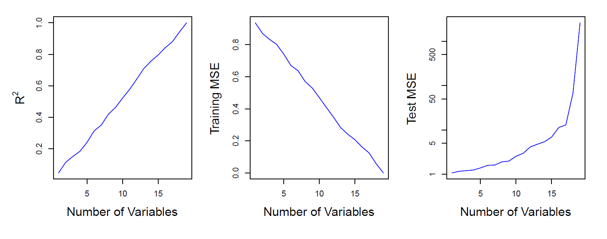

# 6 Linear Model Selection and Regularization
线性模型选择和正则化

**原书：An Introduction to Statistical Learning_ with Applications in Python (Springer Texts in Statistics)-Springer (2023)**

[原书链接](https://www.statlearning.com/)

[课程配套网课（油管链接）](https://www.youtube.com/watch?v=LvySJGj-88U&list=PLoROMvodv4rPP6braWoRt5UCXYZ71GZIQ)，b站也有搬运视频可以自行搜索

**翻译：GPT，校对：Iridescence-ovo**

--------

在回归模型中，标准线性模型

$$ 
Y = \beta_0 + \beta_1X_1 + \cdots + \beta_pX_p + \epsilon \tag{6.1}
$$

通常用于描述响应变量 $Y$ 与一组变量 $X_1, X_2, \ldots, X_p$ 之间的关系。我们在第3章中看到，通常使用最小二乘法来拟合这个模型。

在接下来的章节中，我们将考虑一些扩展线性模型框架的方法。在第7章中，我们将对公式（6.1）进行概括，以适应非线性但仍然是加性的关系，而在第8章和第10章中，我们将考虑更一般的非线性模型。然而，线性模型在推断方面具有明显的优势，并且在现实问题中，通常与非线性方法相比表现得相当有竞争力。因此，在转向非线性领域之前，我们将在本章讨论一些改进简单线性模型的方法，通过使用一些替代拟合程序来替代普通的最小二乘拟合。

那么，为什么我们可能希望使用其他拟合程序而不是最小二乘法呢？正如我们将看到的，替代拟合程序可以提供更好的**预测准确性**和**模型可解释性**。

- **预测准确性**：如果响应变量与预测变量之间的真实关系大致是线性的，则最小二乘估计会具有较低的偏差。如果 $n \gg p$——也就是说，观测数量 $n$ 远大于变量数量 $p$——那么最小二乘估计往往也具有较低的方差，因此在测试观测上表现良好。然而，如果 $n$ 不比 $p$ 大得多，则最小二乘拟合可能会有很大的差异性，导致过拟合，从而在未用于模型训练的未来观测上做出不佳的预测。如果 $p > n$，则不再存在唯一的最小二乘系数估计：存在无限多个解。每一个这些最小二乘解在训练数据上都给出零误差，但通常由于极高的方差，在测试集上表现很差。通过对估计系数进行约束或收缩，我们通常可以在仅微小增加偏差的代价下显著降低方差。这可以在预测未用于模型训练的观测响应的准确性上带来实质性改善。
- **模型可解释性**：在多重回归模型中，某些或许多个变量实际上与响应变量并没有关联。包含这些无关变量会导致生成的模型复杂性不必要。通过移除这些变量——也就是将相应的系数估计设置为零——我们可以获得一个更易于解释的模型。现在，最小二乘法极不可能产生任何精确为零的系数估计。在本章中，我们将看到一些自动执行 **特征选择(feature selection)** 或 **变量选择(variable selection)** 的方法，即排除多重回归模型中的无关变量。

有许多替代方法，无论是经典的还是现代的，可以用来替代最小二乘法拟合公式 (6.1)。在本章中，我们讨论三种重要的方法类别。

- **子集选择**。这种方法涉及识别一组我们认为与响应相关的 p 个预测变量的子集。然后，我们在减少的变量集合上使用最小二乘法拟合模型。

- **收缩**。这种方法涉及拟合一个包含所有 p 个预测变量的模型。然而，估计的系数相对于最小二乘估计被收缩向零。这种收缩（也称为正则化）可以减少方差。根据执行的收缩类型，有些系数可能会被估计为恰好为零。因此，收缩方法也可以执行变量选择。

- **维度减少**。这种方法涉及将 p 个预测变量投影到一个 M 维子空间，其中 M < p。这是通过计算 M 个不同的线性组合或变量的投影来实现的。然后，这些 M 个投影作为预测变量，用于通过最小二乘法拟合线性回归模型。

在接下来的部分中，我们将更详细地描述这些方法及其优缺点。尽管本章描述了对第 3 章中线性回归模型的扩展和修改，但相同的概念也适用于其他方法，例如第 4 章中介绍的分类模型。

## 6.1 Subset selection 子集选择
在本节中，我们考虑一些选择预测变量子集的方法。这些方法包括最佳子集选择（best subset）和逐步模型选择（stepwise model selection）程序。

### 6.1.1 Best Subset Selection
为了执行最佳子集选择，我们为每个可能的  $p$ 个预测变量组合拟合一个单独的最小二乘回归模型。也就是说，我们拟合所有仅包含一个预测变量的  $p$ 个模型，所有包含恰好两个预测变量的  $\binom{p}{2} = \frac{p(p-1)}{2}$ 个模型，依此类推。然后，我们查看所有结果模型，目标是识别出最佳模型。

从最佳子集选择考虑的  $2^p$ 种可能性中选择最佳模型的问题并非简单。这通常分为两个阶段，如算法 6.1 所述。

**算法 6.1 最佳子集选择**

1. 设  $M_0$ 表示空模型，该模型不包含任何预测变量。该模型仅预测每个观测值的样本均值。
2. 对于  $k = 1, 2, \ldots, p$:
   (a) 拟合所有包含恰好  $k$ 个预测变量的  $\binom{p}{k}$ 个模型。
   (b) 从这些  $\binom{p}{k}$ 个模型中选择最佳模型，称为  $M_k$。这里的最佳定义为具有最小的残差平方和（RSS），或等效地，具有最大的  $R^2$。
3. 从  $M_0, \ldots, M_p$ 中选择一个最佳模型，使用验证集上的预测误差、AIC、BIC 或校正  $R^2$ 进行选择，或者使用交叉验证方法。

在算法 6.1 中，步骤 2 确定每个子集大小的最佳模型（基于训练数据），以将问题从  $2^p$ 个可能模型的选择简化为 $p + 1$ 个可能模型的选择。在图 6.1 中，这些模型构成了用红色描绘的下边界。

现在，为了选择一个最佳模型，我们只需在这 $p + 1$ 个选项中进行选择。这个任务必须谨慎进行，因为这 $p + 1$ 个模型的 RSS 随着所包含特征数量的增加而单调减少，而 $R^2$ 随着特征数量的增加而单调增加。因此，如果我们使用这些统计量来选择最佳模型，那么我们最终总是会得到一个包含所有变量的模型。问题在于，低 RSS 或高 $R^2$ 指示模型具有低训练误差，而我们希望选择的是具有低测试误差的模型。（正如在第 2 章图 2.9 至 2.11 中所示，训练误差往往明显小于测试误差，低训练误差并不保证低测试误差。）因此，在步骤 3 中，我们使用验证集上的误差、AIC、BIC 或调整后的 $R^2$ 来选择 $M_0, M_1, \ldots, M_p$ 之间的模型。如果使用交叉验证来选择最佳模型，那么步骤 2 将在每个训练折叠上重复，并且将平均验证误差以选择最佳的 $k$ 值。然后，在完整的训练集上拟合的模型 $M_k$ 将被用于所选择的 $k$。这些方法在 6.1.3 节中进行了讨论。

**图 6.1**。*对于`Credit`数据集中包含十个预测变量的每个可能模型，显示了 RSS 和 $R^2$。红色边界根据 RSS 和 $R^2$ 跟踪给定数量预测变量的最佳模型。尽管数据集中仅包含十个预测变量，但 x 轴的范围从 1 到 11，因为其中一个变量是分类变量，取三个值，从而创建了两个虚拟变量。*

最佳子集选择的一个应用示例如图 6.1 所示。每个绘制的点对应于使用信用数据集中不同的 10 个预测变量的子集进行的最小二乘回归模型拟合，具体讨论见第三章。这里的变量“region”是一个三级定性变量，因此用两个虚拟变量表示，在这种情况下单独选择。因此，总共有 11 个可能的变量可以纳入模型。我们将每个模型的 RSS 和 $R^2$ 统计量绘制为变量数量的函数。红色曲线连接了根据 RSS 或 $R^2$ 选出的每个模型大小的最佳模型。图中显示，正如预期的那样，随着变量数量的增加，这些数量得到了改善；然而，从三变量模型开始，包含额外预测变量对 RSS 和 $R^2$ 的改善有限。

尽管我们在这里为最小二乘回归呈现了最佳子集选择，但相同的思路适用于其他类型的模型，例如逻辑回归。在逻辑回归的情况下，在算法 6.1 的第 2 步中，我们不是按 RSS 排序模型，而是使用**离差（deviance）**，这是一种在更广泛的模型类中充当 RSS 角色的度量。离差是最大化对数似然的负两倍；离差越小，拟合效果越好。

虽然最佳子集选择是一种简单且在概念上很有吸引力的方法，但它受到计算限制的影响。随着 p 的增加，必须考虑的可能模型数量迅速增长。一般来说，涉及 p 个预测变量的子集有 $2^p$ 个模型。因此，如果 $p = 10$，那么大约有 1,000 个可能的模型要考虑；如果 $p = 20$，那么可能性超过一百万！因此，最佳子集选择在 $p$ 大于约 40 时变得在计算上不可行，即使使用极其快速的现代计算机。虽然有一些计算捷径——所谓的分支限界技术——可以消除某些选择，但随着 $p$ 的增大，它们也有局限性。这些方法也仅适用于最小二乘线性回归。接下来我们将介绍一些计算上高效的替代最佳子集选择的方法。

### 6.1.2 Stepwise Selection 逐步回归

出于计算原因，当  $p$ 值非常大时，无法应用最佳子集选择。当  $p$ 较大时，最佳子集选择也可能会遇到统计问题。搜索空间越大，就越有可能找到在训练数据上表现良好的模型，尽管这些模型可能对未来数据没有任何预测能力。因此，巨大的搜索空间可能导致过拟合和系数估计的高方差。

出于这两个原因，逐步回归成为最佳子集选择的有吸引力的替代方案，因为它们探索的模型集要小得多。

#### Forward Stepwise Selection 前向逐步选择
**前向逐步选择(Forward stepwise selection)** 是一种计算效率更高的替代方法，用于最佳子集选择。虽然最佳子集选择过程会考虑包含  $p$ 个预测变量的所有  $2^p$ 个可能的模型，但前向逐步选择仅考虑较小的模型集合。前向逐步选择从不包含任何预测变量的模型开始，然后逐步将预测变量逐个添加到模型中，直到所有预测变量都被包含进模型中。具体来说，在每一步中，添加的变量是能够提供最大拟合改进的变量。更正式地说，前向逐步选择过程在算法 6.2 中描述。

**算法 6.2 前向逐步选择**

1. 令  $M_0$ 表示空模型，即不包含任何预测变量的模型。
2. 对于  $k = 0, \ldots, p - 1$:
   (a) 考虑所有通过在  $M_k$ 中加入一个额外预测变量而扩展得到的  $p - k$ 个模型。
   (b) 从这  $p - k$ 个模型中选择最佳模型，记为  $M_{k+1}$。最佳定义为具有最小的 RSS 或最大的  $R^2$。
3. 从  $M_0, \ldots, M_p$ 中选择一个最佳模型，可使用验证集上的预测误差、 $C_p$ （AIC）、BIC 或校正  $R^2$。或者可以使用交叉验证方法。

与最佳子集选择不同，最佳子集选择涉及拟合 $2^p$ 个模型，而前向逐步选择只需拟合一个空模型，并在第 $k$ 次迭代中拟合 $p - k$ 个模型，对于 $k = 0, \ldots, p - 1$。总共需要拟合 $1 + \sum_{k=0}^{p-1} (p - k) = 1 + \frac{p(p+1)}{2}$ 个模型。这是一个显著的差异：当 $p = 20$ 时，最佳子集选择需要拟合 1,048,576 个模型，而前向逐步选择仅需拟合 211 个模型。

在算法 6.2 的步骤 2(b) 中，我们必须在增加了一个额外预测变量的 $p - k$ 个模型中选出最佳模型。我们可以通过选择 RSS 最小或 $R^2$ 最大的模型来完成这一操作。然而，在步骤 3 中，我们需要在包含不同数量变量的模型集合中确定最佳模型。这更加具有挑战性，并将在第 6.1.3 节中讨论。

前向逐步选择在计算上的优势显而易见。尽管前向逐步选择在实际中表现良好，但它并不能保证在包含 $p$ 个预测变量的所有 $2^p$ 个模型中找到最佳模型。例如，假设在某个数据集中有 $p = 3$ 个预测变量，最佳的一变量模型包含 $X_1$，而最佳的二变量模型则包含 $X_2$ 和 $X_3$。在这种情况下，前向逐步选择无法选出最佳的二变量模型，因为 $M_1$ 会包含 $X_1$，因此 $M_2$ 必须包含 $X_1$ 和另外一个变量。

|\# Variables| Best subset | Forward stepwise |
|---|---|---|
|One|rating|rating|
|Two|rating, income|rating, income|
|Three |rating, income, student| rating, income, student|
|Four |cards, income,  student, limit|rating, income,student, limit|

**表 6.1**：*信用数据集上最佳子集选择和前向逐步选择的前四个选定模型。前三个模型相同，但第四个模型有所不同。*

表 6.1 展示了对信用数据集进行最佳子集选择和前向逐步选择的前四个选定模型，说明了这一现象。对于最佳的一变量模型，最佳子集选择和前向逐步选择都选择了变量“rating”，接着在两变量和三变量模型中都包含了“income”和“student”。然而，最佳子集选择在四变量模型中将“rating”替换为了“cards”，而前向逐步选择必须在四变量模型中保持“rating”。在此示例中，图 6.1 表明三变量和四变量模型的 RSS 差异不大，因此两种四变量模型中的任意一个都可能足够合适。

前向逐步选择也可以应用于高维设置下，即  $n < p$ 的情况下；然而在这种情况下，只能构建子模型  $M_0, \ldots, M_{n-1}$，因为每个子模型都是通过最小二乘法拟合的，而当  $p \ge n$ 时不会得到唯一解。

#### Backward Stepwise Selection 后向逐步选择

与前向逐步选择类似，**后向逐步选择(Backward Stepwise Selection)**提供了一种比最佳子集选择更高效的替代方法。然而，不同于前向逐步选择，它从包含所有  $p$ 个预测变量的完整最小二乘模型开始，然后逐步移除最无用的预测变量，一次一个。详情见算法 6.3。

**算法 6.3 后向逐步选择**

1. 设  $M_p$ 表示包含所有  $p$ 个预测变量的完整模型。
2. 对于  $k = p, p - 1, \dots, 1$:
   (a) 考虑所有包含  $M_k$ 中除一个预测变量以外的  $k$ 个模型，总计  $k - 1$ 个预测变量。
   (b) 从这  $k$ 个模型中选择最优模型，记为  $M_{k-1}$，最优模型定义为具有最小的 RSS 或最高的  $R^2$。
3. 从  $M_0, \dots, M_p$ 中选择一个最优模型，使用验证集上的预测误差、 $C_p$（AIC）、BIC 或调整后的  $R^2$进行选择，或使用交叉验证方法。

与前向逐步选择相似，后向选择方法仅需搜索 $1 + p(p + 1)/2$ 个模型，因此可以应用于  $p$ 较大的情境，无法使用最佳子集选择法时也可适用。此外，与前向逐步选择一样，后向逐步选择并不能保证找到包含  $p$ 个预测变量的所有子集中的最佳模型。

后向选择要求样本数量  $n$ 要大于变量数量  $p$（以便能够拟合完整模型）。相比之下，前向逐步选择可以在  $n < p$ 的情况下使用，因此在  $p$ 非常大的情况下，前向逐步选择是唯一可行的子集选择方法。

#### Hybrid Approaches
最佳子集选择、前向逐步选择和后向逐步选择方法通常会产生相似但并不完全相同的模型。作为另一种选择，还有前向和后向逐步选择的混合版本，这种方法按顺序将变量添加到模型中，类似于前向选择。然而，在添加每个新变量之后，该方法还可以移除任何不再改善模型拟合的变量。这种方法试图更接近最佳子集选择，同时保留前向和后向逐步选择的计算优势。

### 6.1.3 Choosing the Optimal Model 选择最佳模型

最佳子集选择、前向选择和后向选择会生成一组模型，每个模型都包含 p 个预测变量的一个子集。为了应用这些方法，我们需要一种确定这些模型中哪个是最好的方法。正如我们在第 6.1.1 节中讨论的那样，包含所有预测变量的模型将始终具有最小的 RSS 和最大的 R²，因为这些量与训练误差相关。相反，我们希望选择一个具有低测试误差的模型。正如这里所显而易见的，以及我们在第 2 章中展示的，训练误差可能是测试误差的一个较差估计。因此，RSS 和 R² 不适合在不同预测变量数量的模型集合中选择最佳模型。

为了选择相对于测试误差的最佳模型，我们需要估计这个测试误差。有两种常见的方法：
1. 我们可以通过对训练误差进行调整，间接估计测试误差，以考虑由于过拟合导致的偏差。
2. 我们可以直接估计测试误差，使用验证集方法或交叉验证方法，如第 5 章所讨论的。

我们将在下文中考虑这两种方法。

#### $C_p$, AIC, BIC, and Adjusted $R^2$

我们在第 2 章中展示了，训练集均方误差（MSE）通常低于测试均方误差。这是因为当我们使用最小二乘法对训练数据进行模型拟合时，具体地说，我们估计回归系数，使得训练 RSS（而不是测试 RSS）尽可能小。特别地，随着更多变量被纳入模型，训练误差将减少，但测试误差可能不会。因此，训练集 RSS 和训练集 R² 不能用于在不同变量数量的模型集合中进行选择。

然而，有许多技术可以*调整*训练误差以考虑模型大小。这些方法可以用来在不同变量数量的模型集合中进行选择。我们现在考虑四种这样的方案：**$C_p$、赤池信息准则（AIC）、贝叶斯信息准则（BIC）和校对R²**。图 6.2 显示了基于最佳子集选择在信用数据集上产生的每种模型规模的最佳模型的 $C_p$、BIC 和校对 R²。

对于包含 $d$ 个预测变量的拟合最小二乘模型，$C_p$ 对测试 MSE 的估计是通过以下公式计算的：

$$
C_p = \frac{1}{n} \left( RSS + 2d\hat{\sigma}^2 \right) \quad (6.2)
$$

其中，$\hat{\sigma}^2$ 是与 (6.1) 中每个响应测量相关的误差 $\epsilon$ 的方差估计。通常，$\hat{\sigma}^2$ 是使用包含所有预测变量的全模型进行估计的。实质上，$C_p$ 统计量在训练 RSS 的基础上增加了 $2d\hat{\sigma}^2$ 的惩罚，以调整训练误差倾向于低估测试误差的事实。显然，随着模型中预测变量数量的增加，惩罚也会增加；这是为了调整训练 RSS 的相应降低。虽然这超出了本书的范围，但可以证明，如果 $\hat{\sigma}^2$ 是 (6.2) 中 $\sigma^2$ 的无偏估计，则 $C_p$ 是测试 MSE 的无偏估计。因此，$C_p$ 统计量对于具有低测试误差的模型往往会取较小值，因此在确定一组模型中哪个是最佳模型时，我们选择 $C_p$ 值最低的模型。在图 6.2 中，$C_p$ 选择了包含预测变量`income`、`limit`、`rating`、`cards`、`age`和`student`的六变量模型。

**图 6.2**. *显示了`Credit`数据集中每种规模的最佳模型的 $C_p$、BIC 和校正R²（即图 6.1 中的下边界）。$C_p$ 和 BIC 是测试 MSE 的估计值。在中间的图中可以看到，当选择四个变量后，BIC 对测试误差的估计值开始上升。其他两个图在包含四个变量后变化相对平缓。*

**AIC 准则**适用于由最大似然估计拟合的大类模型。在 (6.1) 中具有高斯误差的情况下，最大似然估计与最小二乘法相同。在此情形下，AIC 表达式为：

$$
AIC = \frac{1}{n} \left( RSS + 2d\hat{\sigma}^2 \right)
$$

这里为了简洁起见，我们省略了无关常数。因此，对于最小二乘模型，$C_p$ 和 AIC 是成比例的，因此图 6.2 中仅显示了 $C_p$。

**BIC** 从贝叶斯的角度推导而来，但其形式与 $C_p$（和 AIC）类似。对于具有 d 个预测变量的最小二乘模型，BIC 表达式为（省略无关常数）：

$$
BIC = \frac{1}{n} \left( RSS + \log(n)d\hat{\sigma}^2 \right) \quad (6.3)
$$

像 $C_p$ 一样，BIC 对具有较低测试误差的模型通常取较小值，因此通常我们选择 BIC 值最低的模型。注意，BIC 用 $\log(n)d\hat{\sigma}^2$ 替代了 $C_p$ 中的 $2d\hat{\sigma}^2$ 项，这里的 $n$ 是观测值的数量。由于对于 $n > 7$，$\log n > 2$，因此 BIC 统计量一般对包含较多变量的模型施加更重的惩罚，从而倾向于选择比 $C_p$ 较小的模型。

在图 6.2 中，我们确实在信用数据集中看到了这种情况；BIC 选择了仅包含`income`、`limit`、`cards`和`student`这四个预测变量的模型。在这种情况下，曲线非常平缓，因此四变量模型和六变量模型在准确性上似乎没有太大差异。

**校正R²统计量**是另一种常用方法，用于在包含不同数量变量的模型集合中进行选择。回顾第 3 章中提到的通常的 R² 定义为 $1 - {\text{RSS}}/{\text{TSS}}$，其中 TSS =  $\sum (y_i - \bar{y})^2$ 是响应变量的总平方和。由于当添加更多变量到模型中时 RSS 总是减少，因此 R² 随之增加。对于一个包含 d 个变量的最小二乘模型，校正R²统计量计算公式为：

$$
\text{Adjusted R²} = 1 - \frac{\text{RSS}/(n - d - 1)}{\text{TSS}/(n - 1)}
$$

与 $C_p$、AIC 和 BIC 不同的是，校正R²值越大表示测试误差越小。最大化校正R²等效于最小化 $\frac{\text{RSS}}{n - d - 1}$。虽然随着模型中变量数量的增加，RSS 总是减少，但由于分母中有 d 的存在，$\frac{\text{RSS}}{n - d - 1}$ 可能增加或减少。

校正R²的直观理解是：一旦将所有正确的变量都包含在模型中，添加额外的噪声变量只会导致 RSS 的极小减少。由于添加噪声变量会增加 d，这些变量会导致 $\frac{\text{RSS}}{n - d - 1}$ 的增加，从而导致校正R²的减少。因此，理论上，具有最大调整后 R² 的模型仅包含正确的变量而不含噪声变量。与 R² 统计量不同，校正R²统计量会为模型中**不必要的变量的引入付出代价**。图 6.2 显示了`Credit`数据集的调整后 R²。使用该统计量会选择包含七个变量的模型，添加了 $C_p$ 和 AIC 选择的模型中的 `own` 变量。

$C_p$、AIC 和 BIC 都有严格的理论依据，但超出了本书的范围。这些依据依赖于渐近论证（即样本量 $n$ 很大的情况）。尽管校正 $R^2$ 十分流行，且直观易懂，但它在统计理论上的动机不如 AIC、BIC 和 $C_p$ 充分。这些度量方法都简单易用，计算方便。这里我们给出了在线性模型中使用最小二乘法拟合时的公式；然而，AIC 和 BIC 也可以定义于更广泛类型的模型。

#### Validation and Cross-Validation

作为上述方法的替代方案，我们可以使用第5章讨论的验证集和交叉验证方法直接估计测试误差。我们可以计算每个候选模型的验证集误差或交叉验证误差，然后选择估计测试误差最小的模型。相较于 AIC、BIC、$C_p$ 和调整后的 $R^2$，此方法的优势在于它直接估计测试误差，对真实潜在模型的假设更少。它也适用于更广泛的模型选择任务，即使在难以确定模型自由度（例如模型中的预测变量数量）或难以估计误差方差 $\sigma^2$ 的情况下也能使用。需要注意的是，当使用交叉验证时，算法 6.1–6.3 中的模型序列 $M_k$ 在每个训练折叠上分别确定，并对每个模型大小 $k$ 平均各折叠的验证误差。例如，在最优子集回归中，大小为 $k$ 的最优子集 $M_k$ 在各折叠间可能会有所不同。一旦选择了最优大小 $k$，我们在整个数据集上找到该大小的最佳模型。

过去，对于许多 $p$ 大且/或 $n$ 大的问题来说，执行交叉验证在计算上是不可行的，因此 AIC、BIC、$C_p$ 和调整后的 $R^2$ 成为了更具吸引力的选择。然而，现在有了快速的计算机，执行交叉验证所需的计算几乎不再是问题。因此，交叉验证成为在多个候选模型中进行选择的一个非常有吸引力的方法。

**图6.3**：*对于`Credit`数据集，显示了包含 $d$ 个预测变量的最佳模型的三个指标，$d$ 从1到11变化。根据每个指标确定的总体最佳模型以蓝色叉号表示。左图：BIC的平方根。中图：验证集误差。右图：交叉验证误差。*

图6.3显示了在Credit数据集上，包含 $d$ 个变量的最佳模型的BIC、验证集误差和交叉验证误差，作为 $d$ 的函数变化。验证误差通过随机选取四分之三的观测值作为训练集，其余作为验证集来计算。交叉验证误差使用 $k=10$ 折计算。

在此情况下，验证法和交叉验证法均选出了包含六个变量的模型。然而，这三种方法均表明，包含四个、五个和六个变量的模型在测试误差方面大致相当。

事实上，图6.3中间和右侧面板中显示的估计测试误差曲线非常平缓。尽管三变量模型的估计测试误差显著低于二变量模型，但包含3至11个变量的模型的估计测试误差相差不大。此外，如果用不同的数据划分为训练集和验证集重新进行验证集方法，或使用不同的折叠方式重新进行交叉验证，那么最低估计测试误差的具体模型很可能会发生变化。在这种情况下，我们可以使用 **"一标准误差规则"(one standard-error rule)** 来选择模型。首先计算每个模型规模的估计测试均方误差的标准误差，然后选择那些估计测试误差在曲线最低点的一标准误差以内的最小模型。这里的依据是，如果一组模型效果相当，那么最好选择最简单的模型——即变量数最少的模型。在此例中，应用一标准误差规则到验证集或交叉验证方法上会选择出包含三个变量的模型。

## 6.2 Shrinkage Methods

第6.1节中描述的子集选择方法涉及使用最小二乘法拟合包含部分预测变量的线性模型。作为替代方法，我们可以使用一种对系数估计值进行约束或正则化的技术来拟合包含所有  $p$ 个预测变量的模型，或者等效地，将系数估计值向零收缩。乍一看，这种约束似乎不会改善拟合效果，但事实证明，收缩系数估计值可以显著降低其方差。收缩回归系数最为知名的两种技术是**岭回归**和**套索回归**。

### 6.2.1 Ridge Regression
回顾第3章中的内容，最小二乘拟合过程通过使以下值最小化来估计  $\beta_0, \beta_1, \ldots, \beta_p$： 

$$
\text{RSS} = \sum_{i=1}^n \left( y_i - \beta_0 - \sum_{j=1}^p \beta_j x_{ij} \right)^2
$$

**岭回归**与最小二乘非常相似，但其系数估计通过最小化略有不同的量来得到。特别地，岭回归系数估计  $\hat{\beta}^R$ 是通过最小化以下式子获得的：

$$
\sum_{i=1}^n \left( y_i - \beta_0 - \sum_{j=1}^p \beta_j x_{ij} \right)^2 + \lambda \sum_{j=1}^p \beta_j^2 = \text{RSS} + \lambda \sum_{j=1}^p \beta_j^2 
\tag{6.5}
$$

其中， $\lambda \geq 0$ 是需要单独确定的**调节参数**。公式6.5平衡了两个不同的标准。和最小二乘一样，岭回归通过使RSS变小来寻找适合数据的系数估计。然而，第二项  $\lambda \sum_j \beta_j^2$，称为**收缩惩罚项**，当  $\beta_1, \ldots, \beta_p$ 接近零时，该项较小，因此具有将  $\beta_j$ 的估计值向零收缩的效果。调节参数  $\lambda$ 控制这两项对回归系数估计的相对影响。当  $\lambda = 0$ 时，惩罚项不起作用，岭回归将产生最小二乘估计。然而，当  $\lambda \to \infty$ 时，收缩惩罚的影响增加，岭回归系数估计将趋向于零。与最小二乘法只生成一组系数估计不同，岭回归会根据每个  $\lambda$ 值生成不同的系数估计  $\hat{\beta}^R_\lambda$。选择适合的  $\lambda$ 值至关重要，我们将在第6.2.3节中利用交叉验证来讨论这一点。

请注意，在公式 (6.5) 中，收缩惩罚项仅应用于  $\beta_1, \ldots, \beta_p$，而不适用于截距项  $\beta_0$。我们希望收缩每个变量与响应变量之间的估计关系，但不希望收缩截距项，因为它仅仅是响应变量在  $x_{i1} = x_{i2} = \cdots = x_{ip} = 0$ 时的平均值。如果我们假设变量（即数据矩阵  $X$ 的列）在岭回归之前已经经过中心化处理以使均值为零，那么估计的截距将为  $\hat{\beta}_0 = \bar{y} = \sum_{i=1}^n y_i / n$。

#### An Application to the Credit Data

在图6.4中，显示了`Credit`数据集的岭回归系数估计。在左侧面板中，每条曲线对应于十个变量中一个的岭回归系数估计，绘制为 λ 的函数。例如，黑色实线表示`income`系数的岭回归估计，随着 λ 的变化而变化。在图的最左侧，λ 基本上为零，因此相应的岭系数估计与常规的最小二乘估计相同。但随着 λ 的增加，岭系数估计向零收缩。当 λ 极大时，所有的岭系数估计基本上为零；这对应于不包含任何预测变量的零模型。在这个图中，`income`, `limit`, `rating`和`student`变量用不同的颜色显示，因为这些变量的系数估计往往是最大的。虽然随着 λ 的增加，岭系数估计通常呈现出总体下降的趋势，但某些个别系数，如`rating`和`income`，可能会在 λ 增加时偶尔上升。

**图6.4**。*标准化的岭回归系数显示了信用数据集，作为 λ 和  ${\| \hat{\beta}_R^\lambda \|_2}/{\| \hat{\beta} \|_2}$ 的函数。*

图6.4的右侧面板显示了与左侧面板相同的岭系数估计，但这次在x轴上展示的是 $\| \hat{\beta}^R_\lambda \|_2 / \| \hat{\beta} \|_2$，其中 $\hat{\beta}$ 表示最小二乘系数估计的向量。符号 $\|\beta\|_2$ 表示一个向量的 **$\ell_2$ 范数**（发音为“ell 2”），定义为 $\|\beta\|_2 = \sqrt{\sum_{j=1}^{p} \beta_j^2}$。它测量 $\beta$ 离零的距离。随着 $\lambda$ 的增加，$\hat{\beta}^R_\lambda$ 的 $\ell_2$ 范数将始终减小，因此 $\|\hat{\beta}^R_\lambda\|_2 / \|\hat{\beta}\|_2$ 也会减小。后者的范围从 1（当 $\lambda = 0$ 时，此时岭回归系数估计与最小二乘估计相同，因此它们的 $\ell_2$ 范数相同）到 0（当 $\lambda = \infty$ 时，此时岭回归系数估计是一个零向量，$\ell_2$ 范数等于零）。因此，我们可以将图6.4右侧面板的x轴视为岭回归系数估计向零收缩的程度；小值表示它们已经非常接近于零。

在第三章讨论的标准最小二乘系数估计是**规模等变(scale equivalent)**的：将 $X_j$ 乘以一个常数 $c$ 只是会导致最小二乘系数估计缩放一个因子 $1/c$。换句话说，无论第 $j$ 个预测变量的缩放方式如何，$X_j \hat{\beta}_j$ 将保持不变。相比之下，当将给定预测变量乘以一个常数时，岭回归系数估计可能会发生显著变化。例如，考虑以美元为单位的收入变量。合理的做法是将收入以千美元为单位进行测量，这将导致观察到的收入值减少一个因子 $1,000$。由于岭回归公式（6.5）中的平方系数和项，这种缩放变化不会简单地导致收入的岭回归系数估计变化 $1,000$ 倍。换句话说，$X_j \hat{\beta}^R_{j,\lambda}$ 不仅取决于 $\lambda$ 的值，还取决于第 $j$ 个预测变量的缩放。实际上，$X_j \hat{\beta}^R_{j,\lambda}$ 的值甚至可能依赖于其他预测变量的缩放！因此，最好在标准化预测变量之后应用岭回归，使用公式

$$
\tilde{x}_{ij} = \frac{x_{ij} - \bar{x}_j}{\sqrt{\frac{1}{n}\sum_{i=1}^{n}(x_{ij} - \bar{x}_j)^2}} \tag{6.6}
$$

这样它们就都在同一尺度上。在（6.6）中，分母是第 $j$ 个预测变量的估计标准差。因此，所有标准化的预测变量的标准差都将为1。结果，最终的拟合将不依赖于预测变量的测量尺度。在图6.4中，y轴显示的是标准化的岭回归系数估计，即使用标准化预测变量进行岭回归所得到的系数估计。

#### Why Does Ridge Regression Improve Over Least Squares?
岭回归相对于最小二乘法的优势源于**偏差-方差权衡**。随着 $\lambda$ 的增加，岭回归拟合的灵活性降低，导致方差减少但偏差增加。这在图6.5的左侧面板中得到了说明，该图使用包含 $p = 45$ 个预测变量和 $n = 50$ 个观察值的模拟数据集。图6.5左侧面板中的绿色曲线显示了岭回归预测的方差与 $\lambda$ 的关系。在最小二乘系数估计处，$\lambda = 0$ 时的岭回归，方差较高但没有偏差。然而，随着 $\lambda$ 的增加，岭系数估计的缩减导致预测方差显著减少，而偏差略有增加。请注意，绘制为紫色的测试均方误差（MSE）与方差加上平方偏差密切相关。对于 $\lambda$ 值达到约10时，方差快速下降，而偏差（绘制为黑色）几乎没有增加。因此，当 $\lambda$ 从0增加到10时，MSE显著下降。超过这个点后，由于 $\lambda$ 增加导致的方差减少减缓，系数的缩减导致它们被显著低估，导致偏差大幅增加。最小的MSE大约出现在 $\lambda = 30$ 时。有趣的是，由于其高方差，$\lambda = 0$ 时最小二乘拟合的MSE几乎与 $\lambda = \infty$ 时所有系数估计为零的零模型的MSE一样高。然而，对于中间值的 $\lambda$，MSE显著较低。

**图6.5**。*随着 $\lambda$ 和 ${\|\hat{\beta}^R_\lambda\|_2}/{\|\hat{\beta}\|_2}$ 的变化，平方偏差（黑色）、方差（绿色）和测试均方误差（紫色）在模拟数据集上岭回归预测的情况。水平虚线表示可能的最小MSE。紫色的交叉点表示MSE最小的岭回归模型。*

图6.5的右侧面板显示了与左侧面板相同的曲线，这次是以岭回归系数估计的 $\ell_2$ 范数与最小二乘估计的 $\ell_2$ 范数的比值为横坐标。当我们从左向右移动时，拟合变得更加灵活，因此偏差减小而方差增加。

一般来说，在响应变量与预测变量之间的关系接近线性的情况下，最小二乘估计将具有较低的偏差，但可能具有较高的方差。这意味着训练数据的小变化可能会导致最小二乘系数估计的巨大变化。特别是在变量数量 $p$ 几乎与观测值数量 $n$ 相等的情况下（如图6.5中的示例），最小二乘估计会非常不稳定。如果 $p > n$，那么最小二乘估计甚至没有唯一的解，而岭回归通过在偏差上进行小幅增加来换取方差的大幅减少，仍然可以表现良好。因此，岭回归在最小二乘估计具有高方差的情况下效果最佳。

岭回归在计算上也相对于最佳子集选择具有显著优势，后者需要搜索 $2^p$ 个模型。正如我们之前讨论的，即使对于中等的 $p$ 值，这样的搜索在计算上也可能不可行。相反，对于任何固定的 $\lambda$ 值，岭回归只拟合一个模型，并且模型拟合过程可以非常快速地完成。事实上，可以证明，为所有 $\lambda$ 值同时求解（6.5）所需的计算与使用最小二乘法拟合模型所需的计算几乎是相同的。

### 6.2.2 The Lasso

岭回归确实有一个明显的缺点。与最佳子集选择、前向逐步选择和后向逐步选择不同，这些方法通常会选择仅包含一部分变量的模型，而岭回归将在最终模型中包含所有 $p$ 个预测变量。公式 (6.5) 中的惩罚项 $\lambda \sum \beta_j^2$ 将所有系数缩小到接近零，但不会将任何系数设置为零（除非 $\lambda = \infty$）。这在预测准确性上可能不是问题，但在变量数量 $p$ 很大时，它可能会在模型解释上造成挑战。例如，在信用数据集中，似乎最重要的变量是收入、信用额度、评级和是否为学生。因此，我们可能希望构建一个仅包含这些预测变量的模型。然而，岭回归总是会生成一个涉及所有十个预测变量的模型。增加 $\lambda$ 的值往往会减少系数的大小，但不会导致任何变量被排除。

**Lasso 回归**是一种相对较新的替代岭回归的方法，克服了这一缺点。Lasso 系数 $\hat{\beta}_{\lambda}^{L}$ 最小化的量为

$$
\sum_{i=1}^{n} \left( y_i - \beta_0 - \sum_{j=1}^{p} \beta_j x_{ij} \right)^2 + \lambda \sum_{j=1}^{p} |\beta_j| = RSS + \lambda \sum_{j=1}^{p} |\beta_j|. \tag{6.7}
$$

将 (6.7) 与 (6.5) 进行比较，我们可以看到 Lasso 和岭回归的公式相似。唯一的区别在于，岭回归惩罚项 (6.5) 中的 $\beta_j^2$ 被 Lasso 惩罚项 (6.7) 中的 $|\beta_j|$ 所替代。在统计学术语中，Lasso 使用的是 $\ell_1$（发音为“ell 1”）惩罚，而不是 $\ell_2$ 惩罚。系数向量 $\beta$ 的 $\ell_1$ 范数定义为 $\|\beta\|_1 = \sum |\beta_j|$。

与岭回归一样，Lasso 也会将系数估计缩小到接近零。然而，在 Lasso 的情况下，$\ell_1$ 惩罚的效果是迫使一些系数估计在调节参数 $\lambda$ 足够大时恰好等于零。因此，Lasso 的表现类似于最佳子集选择，它进行变量选择。因此，由 Lasso 生成的模型通常比岭回归生成的模型更容易解释。我们称 Lasso 产生**稀疏(sparse)**模型——即仅涉及一部分变量的模型。与岭回归一样，为 Lasso 选择一个合适的 $\lambda$ 值是至关重要的；我们将这部分讨论推迟到第 6.2.3 节，在那里我们会使用交叉验证。

举个例子，考虑图 6.6 中的系数图，这些图是通过将 Lasso 应用于信用数据集生成的。当 $\lambda = 0$ 时，Lasso 仅给出最小二乘拟合，而当 $\lambda$ 变得足够大时，Lasso 给出所有系数估计都等于零的零模型。然而，在这两种极端情况之间，岭回归模型和 Lasso 模型之间存在显著差异。在图 6.6 的右侧面板中，从左到右移动时，我们观察到最开始 Lasso 结果生成的模型仅包含评级预测变量。随后，学生和信用额度几乎同时进入模型，紧接着收入也进入模型。最终，剩余的变量也进入模型。因此，依赖于 $\lambda$ 的值，Lasso 可以生成一个涉及任意数量变量的模型。相反，岭回归将始终在模型中包括所有变量，尽管系数估计的大小将取决于 $\lambda$。

**图 6.6**. *标准化的 Lasso 系数在信用数据集上的变化，作为 $\lambda$ 和 ${\|\hat{\beta}^L_\lambda\|_1}/{\|\hat{\beta}\|_1}$ 的函数。*

#### Another Formulation for Ridge Regression and the Lasso
可以证明，Lasso 和岭回归的系数估计分别解决以下问题：

$$
\text{minimize} \quad \sum_{i=1}^{n} \left( y_i - \beta_0 - \sum_{j=1}^{p} \beta_j x_{ij} \right)^2 \quad \text{subject to} \quad \sum_{j=1}^{p} |\beta_j| \leq s
\tag{6.8}
$$

和

$$
\text{minimize} \quad \sum_{i=1}^{n} \left( y_i - \beta_0 - \sum_{j=1}^{p} \beta_j x_{ij} \right)^2 \quad \text{subject to} \quad \sum_{j=1}^{p} \beta_j^2 \leq s,
\tag{6.9}
$$

换句话说，对于每一个 $\lambda$ 值，都存在某个 $s$ 使得方程 (6.7) 和 (6.8) 会给出相同的 Lasso 系数估计。同样地，对于每个 $\lambda$ 值，都存在相应的 $s$ 使得方程 (6.5) 和 (6.9) 给出相同的岭回归系数估计。

当 $p = 2$ 时，方程 (6.8) 表示 Lasso 系数估计在所有位于由 $|\beta_1| + |\beta_2| \leq s$ 定义的菱形内的点中拥有最小的 RSS。同样地，岭回归估计在所有位于由 $\beta_1^2 + \beta_2^2 \leq s$ 定义的圆内的点中拥有最小的 RSS。

我们可以将方程 (6.8) 看作如下过程：当我们执行 Lasso 时，我们试图找到一组系数估计，使得 RSS 最小，且满足 $\sum_{j=1}^{p} |\beta_j|$ 不超过预算 $s$。当 $s$ 非常大时，该预算限制不严格，因此系数估计可以较大。实际上，如果 $s$ 足够大，以至于最小二乘解落在预算范围内，那么 (6.8) 将简单地产生最小二乘解。相反，如果 $s$ 较小，则必须让 $\sum_{j=1}^{p} |\beta_j|$ 较小，以避免违反预算。同样地，方程 (6.9) 表明，当我们执行岭回归时，我们寻找一组系数估计，使得 RSS 尽可能小，且满足 $\sum_{j=1}^{p} \beta_j^2$ 不超过预算 $s$。

公式 (6.8) 和 (6.9) 揭示了 Lasso、岭回归和最佳子集选择之间的密切关系。考虑以下问题：

$$
\text{minimize} \quad \sum_{i=1}^{n} \left( y_i - \beta_0 - \sum_{j=1}^{p} \beta_j x_{ij} \right)^2 \quad \text{subject to} \quad \sum_{j=1}^{p} I(\beta_j \neq 0) \leq s.
\tag{6.10}
$$

其中，$I(\beta_j \neq 0)$ 是一个指示变量：当 $\beta_j \neq 0$ 时，它取值为 1，否则为 0。方程 (6.10) 相当于在限制不超过 $s$ 个系数为非零的条件下，找到一组系数估计，使得 RSS 尽可能小。这一问题 (6.10) 就是最佳子集选择。然而，当 $p$ 较大时，解决 (6.10) 计算上是不可行的，因为这需要考虑包含 $s$ 个预测变量的所有 $\binom{p}{s}$ 种模型。因此，我们可以将岭回归和 Lasso 视为最佳子集选择的计算上可行的替代方案，它们将 (6.10) 中不可解的预算形式替换为更易求解的形式。

当然，Lasso 与最佳子集选择更为接近，因为在 (6.8) 中，当 $s$ 较小时，Lasso 能够进行特征选择，而岭回归则不具备这种功能。

#### The Variable Selection Property of the Lasso

为什么 Lasso 会导致系数估计精确为零，而岭回归不会呢？公式 (6.8) 和 (6.9) 可以帮助解释这个问题。图 6.7 描绘了这种情况。最小二乘解标记为 $\hat{\beta}$，蓝色的菱形和圆分别代表 Lasso 和岭回归在 (6.8) 和 (6.9) 中的约束。如果 $s$ 足够大，那么约束区域将包含 $\hat{\beta}$，因此岭回归和 Lasso 的估计将与最小二乘估计相同。（如此大的 $s$ 值对应于 (6.5) 和 (6.7) 中的 $\lambda = 0$。）然而，在图 6.7 中，最小二乘估计位于菱形和圆形之外，因此最小二乘估计与 Lasso 和岭回归估计不同。

每个围绕 $\hat{\beta}$ 的椭圆代表一个**等高线**，这意味着特定椭圆上的所有点具有相同的 RSS 值。当椭圆从最小二乘系数估计扩展时，RSS 增加。根据公式 (6.8) 和 (6.9)，Lasso 和岭回归的系数估计位于椭圆首次接触约束区域的点。由于岭回归的约束是圆形的，没有尖角，因此通常不会在坐标轴上相交，因此岭回归的系数估计不会为零。然而，Lasso 的约束在每个坐标轴上有尖角，因此椭圆经常会在坐标轴上与约束区域相交。当这种情况发生时，其中一个系数将等于零。在更高维度中，可能会有多个系数同时等于零。在图 6.7 中，相交点在 $\beta_1 = 0$，因此得到的模型将只包含 $\beta_2$。

**图 6.7**：*Lasso（左）和岭回归（右）的误差和约束函数的等高线。实心蓝色区域为约束区域，分别为 $|\beta_1| + |\beta_2| \leq s$ 和 $\beta_1^2 + \beta_2^2 \leq s$，而红色椭圆为 RSS 的等高线。*

在图 6.7 中，我们考虑了  $p = 2$ 的简单情况。当  $p = 3$ 时，岭回归的约束区域变为一个球体，而 Lasso 的约束区域变为一个多面体。当  $p > 3$ 时，岭回归的约束变为一个超球体，而 Lasso 的约束则变为一个多胞体。然而，图 6.7 中的关键思想仍然适用。特别地，由于多面体或多胞体的尖锐棱角，当  $p > 2$ 时，Lasso 会导致特征选择。

#### Comparing the Lasso and Ridge Regression

显然，Lasso 回归相比于岭回归具有一个主要优势，即它产生的模型更简单且更易于解释，仅涉及一部分预测变量。然而，哪种方法能带来更好的预测准确性呢？图 6.8 显示了应用于与图 6.5 相同模拟数据的 Lasso 回归的方差、平方偏差和测试均方误差（MSE）。显然，Lasso 的行为与岭回归 qualitatively 相似，随着 $\lambda$ 的增加，方差减少，偏差增加。在图 6.8 的右侧面板中，虚线代表岭回归的拟合。在这里，我们将两者与其在训练数据上的 $R^2$ 绘制在一起。这是另一种有用的模型索引方式，可以用于比较具有不同类型正则化的模型，正是本例中的情况。在这个例子中，Lasso 和岭回归的偏差几乎相同。然而，岭回归的方差略低于 Lasso 的方差。因此，岭回归的最小 MSE 略小于 Lasso 的最小 MSE。

**图 6.8**。*左侧：Lasso 在模拟数据集上的平方偏差（黑色）、方差（绿色）和测试均方误差（MSE，紫色）的绘图。右侧：Lasso（实线）与岭回归（虚线）之间的平方偏差、方差和测试 MSE 的比较。两者均以其在训练数据上的 $R^2$ 为横坐标绘制，作为一种常见的索引形式。两个图中的十字标记表示 MSE 最小的 Lasso 模型。*

然而，图 6.8 中的数据是以一种方式生成的，使得所有 45 个预测变量都与响应相关——也就是说，真实系数 $\beta_1, \ldots, \beta_{45}$ 均不等于零。Lasso 隐含地假设一些系数确实等于零。因此，在这种情况下，岭回归在预测误差方面优于 Lasso 并不令人惊讶。图 6.9 展示了类似的情况，只是这次响应仅是 45 个预测变量中的 2 个的函数。现在，Lasso 在偏差、方差和 MSE 方面往往优于岭回归。

**图 6.9**。*左侧：Lasso 的平方偏差（黑色）、方差（绿色）和测试均方误差（MSE，紫色）的绘图。模拟数据与图 6.8 中类似，只是现在只有两个预测变量与响应相关。右侧：Lasso（实线）与岭回归（虚线）之间的平方偏差、方差和测试 MSE 的比较。两者均以其在训练数据上的 $R^2$ 为横坐标绘制，作为一种常见的索引形式。两个图中的十字标记表示 MSE 最小的 Lasso 模型。*

这两个例子说明，岭回归和 Lasso 并不会普遍地互相优于对方。一般而言，可以预期 Lasso 在相对较少的预测变量具有较大系数，而其余预测变量的系数非常小或等于零的情况下表现更好。而当响应是许多预测变量的函数且所有系数大致相等时，岭回归会表现更好。然而，实际数据集中与响应相关的预测变量数量是无法事先知道的。可以使用交叉验证等技术来确定在特定数据集上哪种方法更好。

与岭回归一样，当最小二乘估计具有过高的方差时，Lasso 解决方案可以在小幅增加偏差的代价下减少方差，因此可以生成更准确的预测。与岭回归不同，Lasso 进行变量选择，从而产生更易于解释的模型。对于拟合岭回归和 Lasso 模型，有非常高效的算法；在这两种情况下，整个系数路径的计算工作量与单次最小二乘拟合大致相同。我们将在本章末的实验中进一步探讨这一点。

#### A Simple Special Case for Ridge Regression and the Lasso
为了更直观地理解岭回归和套索回归的行为，考虑一种简单的特殊情况：令  $n = p$，矩阵  $X$ 为对角矩阵，其对角线元素为1，非对角线元素均为0。进一步简化问题，假设我们在无截距的情况下进行回归。基于这些假设，常规的最小二乘问题简化为寻找  $\beta_1, \dots, \beta_p$ 以最小化

$$
\sum_{j=1}^{p} (y_j - \beta_j)^2. \tag{6.11}
$$

在这种情况下，最小二乘解为

$$
\hat{\beta}_j = y_j.
$$

在该设定下，岭回归则简化为寻找  $\beta_1, \dots, \beta_p$，以使得

$$
\sum_{j=1}^{p} (y_j - \beta_j)^2 + \lambda \sum_{j=1}^{p} \beta_j^2 \tag{6.12}
$$

最小化，而套索回归则要求系数满足

$$
\sum_{j=1}^{p} (y_j - \beta_j)^2 + \lambda \sum_{j=1}^{p} |\beta_j| \tag{6.13}
$$

最小化。在这种情境下，可以证明岭回归估计取以下形式：

$$
\hat{\beta}_j^R = \frac{y_j}{1 + \lambda}, \tag{6.14}
$$

而套索估计的形式为

$$
\hat{\beta}_j^L = 
\begin{cases} 
y_j - {\lambda}/{2} & \text{if } y_j > {\lambda}/{2}; \\
y_j + {\lambda}/{2} & \text{if } y_j < -{\lambda}/{2}; \\
0 & \text{if } |y_j| \leq {\lambda}/{2}.
\end{cases} \tag{6.15}
$$

**图6.10**：*岭回归和套索回归在简单设置下的系数估计，其中  $n = p$ 且  $X$ 为对角线元素为1的对角矩阵。左图：岭回归的系数估计相对于最小二乘估计按比例收缩向零。右图：套索的系数估计经过软阈值处理，向零收缩。*

图6.10展示了这种情况。我们可以看到岭回归和套索回归执行了两种非常不同的收缩方式。在岭回归中，每个最小二乘系数估计都按相同比例收缩。相比之下，套索将每个最小二乘系数按一个常量  $\lambda/2$ 收缩到零；绝对值小于  $\lambda/2$ 的最小二乘系数则完全被收缩到零。这种在简单情境下（公式6.15）由套索执行的收缩类型被称为**软阈值(soft thresholding)**。一些套索系数完全收缩到零的事实解释了套索为何能够执行特征选择。

在更一般的数据矩阵  $X$ 的情况下，情形比图6.10所示的稍微复杂一些，但主要思想大体相同：岭回归几乎在数据的每个维度上都按相同比例收缩，而套索则将所有系数收缩到接近零的相似程度，且足够小的系数会完全收缩到零。

#### Bayesian Interpretation of Ridge Regression and the Lasso(选)

### 6.2.3 Selecting the Tuning Parameter

正如第 6.1 节中所讨论的子集选择方法需要一种方式来确定最佳模型，岭回归和 Lasso 的实现也需要选择调参参数  $\lambda$ 的方法（在公式 6.5 和 6.7 中），或等价地选择约束  $s$ 的值（在公式 6.9 和 6.8 中）。交叉验证提供了一种简单的解决方法。我们选择一组  $\lambda$ 的值，并计算每个  $\lambda$ 值对应的交叉验证误差，如第 5 章所述。然后，选择交叉验证误差最小的调参参数值。最后，使用所有可用观测值和选择的调参参数重新拟合模型。

图 6.12 显示了对 `Credit` 数据集进行岭回归拟合并通过留一法交叉验证选择的  $\lambda$ 值。虚线表示选定的  $\lambda$ 值。在该情况下，所选值相对较小，表明相对于最小二乘解，最佳拟合仅涉及少量收缩。此外，误差下降并不显著，因此有一段较宽的  $\lambda$ 值范围可以产生非常相似的误差。在这种情况下，我们可能会简单地使用最小二乘解。

**图 6.12**。*左图：对 `Credit` 数据集应用岭回归并采用不同的  $\lambda$ 值得到的交叉验证误差。右图：随  $\lambda$ 变化的系数估计。虚线表示通过交叉验证选择的  $\lambda$ 值。*

图 6.13 展示了将十折交叉验证应用于图 6.9 中稀疏模拟数据的套索回归拟合。图 6.13 左图展示了交叉验证误差，右图展示了系数估计。虚线表示交叉验证误差最小的位置。图 6.13 右图中，彩色的两条线代表与响应相关的两个预测变量，而灰色的线则代表无关的预测变量，通常分别被称为**信号**变量和噪声变量。套索回归不仅正确地赋予了信号变量更大的系数，还有效地排除了噪声变量对结果的影响。而相比之下，在图 6.13 右图最右端展示的最小二乘解仅为两个信号变量之一赋予了较大的系数估计。

**图 6.13**。*左图：将套索回归应用于图 6.9 中稀疏模拟数据集的十折交叉验证 MSE。右图：相应的套索系数估计。彩色的两条线表示信号变量，灰色的线表示噪声变量。虚线表示交叉验证误差最小的套索回归拟合。*

## 6.3 Dimension Reduction Methods

到目前为止，我们在本章中讨论的方法通过两种不同的方式控制方差：一种是使用原始变量的子集，另一种是将它们的系数缩小至接近零。这些方法都基于原始预测变量 $X_1, X_2, \dots, X_p$ 来定义。现在我们将探讨一种将预测变量进行转换后再使用转换后的变量来拟合最小二乘模型的方法。我们称这些技术为**降维方法(dimension reduction)**。

令 $Z_1, Z_2, \dots, Z_M$ 表示原始 $p$ 个预测变量的 $M < p$ 个**线性组合(linear combination)**，即：

$$
Z_m = \sum_{j=1}^p \phi_{jm} X_j \tag{6.16}
$$

其中，$\phi_{1m}, \phi_{2m}, \dots, \phi_{pm}$ 为常数，$m = 1, \dots, M$。然后，我们可以使用最小二乘法拟合如下线性回归模型：

$$
y_i = \theta_0 + \sum_{m=1}^M \theta_m z_{im} + \epsilon_i, \quad i = 1, \dots, n \tag{6.17}
$$

在 (6.17) 式中，回归系数为 $\theta_0, \theta_1, \dots, \theta_M$。如果常数 $\phi_{1m}, \phi_{2m}, \dots, \phi_{pm}$ 选择得当，那么这种降维方法通常会比直接使用最小二乘回归表现更好。换句话说，使用最小二乘法拟合 (6.17) 式可能比直接拟合 (6.1) 式得到更好的结果。

“降维”一词源于这一方法将估计 $p + 1$ 个系数 $\beta_0, \beta_1, \ldots, \beta_p$ 的问题简化为估计 $M + 1$ 个系数 $\theta_0, \theta_1, \ldots, \theta_M$ 的更简单的问题，其中 $M < p$。换句话说，问题的维度从 $p + 1$ 降低到了 $M + 1$。

注意从 (6.16) 中可以得到：

$$
\sum_{m=1}^M \theta_m z_{im} = \sum_{m=1}^M \theta_m \sum_{j=1}^p \phi_{jm} x_{ij} = \sum_{j=1}^p \sum_{m=1}^M \theta_m \phi_{jm} x_{ij} = \sum_{j=1}^p \beta_j x_{ij} 
$$

其中

$$
\beta_j = \sum_{m=1}^M \theta_m \phi_{jm} \quad (6.18)
$$

因此，(6.17) 可以看作是原始线性回归模型 (6.1) 的一种特例。降维方法限制了估计的 $\beta_j$ 系数的形式，因为现在它们必须满足 (6.18) 的形式。这种对系数形式的约束可能会导致系数估计的偏差。然而，在 $p$ 相对于 $n$ 较大的情况下，选择 $M \ll p$ 的值可以显著降低拟合系数的方差。如果 $M = p$，且所有 $Z_m$ 线性无关，则 (6.18) 不施加约束。在这种情况下，不会发生降维，因此拟合 (6.17) 等价于对原始 $p$ 个预测变量进行最小二乘法。

所有的降维方法通常分为两个步骤。首先，获得变换后的预测变量 $Z_1, Z_2, \ldots, Z_M$。其次，使用这 $M$ 个预测变量拟合模型。然而，$Z_1, Z_2, \ldots, Z_M$ 的选择，或者等价地说，$\phi_{jm}$ 的选择，可以通过不同的方法来实现。在本章中，我们将考虑两种方法：主成分分析和偏最小二乘法。

### 6.3.1 Principal Components Regression
主成分分析（PCA）是一种流行的方法，用于从大量变量中提取低维特征集。第12章将更详细地讨论PCA作为无监督学习的工具。在这里，我们将其作为回归的降维技术进行描述。

#### An Overview of Principal Components Analysis
主成分分析（PCA）是一种用于降低 $n \times p$ 数据矩阵 $X$ 维度的技术。数据的第一主成分方向是观察值变化最大的方向。例如，考虑图6.14，该图展示了100个城市的人口规模`pop`（以万人为单位）和某公司广告支出`ad`（以千美元为单位）。绿色实线代表数据的第一主成分方向。我们可以通过肉眼观察到这是数据中变化最大的方向。也就是说，如果我们将这100个观察值投影到这条线上（如图6.15的左侧面板所示），那么得到的投影观察值将具有最大的可能方差；而将观察值投影到其他任何直线上都会得到较低方差的投影观察值。将一个点投影到一条线上的过程简单来说就是找到该点到直线的最近点。

**图 6.14**。*100 个不同城市的人口规模（pop）和广告支出（ad）以紫色圆圈表示。绿色实线表示第一主成分，蓝色虚线表示第二主成分。*

第一主成分在图6.14中以图形方式显示，但如何用数学公式来总结呢？它可以通过以下公式表示：
$$
Z_1 = 0.839 \times (pop - \bar{pop}) + 0.544 \times (ad - \bar{ad}). \quad (6.19)
$$
这里，$\phi_{11} = 0.839$ 和 $\phi_{21} = 0.544$ 是主成分载荷，定义了上述的方向。在公式（6.19）中，$\bar{pop}$ 表示该数据集中所有人口值的平均值，$\bar{ad}$ 表示所有广告支出的平均值。其思想是，在所有可能的线性组合 $\phi_{11}^2 + \phi_{21}^2 = 1$ 中，这个特定的线性组合产生最高的方差；也就是说，这是使 $\text{Var}(\phi_{11} \times (pop - \bar{pop}) + \phi_{21} \times (ad - \bar{ad}))$ 达到最大值的线性组合。只考虑形如 $\phi_{11}^2 + \phi_{21}^2 = 1$ 的线性组合是必要的，因为否则我们可以任意增加 $\phi_{11}$ 和 $\phi_{21}$ 来使方差增大。在公式（6.19）中，这两个载荷都是正值且大小相似，因此 $Z_1$ 几乎是这两个变量的平均值。

由于  $n = 100$，人口（pop）和广告（ad）都是长度为100的向量， $Z_1$ 在（6.19）中也是如此。例如，  
$$ 
z_{i1} = 0.839 \times (pop_i - pop) + 0.544 \times (ad_i - ad). \tag{6.20}
$$  
值  $z_{11}, \ldots, z_{n1}$ 被称为主成分得分，可以在图6.15的右侧面板中看到。

**图6.15**。*广告数据的一个子集。平均人口`pop`和广告预算`ad`用蓝色圆圈表示。左侧：第一主成分方向以绿色显示。这是数据变化最大的维度，同时也定义了与所有 $n$ 个观察值距离最近的直线。从每个观察值到主成分的距离用黑色虚线段表示。蓝点表示 $\bar{pop},\bar{ad}$。右侧：左侧面板已旋转，使第一主成分方向与 x 轴重合。*

PCA还有另一种解释：第一主成分向量定义了与数据尽可能接近的直线。例如，在图6.14中，第一主成分线最小化每个点与直线之间的平方垂直距离的总和。这些距离在图6.15的左侧面板中以虚线段的形式绘制，其中的十字表示每个点在第一主成分线上的投影。选择第一主成分是为了使得投影的观察值尽可能接近原始观察值。

在图6.15的右侧面板中，左侧面板已被旋转，使得第一主成分方向与 x 轴重合。可以证明，对于第  $i$ 个观察值，给定的第一主成分得分（6.20）是第  $i$ 个交叉点在 x 方向上与零的距离。因此，例如，图6.15左侧面板的左下角的点具有较大的负主成分得分  $z_{i1} = -26.1$，而右上角的点具有较大的正得分  $z_{i1} = 18.7$。这些得分可以直接使用（6.20）计算。

我们可以将主成分  $Z_1$ 的值视为每个位置的人口（pop）和广告（ad）预算的单一数字摘要。在这个例子中，如果$z_{i1} = 0.839 \times (pop_i - pop) + 0.544 \times (ad_i - ad) < 0$，这表示该城市的人口规模和广告支出均低于平均水平。正得分则暗示相反的情况。一个单一的数字在多大程度上可以代表人口和广告呢？在这种情况下，图6.14显示人口和广告之间大致呈线性关系，因此我们可以期待单一数字摘要效果良好。图6.16展示了  $z_{i1}$ 与人口和广告的关系。图中的图形显示出第一主成分与这两个特征之间的强关系。换句话说，第一主成分似乎捕获了人口和广告预测变量中大部分的信息。

**图 6.16**。*第一主成分得分 `z_{i1}` 与人口 `pop` 和广告支出 `ad` 的散点图。两者之间的关系较强。*

到目前为止，我们专注于第一主成分。一般来说，可以构造多达  $p$ 个不同的主成分。第二主成分  $Z_2$ 是与  $Z_1$ 不相关的变量的线性组合，并在这一约束下具有最大的方差。第二主成分方向在图6.14中以虚线蓝色表示。结果表明， $Z_1$ 与  $Z_2$ 的零相关性条件等价于方向必须与第一主成分方向垂直或正交的条件。第二主成分的表达式为  
$$ 
Z_2 = 0.544 \times (pop - \bar{pop}) - 0.839 \times (ad - \bar{ad}). 
$$  

由于广告数据有两个预测变量，前两个主成分包含了所有人口和广告中的信息。然而，根据构造，第一主成分会包含最多的信息。考虑图6.15右侧面板中  $z_{i1}$（x轴）与  $z_{i2}$（y轴）之间更大的变异性。第二主成分得分接近零表明该成分捕获的信息要少得多。作为另一个例子，图6.17展示了  $z_{i2}$ 与人口和广告之间的关系。这两个预测变量与第二主成分之间几乎没有关系，再次表明在这种情况下，只需要第一主成分就能准确表示人口和广告预算。

**图 6.17**。*第二主成分得分 $z_{i2}$ 与人口 `pop` 和广告支出 `ad` 的散点图。两者之间的关系较弱。*

在二维数据中，例如我们的广告示例中，最多可以构建两个主成分。然而，如果我们有其他预测变量，例如人口年龄、收入水平、教育等，则可以构建额外的主成分。这些主成分将依次最大化方差，同时保持与前面主成分不相关的约束。

#### The Principal Components Regression Approach
主成分回归（PCR）方法包含构建前  $M$ 个主成分  $Z_1, Z_2, \ldots, Z_M$，并使用这些主成分作为线性回归模型中的预测变量，并用最小二乘法拟合该模型。PCR 的核心思想是，通常少数几个主成分就足以解释数据中的大部分变异性以及与响应变量的关系。换句话说，我们假设  $X_1, X_2, \ldots, X_p$ 在变化幅度最大的方向与  $Y$ 之间相关。尽管这一假设并不一定总是成立，但它通常是一个足够合理的近似，可以带来良好的结果。

如果 PCR 的假设成立，那么对  $Z_1, Z_2, \ldots, Z_M$ 拟合一个最小二乘模型将比对  $X_1, X_2, \ldots, X_p$ 拟合最小二乘模型更有效。因为与响应变量相关的主要信息几乎全部都包含在  $Z_1, Z_2, \ldots, Z_M$ 中，并且通过只估计  $M \ll p$ 个系数可以减轻过拟合的风险。在广告数据中，第一个主成分可以解释`pop`和`ad`的大部分方差，因此使用这个单一变量进行主成分回归来预测销售等感兴趣的响应变量，很可能会取得较好的效果。

*图 6.18：将 PCR 应用于两个模拟数据集。在每个图中，水平虚线表示不可约误差。左图：来自图 6.8 的模拟数据。右图：来自图 6.9 的模拟数据。*

图 6.18 展示了在图 6.8 和图 6.9 的模拟数据集上应用 PCR 的拟合结果。回忆一下，这两个数据集都是通过  $n = 50$ 个观测值和  $p = 45$ 个预测变量生成的。然而，第一个数据集的响应是所有预测变量的函数，而第二个数据集的响应则只依赖于其中的两个预测变量。曲线随  $M$ （在回归模型中用作预测变量的主成分数量）的变化而绘制。随着回归模型中使用的主成分数量增加，偏差减少，但方差增加。这导致均方误差呈现出典型的 U 形。当  $M = p = 45$ 时，PCR 就相当于对所有原始预测变量进行最小二乘拟合。图中表明，选择适当的  $M$ 值进行 PCR 可以显著提高效果，特别是在左侧图中。然而，通过比较图 6.5、图 6.8 和图 6.9 中的岭回归和套索回归结果，我们可以看到，在这个例子中，PCR 的表现不如这两种收缩方法。

图 6.18 中 PCR 表现较差的原因在于，数据生成的方式要求使用多个主成分才能充分建模响应。相比之下，当前几个主成分足以捕捉大部分预测变量的变异以及与响应的关系时，PCR 倾向于表现更好。图 6.19 左侧展示了另一个模拟数据集的结果，该数据集设计得更有利于 PCR。在这里，响应的生成方式使其完全依赖于前五个主成分。此时，随着  $M$ （PCR 中使用的主成分数量）的增加，偏差迅速下降至零。均方误差在  $M = 5$ 时达到明显的最小值。图 6.19 右侧显示了使用岭回归和套索回归在这些数据上的结果。所有三种方法相较于最小二乘法都有显著的改进。然而，PCR 和岭回归略优于套索回归。

**图 6.19**。*PCR、岭回归和 Lasso 应用于一个模拟数据集，其中 $X$ 的前五个主成分包含了关于响应 $Y$ 的所有信息。在每个面板中，不可减少的误差 Var(ϵ) 以水平虚线表示。左侧：PCR 的结果。右侧：Lasso（实线）和岭回归（虚线）的结果。横轴显示了系数估计的收缩因子，定义为收缩系数估计的 ℓ2 范数与最小二乘估计的 ℓ2 范数之比。*

我们注意到，虽然 PCR 提供了一种用  $M < p$ 个预测变量执行回归的简单方法，但它并不是一种特征选择方法。这是因为在回归中使用的每个主成分  $M$ 都是所有  $p$ 个原始特征的线性组合。例如，在公式 (6.19) 中， $Z_1$ 是 pop 和 ad 的线性组合。因此，尽管 PCR 在许多实际情况下表现良好，它并不会生成依赖于一小部分原始特征的模型。从这个角度看，PCR 与岭回归的关系更密切，而不是套索回归。事实上，可以证明 PCR 和岭回归非常接近，甚至可以将岭回归视为 PCR 的一种连续版本！

在 PCR 中，主成分的数量  $M$ 通常通过交叉验证来选择。图 6.20 显示了将 PCR 应用于信用数据集的结果；右侧面板展示了随  $M$ 变化的交叉验证误差。在该数据集中，交叉验证误差在  $M = 10$ 个主成分时达到最低；此时几乎没有进行维度缩减，因为当  $M = 11$ 时，PCR 相当于直接执行最小二乘法。

**图 6.20**。*左侧：在信用数据集上，PCR 的标准化系数估计，针对不同的 $M$ 值。右侧：使用 PCR 获得的十折交叉验证均方误差（MSE），作为 $M$ 的函数。*

在执行 PCR 时，我们通常建议在生成主成分之前根据公式 (6.6) 对每个预测变量进行标准化。标准化确保了所有变量处于相同的尺度上。如果没有标准化，高方差的变量将在获得的主成分中起到更大作用，变量的度量单位最终会影响到最终的 PCR 模型。然而，如果所有变量都采用相同的单位（例如公斤或英寸），那么可以选择不进行标准化。

### 6.3.2 Partial Least Squares

我们刚刚描述的 PCR 方法涉及确定能够最好地表示预测变量 $X_1, \dots, X_p$ 的线性组合或方向。这些方向是以无监督的方式识别的，因为响应变量 $Y$ 并未用于确定主成分方向。也就是说，响应变量并不“监督”主成分的识别。因此，PCR 存在一个缺点：没有保证能够最好地解释预测变量的方向也会是最适合预测响应变量的方向。有关无监督方法的进一步讨论见第 12 章。

现在，我们介绍偏最小二乘（PLS），一种 PCR 的有监督替代方法。与 PCR 类似，PLS 也是一种降维方法，它首先识别出一组新的特征 $Z_1, \dots, Z_M$，这些特征是原始特征的线性组合，然后使用这 $M$ 个新特征通过最小二乘拟合线性模型。但不同于 PCR，PLS 通过有监督的方式识别这些新特征——即利用响应变量 $Y$ 来识别新的特征，使其不仅能够很好地近似原始特征，而且还与响应变量相关。粗略地说，PLS 方法试图找到能够帮助解释响应变量和预测变量的方向。

我们现在描述如何计算第一个 PLS 方向。对 $p$ 个预测变量进行标准化后，PLS 将第一个方向 $Z_1$ 计算为将 (6.16) 式中的每个 $ϕ_{j1}$ 设置为 $Y$ 对 $X_j$ 的简单线性回归的系数。可以证明该系数与 $Y$ 和 $X_j$ 之间的相关性成比例。因此，在计算 $Z_1 = \sum_{j=1}^{p}ϕ_{j1}X_j$ 时，PLS 会对与响应变量关系最密切的变量赋予最高权重。

图 6.21 显示了在一个合成数据集上应用 PLS 的示例，其中有 100 个区域的销售额作为响应变量，两个预测变量为人口规模和广告支出。绿色实线表示第一个 PLS 方向，而虚线显示了第一个主成分方向。相对于 PCA，PLS 选择了在每单位人口变化时广告维度变化较小的方向，这表明人口与响应变量的相关性高于广告。PLS 方向没有像 PCA 那样紧密拟合预测变量，但它更好地解释了响应变量。

*图 6.21。对于广告数据，显示了第一个 PLS 方向（实线）和第一个 PCR 方向（虚线）。*

为了识别第二个PLS方向，我们首先通过将每个变量回归到$Z_1$并取残差来调整每个变量。这些残差可以解释为尚未被第一个PLS方向解释的剩余信息。然后，我们使用这些正交化的数据，通过和计算$Z_1$时完全相同的方式来计算$Z_2$。这种迭代方法可以重复M次，以识别多个PLS成分$Z_1, \ldots , Z_M$。最后，在这一过程结束时，我们使用最小二乘法拟合线性模型，以$Z_1, \ldots , Z_M$预测Y，方式与PCR完全相同。

与PCR一样，在PLS中使用的部分最小二乘方向的数量M是一个调节参数，通常通过交叉验证选择。在执行PLS之前，我们通常对预测变量和响应变量进行标准化。PLS在化学计量学领域中非常受欢迎，其中许多变量来自数字化的光谱信号。在实践中，它的表现往往不比岭回归或PCR更好。虽然PLS的监督降维可以降低偏差，但它也可能增加方差，因此相对于PCR，PLS的整体收益几乎是持平的。

## 6.4 Considerations in High Dimensions

### 6.4.1 High-Dimensional Data
大多数传统的回归和分类统计技术旨在低维设置中，其中观察数 $n$ 远大于特征数 $p$。这部分是因为在该领域历史的大部分时间里，绝大多数需要使用统计学的科学问题都是 **低维(low-dimensional)** 的。例如，考虑开发一个模型，以根据患者的年龄、性别和体重指数（BMI）来预测其血压。模型中有三个预测变量，若包括截距则为四个，而可用的患者数量可能有几千个。因此，$n \gg p$，所以这个问题是低维的（这里的维度指的是 $p$ 的大小）。

在过去20年中，新技术改变了金融、市场营销和医学等多个领域的数据收集方式。如今，收集几乎无限数量的特征测量（$p$ 非常大）已成为常态。虽然 $p$ 可以非常大，但由于成本、样本可用性或其他考虑，观察数 $n$ 通常是有限的。以下是两个例子：

1. 除了根据年龄、性别和 BMI 预测血压外，还可以收集50万个单核苷酸多态性（SNP）的测量（这些是在人群中相对常见的个体 DNA 突变），以纳入预测模型。此时 $n \approx 200$ 且 $p \approx 500,000$。

2. 一位市场分析师希望了解人们的在线购物模式，可以将搜索引擎用户输入的所有搜索词视为特征。这有时被称为“词袋模型”。同一研究人员可能只能访问几百或几千个已同意分享信息的搜索引擎用户的搜索历史。对于每个用户， $p$ 个搜索词被标记为存在（0）或不存在（1），创建一个大型二元特征向量。此时 $n \approx 1,000$ 而 $p$ 则大得多。

包含特征数超过观察数的数据集通常被称为 **高维(high-dimensional)** 数据。在这种情况下，经典方法如最小二乘线性回归并不适用。高维数据分析中出现的许多问题在本书早些时候已讨论过，因为它们在 $n > p$ 时同样适用，这些问题包括偏差-方差权衡的作用和过拟合的风险。尽管这些问题始终相关，但当特征数量相对于观察数量非常大时，尤其重要。

我们将高维设置定义为特征数 $p$ 大于观察数 $n$ 的情况。但我们接下来讨论的考虑在 $p$ 略小于 $n$ 时同样适用，并且在进行监督学习时最好始终牢记这些问题。

### 6.4.2 What Goes Wrong in High Dimensions?

为了说明在  $p > n$ 时，回归和分类需要额外小心和专业技术的重要性，我们首先检查一下如果应用不适合高维设置的统计技术会出现什么问题。为此，我们将考察最小二乘回归，但同样的概念也适用于逻辑回归、线性判别分析和其他经典统计方法。

当特征数量  $p$ 与观测数量  $n$ 相当或更大时，如第3章所述，最小二乘法无法（或更确切地说，不应）执行。原因很简单：无论特征与响应之间是否真的存在关系，最小二乘法都将产生一组系数估计，从而对数据进行完美拟合，使得残差为零。

图6.22展示了一个例子，其中  $p = 1$ 个特征（加上截距），分为两种情况：当有20个观测值时，以及只有两个观测值时。当有20个观测值时， $n > p$，最小二乘回归线并不会完美拟合数据；相反，回归线试图尽可能好地逼近这20个观测值。另一方面，当只有两个观测值时，无论这些观测值的具体值如何，回归线都会完全拟合数据。这是个问题，因为这种完美拟合几乎肯定会导致数据的过拟合。换句话说，尽管在高维设置中可以完美拟合训练数据，但所得到的线性模型在独立测试集上的表现会极其糟糕，因此并不构成一个有用的模型。实际上，我们可以在图6.22中看到这一点：右侧面板中获得的最小二乘线在由左侧面板中的观测值构成的测试集上表现非常差。问题很简单：当  $p > n$ 或  $p \approx n$ 时，简单的最小二乘回归线过于灵活，因此会导致数据过拟合。

*图6.22。左侧：低维设置下的最小二乘回归。右侧：在有2个观测值和两个待估参数（一个截距和一个系数）的情况下进行的最小二乘回归。*

*图6.23。在一个模拟示例中，使用了20个训练观测值，并向模型中添加了与结果完全无关的特征。左侧：随着更多特征的包含，R²增加到1。中间：随着更多特征的包含，训练集的均方误差（MSE）降至0。右侧：随着更多特征的包含，测试集的均方误差（MSE）增加。*

图6.23进一步说明了在特征数量  $p$ 较大时，随意应用最小二乘法的风险。数据是通过模拟获得的，包含  $n = 20$ 个观测值，并使用1到20个特征进行回归，每个特征与响应完全无关。如图所示，随着模型中包含特征数量的增加，模型的  $R^2$ 增加到1，同时训练集的均方误差（MSE）降至0，尽管这些特征与响应完全无关。另一方面，随着模型中包含特征数量的增加，独立测试集上的MSE变得非常大，因为包含额外预测变量会导致系数估计方差的大幅增加。从测试集的MSE来看，显然最佳模型最多只包含少数几个变量。然而，随意只查看  $R^2$ 或训练集 MSE 的人可能错误地得出包含最多变量的模型是最佳的结论。这表明，在分析具有大量变量的数据集时需要特别小心，并且始终需要在独立测试集上评估模型性能。

在第6.1.3节中，我们看到了一些调整训练集RSS或  $R^2$ 的方法，以考虑用于拟合最小二乘模型的变量数量。不幸的是，$C_p$、AIC和BIC方法在高维情况下并不适用，因为估计  $\hat{\sigma}^2$ 是有问题的（例如，第3章中的  $\hat{\sigma}^2$ 公式在这种情况下的估计为  $\hat{\sigma}^2 = 0$）。同样，在高维情况下，调整后的  $R^2$ 的应用也会出现问题，因为可以轻易获得调整后的  $R^2$ 值为1的模型。显然，需要更适合高维设置的替代方法。

### 6.4.3 Regression in High Dimensions
事实证明，本章中用于拟合较不灵活的最小二乘模型的方法，例如前向逐步选择、岭回归、Lasso 和主成分回归，在高维设置中进行回归时特别有效。基本上，这些方法通过使用比最小二乘法更不灵活的拟合方式来避免过拟合。

图 6.24 说明了 Lasso 在一个简单模拟示例中的表现。这里有 $p = 20$、$50$ 或 $2,000$ 个特征，其中 20 个特征与结果真正相关。Lasso 在 $n = 100$ 的训练观察数据上进行，均方误差在一个独立的测试集上评估。随着特征数量的增加，测试集误差也随之增加。当 $p = 20$ 时，验证集的最低误差是在 (6.7) 中的 $\lambda$ 较小的时候实现的；然而，当 $p$ 较大时，最低验证集误差则是在使用较大 $\lambda$ 值时达到的。在每个箱形图中，而不是报告使用的 $\lambda$ 值，显示的是 Lasso 解决方案的自由度；这只是 Lasso 解决方案中非零系数估计的数量，是 Lasso 拟合灵活性的一个衡量指标。图 6.24 强调了三个重要点：(1) 正则化或收缩在高维问题中起着关键作用，(2) 适当的调优参数选择对良好的预测性能至关重要，(3) 测试误差随着问题的维度（即特征或预测变量的数量）增加而增加，除非额外的特征与响应真正相关。

**图 6.24**。*Lasso 在 $n = 100$ 个观察数据和三种特征数 $p$ 的值下进行。其中 $p$ 个特征中，有 20 个与响应相关。箱形图显示了使用调优参数 $\lambda$ 在 (6.7) 中的三种不同值所得到的测试均方误差（MSE）。为了便于解释，报告的是自由度，而不是 $\lambda$ 值；对于 Lasso，这实际上是估计的非零系数的数量。当 $p = 20$ 时，最低的测试 MSE 是在最小正则化下获得的。当 $p = 50$ 时，最低的测试 MSE 是在进行相当程度的正则化时实现的。当 $p = 2,000$ 时，无论正则化的程度如何，Lasso 的表现都很差，因为在 2,000 个特征中，只有 20 个真正与结果相关。*

上述第三点实际上是高维数据分析中的一个关键原则，称为 **维度诅咒(curse of dimensionality)**。人们可能认为，随着用于拟合模型的特征数量增加，拟合模型的质量也会提高。然而，通过比较图 6.24 的左侧和右侧面板，我们看到事实并非如此：在这个例子中，测试集的均方误差随着 $p$ 从 20 增加到 2,000 几乎翻倍。一般来说，添加真正与响应相关的额外信号特征会改善拟合模型，从而降低测试集误差。然而，添加与响应不真正相关的噪声特征则会导致拟合模型的恶化，从而增加测试集误差。这是因为噪声特征增加了问题的维度，加剧了过拟合的风险（因为噪声特征可能由于与训练集响应的偶然关联而被分配非零系数），而没有在改善测试集误差方面的潜在好处。因此，我们看到，允许收集成千上万或数百万特征测量的新技术是一把双刃剑：如果这些特征与当前问题相关，它们可以改善预测模型，但如果特征不相关，则会导致更差的结果。即使特征相关，拟合其系数所带来的方差也可能超过它们带来的偏差减少。

### 6.4.4 Interpreting Results in High Dimensions

当我们在高维环境中执行套索回归、岭回归或其他回归程序时，报告所获得结果的方式必须非常谨慎。在第三章中，我们学习了多重共线性这一概念，即回归中的变量可能彼此相关。在高维环境中，多重共线性问题极为严重：模型中的任何变量都可以表示为模型中所有其他变量的线性组合。实际上，这意味着我们永远无法确切知道哪些变量（如果有的话）真正能够预测结果，也无法识别出在回归中使用的最佳系数。最多，我们只能希望将较大的回归系数分配给与真正能够预测结果的变量相关的变量。

例如，假设我们试图根据50万个SNP预测血压，而前向逐步选择表明这50万个SNP中有17个可以在训练数据上构建出一个良好的预测模型。得出结论认为这17个SNP比模型中未包含的其他SNP更有效地预测血压是错误的。实际上，可能存在许多17个SNP的组合，它们同样能够预测血压，与所选择的模型表现相当。如果我们获得一个独立的数据集并在该数据集上进行前向逐步选择，我们可能会得到一个包含不同甚至可能不重叠的SNP集合的模型。这并不减损所获得模型的价值——例如，该模型可能在独立患者集上非常有效地预测血压，并且对医生来说可能具有临床实用性。但我们必须谨慎，不要夸大所获得结果，并明确指出我们识别的只是预测血压的许多可能模型之一，且该模型必须在独立数据集上进一步验证。

在高维环境中，报告误差和模型拟合度的度量时尤其重要。我们已经看到，当  $p > n$ 时，很容易获得一个残差为零的无用模型。因此，在高维环境中，绝不应该使用训练数据的平方误差、p值、 $R^2$统计量或其他传统的模型拟合度量作为良好模型拟合的证据。例如，正如我们在图6.23中看到的，当  $p > n$ 时，可以轻松获得  $R^2 = 1$ 的模型。报告这一事实可能会误导他人认为获得了一个在统计上有效且有用的模型，而实际上这根本没有提供强有力模型的任何证据。相反，重要的是报告独立测试集上的结果或交叉验证错误。例如，在独立测试集上的均方误差（MSE）或  $R^2$ 是模型拟合的有效度量，但训练集上的MSE则绝对不是。
