# 8 Moving Beyond Linearity

**原书：An Introduction to Statistical Learning_with Applications in Python (Springer Texts in Statistics)-Springer (2023)**

[原书链接](https://www.statlearning.com/)

[课程配套网课（油管链接）](https://www.youtube.com/watch?v=LvySJGj-88U&list=PLoROMvodv4rPP6braWoRt5UCXYZ71GZIQ)，b站也有搬运视频可以自行搜索

**翻译：GPT，校对：Iridescence-ovo**

--------

迄今为止，本书主要聚焦于线性模型。线性模型相对容易描述和实现，在解释和推断方面相比其他方法具有优势。然而，标准的线性回归在预测能力方面可能存在显著的局限性。这是因为线性假设几乎总是某种程度上的近似，有时甚至是很差的近似。在第6章中，我们看到通过岭回归、套索回归、主成分回归等技术可以改进最小二乘法。在这些方法中，改进是通过降低线性模型的复杂性，从而减少估计值的方差来实现的。但我们仍在使用线性模型，而它的改进是有限的！在本章中，我们将放宽线性假设，同时尽可能保留模型的可解释性。我们将研究一些简单的线性模型扩展，例如多项式回归和阶梯函数，以及更复杂的方法，如样条回归、局部回归和广义加性模型。

- **多项式回归** 通过添加额外的预测变量扩展了线性模型，这些额外变量是通过将原始预测变量提升到某个幂次得到的。例如，三次回归使用 $X$、$X^2$ 和 $X^3$ 作为预测变量。这种方法为数据提供了一种简单的非线性拟合方式。

- **阶梯函数** 将变量的取值范围划分为 $K$ 个不同的区间，从而生成一个定性变量。这种方法的效果是拟合一条分段常数的函数。

- **回归样条** 比多项式和阶梯函数更灵活，实际上是这两者的扩展。它通过将 $X$ 的取值范围划分为 $K$ 个不同的区间。在每个区间内，拟合一个多项式函数。然而，这些多项式被约束为在区间边界（称为“节点”）处平滑连接。只要将区间划分得足够细，就可以得到一个非常灵活的拟合结果。

- **平滑样条** 与回归样条相似，但起源于略有不同的情境。平滑样条是通过在一个残差平方和准则上加一个平滑性惩罚项来实现的。

- **局部回归** 与样条相似，但有一个重要区别：这些区间允许重叠，并且实际上以非常平滑的方式重叠。

- **广义加性模型（GAM）** 使我们可以将上述方法扩展到处理多个预测变量的情境中。

在第7.1到7.6节中，我们介绍了若干种方法，用于灵活地建模响应变量 $Y$ 与单个预测变量 $X$ 之间的关系。在第7.7节中，我们展示了如何将这些方法无缝集成，用于建模响应变量 $Y$ 作为多个预测变量 $X_1, \dots, X_p$ 的函数的情况。

## 7.1 Polynomial Regression
历史上，将线性回归扩展到预测变量与响应变量之间关系为非线性的情境的标准方法是用多项式函数代替标准线性模型：  

$$
y_i = \beta_0 + \beta_1x_i + \epsilon_i
$$

变为：

$$
y_i = \beta_0 + \beta_1x_i + \beta_2x_i^2 + \beta_3x_i^3 + \cdots + \beta_dx_i^d + \epsilon_i, \quad (7.1)
$$

其中 $\epsilon_i$ 是误差项。这种方法称为**多项式回归(polynomial regression)**，我们在第3.3.2节中已看到过这种方法的一个示例。对于足够大的多项式次数 $d$，多项式回归能够生成极其非线性的曲线。需要注意的是，式 (7.1) 中的系数可以通过最小二乘线性回归轻松估计，因为这是一个标准的线性模型，其预测变量为 $x_i, x_i^2, x_i^3, \ldots, x_i^d$。  

通常来说，$d > 3$ 或 $4$ 是不常见的，因为当 $d$ 取值较大时，多项式曲线可能变得过于灵活，并在 $X$ 变量的边界附近呈现出一些非常奇怪的形状。  

在图7.1的左侧面板中，我们绘制了 `Wage` 数据集中工资与年龄的关系图。该数据集包含居住在美国大西洋中部地区的男性的收入和人口统计信息。我们看到，使用最小二乘法拟合了一个四次多项式（实线蓝色曲线）。尽管这仍是一个线性回归模型，但单个系数本身并不特别重要。相反，我们观察在从18到80岁构建的63个年龄值网格上拟合的整个函数，以理解年龄与工资之间的关系。

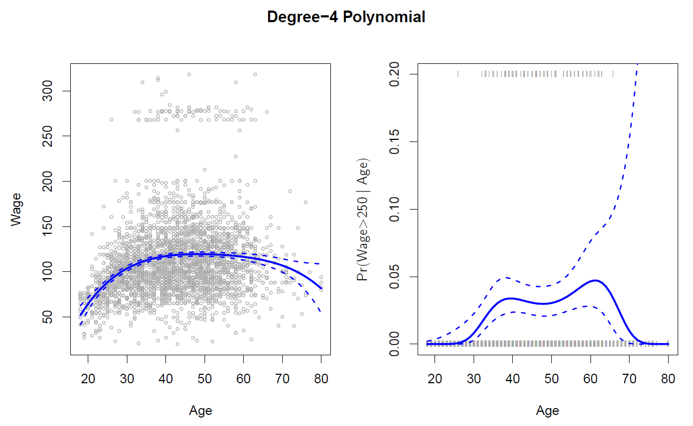
**图7.1**：*`Wage` 数据。左图：实线蓝色曲线是使用最小二乘法拟合的四次多项式，表示工资（以千美元为单位）与年龄的关系。虚线曲线表示估计的95%置信区间。右图：我们使用逻辑回归模型二元事件“工资 > 250”的概率，同样基于四次多项式。蓝色曲线表示工资超过25万美元的拟合后验概率，虚线表示估计的95%置信区间。*

在图7.1中，拟合曲线伴随着一对虚线曲线，这些是（2倍）标准误差曲线。接下来看看它们是如何得出的。假设我们在某个特定的年龄值 $x_0$ 计算了拟合值：  
$$
\hat{f}(x_0) = \hat{\beta}_0 + \hat{\beta}_1x_0 + \hat{\beta}_2x_0^2 + \hat{\beta}_3x_0^3 + \hat{\beta}_4x_0^4 \quad (7.2)
$$  
那么拟合值的方差，即 $\text{Var}(\hat{f}(x_0))$，是多少？最小二乘法会返回每个拟合系数 $\hat{\beta}_j$ 的方差估计值，以及系数估计值之间成对的协方差。我们可以利用这些信息计算 $\hat{f}(x_0)$ 的方差估计值。其点估计标准误差是该方差的平方根。我们在每个参考点 $x_0$ 上重复这一计算，并绘制拟合曲线，同时在拟合曲线两侧绘制两倍标准误差。绘制两倍标准误差的原因是，对于正态分布的误差项，这一数量对应于一个近似的95%置信区间。

从图7.1中可以看出，工资数据似乎来自两个不同的人群：一个是年收入超过25万美元的高收入人群，另一个是低收入人群。我们可以通过将工资分为这两组，将其视为一个二元变量。然后，可以使用逻辑回归来预测这一二元响应，采用年龄的多项式函数作为预测变量。换句话说，我们拟合以下模型：  
$$
\text{Pr}(y_i > 250|x_i) = \frac{\exp(\beta_0 + \beta_1x_i + \beta_2x_i^2 + \cdots + \beta_dx_i^d)}{1 + \exp(\beta_0 + \beta_1x_i + \beta_2x_i^2 + \cdots + \beta_dx_i^d)} \quad (7.3)
$$  
右图展示了这一结果。面板顶部和底部的灰色标记表示高收入者和低收入者的年龄分布。实线蓝色曲线表示作为年龄函数的高收入概率的拟合值，同时显示了估计的95%置信区间。可以看到，置信区间相当宽，尤其是在右侧。尽管此数据集的样本量相当大（$n = 3000$），但高收入人群仅有79人，这导致系数估计的方差较高，从而置信区间较宽。

## 7.2 Step Functions
在线性模型中使用特征的多项式函数作为预测变量，会在 $X$ 的非线性函数上施加一个全局结构。为了避免施加这样的全局结构，我们可以改用 **阶跃函数（step functions）**。在这种方法中，我们将 $X$ 的范围划分为若干区间，并在每个区间内拟合一个不同的常数。这相当于将一个连续变量转换为一个 **有序的分类变量(ordered categorical variable)**。

更具体地说，我们在 $X$ 的范围内创建若干切分点 $c_1, c_2, \ldots, c_K$，然后构造 $K+1$ 个新变量：  
$$
C_0(X) = I(X < c_1), \\
C_1(X) = I(c_1 \leq X < c_2), \\
C_2(X) = I(c_2 \leq X < c_3), \\
\vdots\\
C_{K-1}(X) = I(c_{K-1} \leq X < c_K), \\
C_K(X) = I(c_K \leq X),\tag{7.4}
$$
其中，$I(\cdot)$ 是一个 **指示函数(indicator function)**，当条件为真时返回1，否则返回0。例如，当 $c_K \leq X$ 时，$I(c_K \leq X)$ 的值为1，否则为0。这些变量有时被称为 **哑变量（dummy variables）**。注意，对于任何值的 $X$，都有 $C_0(X) + C_1(X) + \cdots + C_K(X) = 1$，因为 $X$ 必定位于 $K+1$ 个区间中的某一个。

然后，我们使用最小二乘法，以 $C_1(X), C_2(X), \ldots, C_K(X)$ 作为预测变量来拟合一个线性模型：  
$$
y_i = \beta_0 + \beta_1C_1(x_i) + \beta_2C_2(x_i) + \cdots + \beta_KC_K(x_i) + \epsilon_i \quad (7.5)
$$

对于给定的 $X$ 值，在 $C_1, C_2, \ldots, C_K$ 中，至多只有一个变量可以为非零。注意，当 $X < c_1$ 时，公式 (7.5) 中的所有预测变量均为零，因此 $\beta_0$ 可以解释为 $X < c_1$ 时 $Y$ 的平均值。相比之下，公式 (7.5) 在 $c_j \leq X < c_{j+1}$ 时预测的响应值为 $\beta_0 + \beta_j$，因此 $\beta_j$ 表示 $X$ 在区间 $c_j \leq X < c_{j+1}$ 相对于 $X < c_1$ 的平均响应增量。

图 7.2 左图展示了将阶跃函数拟合到图 7.1 中 Wage 数据的一个例子。同时，我们拟合了以下逻辑回归模型：  
$$
Pr(y_i > 250 | x_i) = \frac{\exp(\beta_0 + \beta_1C_1(x_i) + \cdots + \beta_KC_K(x_i))}{1 + \exp(\beta_0 + \beta_1C_1(x_i) + \cdots + \beta_KC_K(x_i))}  
$$
以根据年龄预测某人是高收入者的概率。图 7.2 右图显示了使用这种方法获得的拟合后验概率。

然而，除非预测变量中存在自然的断点，分段常数函数可能无法准确捕捉数据趋势。例如，在图 7.2 左图中，第一个区间显然没有反映出工资随年龄增长的上升趋势。尽管如此，阶跃函数方法在生物统计学和流行病学等学科中非常流行。例如，5 年年龄组通常被用来定义区间。

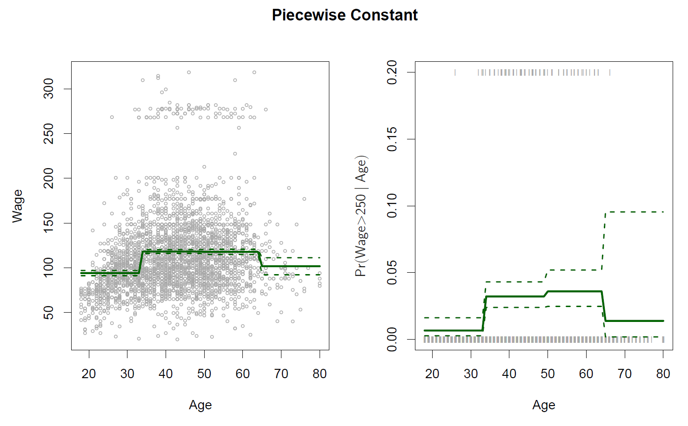
**图 7.2**：*`Wage` 数据集。左图：实线曲线显示了使用年龄的阶跃函数进行最小二乘回归所拟合的工资值（单位为千美元）。虚线表示估计的 95% 置信区间。右图：我们使用逻辑回归对二元事件 $\text{wage} > 250$ 进行建模，同样基于年龄的阶跃函数。图中显示了工资超过 25 万美元的拟合后验概率以及估计的 95% 置信区间。*

## 7.3 Basis Functions
多项式回归和分段常数回归模型实际上是基函数方法的特殊情况。**基函数(basis function)**方法的核心思想是预先定义一组可以应用于变量 $X$ 的函数或变换：$b_1(X), b_2(X), \ldots, b_K(X)$。我们不是对 $X$ 拟合线性模型，而是拟合如下模型：  
$$
y_i = \beta_0 + \beta_1b_1(x_i) + \beta_2b_2(x_i) + \beta_3b_3(x_i) + \cdots + \beta_Kb_K(x_i) + \epsilon_i
$$  

请注意，基函数 $b_1(\cdot), b_2(\cdot), \ldots, b_K(\cdot)$ 是固定且已知的（换句话说，我们需要提前选择这些函数）。  
对于多项式回归，基函数为 $b_j(x_i) = x_i^j$，而对于分段常数函数，它们为 $b_j(x_i) = I(c_j \leq x_i < c_{j+1})$。  
我们可以将 (7.7) 看作是标准的线性模型，其中预测变量是 $b_1(x_i), b_2(x_i), \ldots, b_K(x_i)$。因此，可以使用最小二乘法估计模型中未知的回归系数。  

重要的是，这意味着线性模型的所有推断工具，例如第 3 章中讨论的系数估计的标准误差和模型整体显著性的 $F$-统计量，也可以在此情境中使用。  

到目前为止，我们已经考虑了将多项式函数和分段常数函数用作基函数；然而，还可以选择许多其他方法。例如，可以使用小波或傅里叶级数来构建基函数。  
在下一节中，我们将研究一种非常常见的基函数选择：**回归样条函数（regression splines）**。

## 7.4 Regression Splines
现在我们讨论一类灵活的基函数，它扩展了我们刚刚看到的多项式回归和分段常数回归方法。

### 7.4.1 Piecewise Polynomials
与在整个X范围内拟合高阶多项式不同，**分段多项式回归(piecewise polynomial regression)**涉及在X的不同区域内拟合独立的低阶多项式。例如，分段三次多项式通过拟合一个三次回归模型来工作，形式为：

$$ y_i = \beta_0 + \beta_1x_i + \beta_2x_i^2 + \beta_3x_i^3 + \epsilon_i \quad (7.8) $$

其中，系数$\beta_0$、$\beta_1$、$\beta_2$、$\beta_3$在X的不同部分不同。系数变化的点被称为 **“结点”（knots）**。例如，若没有结点，分段三次多项式就只是一个标准的三次多项式，如（7.1）中的$d=3$。一个在点$c$处有单个结点的分段三次多项式的形式为：

$$
y_i = 
\begin{cases}
\beta_0^1 + \beta_1^1x_i + \beta_2^1x_i^2 + \beta_3^1x_i^3 + \epsilon_i & \text{if } x_i < c \\
\beta_0^2 + \beta_1^2x_i + \beta_2^2x_i^2 + \beta_3^2x_i^3 + \epsilon_i & \text{if } x_i \geq c
\end{cases}
$$

换句话说，我们对数据拟合两个不同的多项式函数，一个适用于$x_i < c$的观察子集，另一个适用于$x_i \geq c$的观察子集。第一个多项式函数有系数$\beta_0^1$、$\beta_1^1$、$\beta_2^1$和$\beta_3^1$，第二个有系数$\beta_0^2$、$\beta_1^2$、$\beta_2^2$和$\beta_3^2$。这些多项式函数中的每一个都可以通过对原始预测变量的简单函数应用最小二乘法来拟合。

使用更多结点会导致更灵活的分段多项式。一般来说，如果我们在X的范围内放置K个不同的结点，那么我们将最终拟合K+1个不同的三次多项式。注意，我们不必非得使用三次多项式。例如，我们可以改为拟合分段线性函数。实际上，我们在第7.2节中的分段常数函数就是分段多项式（度为0）！

图7.3的左上角面板显示了对Wage数据子集进行分段三次多项式拟合，且在年龄=50处有一个结点。我们立刻发现了一个问题：该函数是不连续的，看起来很荒谬！由于每个多项式有四个参数，我们在拟合这个分段多项式模型时总共使用了八个**自由度(degrees of freedom)**。
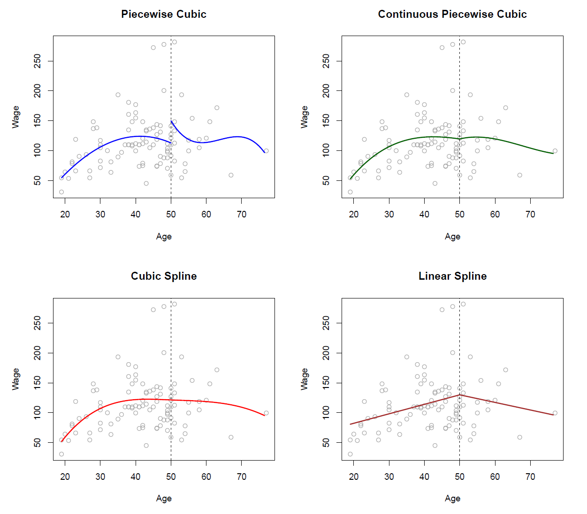
**图7.3.** *各种分段多项式被拟合到 `Wage` 数据的一个子集，其中在年龄=50处设置了一个节点。左上：立方多项式是无限制的。右上：立方多项式被约束为在年龄=50处连续。左下：立方多项式被约束为连续，并且具有连续的一阶和二阶导数。右下：显示了一个线性样条，它被约束为连续。*

### 7.4.2 Constraints and Splines
图7.3的左上图看起来不对，因为拟合曲线过于灵活。为了解决这个问题，我们可以拟合一个分段多项式，要求拟合曲线必须是连续的。换句话说，在年龄=50时不能出现跳跃。图7.3的右上图显示了得到的拟合结果。这比左上图好，但V形的连接看起来不自然。

在左下图中，我们增加了两个额外的约束条件：现在分段多项式的第一和第二导数在年龄=50时也是连续的。换句话说，我们要求分段多项式不仅在年龄=50时是连续的，而且非常平滑。我们对分段立方多项式施加的每个约束都有效地减少了拟合的自由度，从而减少了分段多项式拟合的复杂度。因此，在左上图中，我们使用了8个自由度，而在左下图中，我们施加了三个约束（连续性、第一导数的连续性和第二导数的连续性），因此只剩下5个自由度。左下图中的曲线被称为**立方样条(cubic spline)**。一般来说，一个具有K个节点的立方样条使用总共4+K个自由度。

在图7.3的的右下图中，显示的是一个**线性样条(linear spline)**，它在年龄=50时是连续的。度数为d的样条的一般定义是：它是一个分段d次多项式，在每个节点处导数的连续性达到d-1。因此，线性样条是通过在由节点定义的预测空间的每个区域拟合一条直线，要求在每个节点处连续。

在图7.3中，只有一个节点在年龄=50。我们当然可以添加更多的节点，并要求每个节点处连续。

### 7.4.3 The Spline Basis Representation
我们在上一节看到的回归样条可能看起来有些复杂：我们如何在约束条件下拟合一个分段d次多项式，使其（以及可能是它的前d-1阶导数）保持连续呢？实际上，我们可以使用基函数模型（7.7）来表示回归样条。一个具有K个节点的立方样条可以表示为：

$$
y_i = \beta_0 + \beta_1b_1(x_i) + \beta_2b_2(x_i) + \cdots + \beta_{K+3}b_{K+3}(x_i) + \epsilon_i, \quad (7.9)
$$

其中，基函数 $b_1, b_2, \dots, b_{K+3}$ 的选择是合适的。然后可以使用最小二乘法拟合模型（7.9）。

正如表示多项式有多种方式一样，使用不同选择的基函数，也有许多等价的方式来表示立方样条。在（7.9）中，表示立方样条的最直接方法是从一个立方多项式的基开始——即 $x, x^2, x^3$，然后为每个节点添加一个**截断幂基函数(truncated power basis)**。截断幂基函数定义为：

$$
h(x, \xi) = (x - \xi)_+^3 =
\begin{cases}
(x - \xi)^3 & \text{if } x > \xi \\
0 & \text{otherwise}
\end{cases}
\quad (7.10)
$$

其中，$\xi$ 是节点。可以证明，将形如 $\beta_4 h(x, \xi)$ 的项添加到立方多项式的模型（7.8）中，将只在节点处导致第三导数的间断；该函数将在每个节点处保持连续，并且第一和第二导数也是连续的。

换句话说，为了拟合一个具有K个节点的数据集的立方样条，我们执行最小二乘回归，包含一个截距和3+K个预测变量，形式为 $X, X^2, X^3, h(X, \xi_1), h(X, \xi_2), \dots, h(X, \xi_K)$，其中 $\xi_1, \dots, \xi_K$ 是节点。这相当于估计总共 K + 4 个回归系数；因此，拟合一个具有K个节点的立方样条使用了K + 4 个自由度。

不幸的是，样条在预测变量的外部范围内可能具有较高的方差——即当 $X$ 取非常小或非常大的值时。图7.4展示了一个使用三个节点拟合的Wage数据。我们看到边界区域的置信带看起来相当不稳定。**自然样条(natural spline)** 是具有附加边界约束的回归样条：要求在边界处（在X小于最小节点或大于最大节点的区域内）函数是线性的。这一附加约束意味着自然样条通常在边界处产生更稳定的估计。在图7.4中，红线显示了一个自然立方样条。请注意，相应的置信区间更窄。

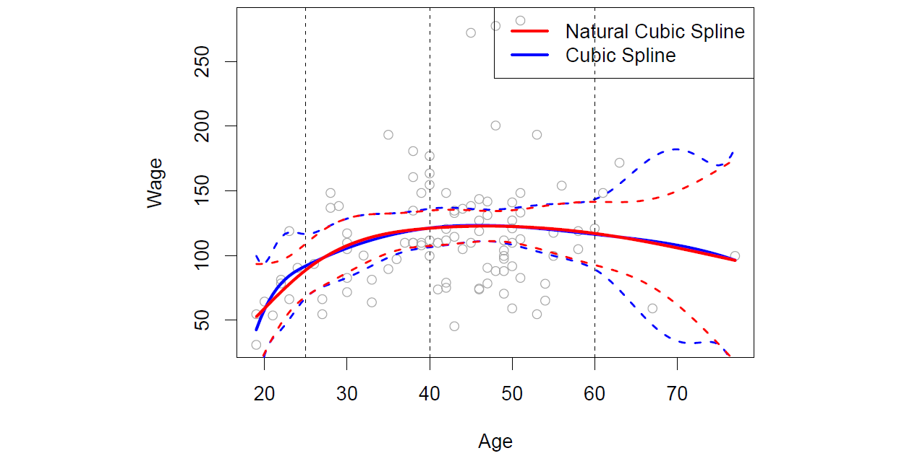
**图7.4.** *一个立方样条和一个自然立方样条，具有三个节点，拟合到Wage数据的一个子集。虚线表示节点位置。*

### 7.4.4 Choosing the Number and Locations of the Knots
在拟合样条时，应该将节点放在哪里呢？回归样条在包含较多节点的区域最灵活，因为在这些区域中多项式系数可以快速变化。因此，一种选择是在函数可能变化最迅速的地方放置更多的节点，而在看起来较稳定的地方放置较少的节点。尽管这种方法可能效果很好，但在实践中通常更常见的是以均匀的方式放置节点。一种实现方式是指定所需的自由度，然后由软件自动将相应数量的节点放置在数据的均匀分位数位置上。

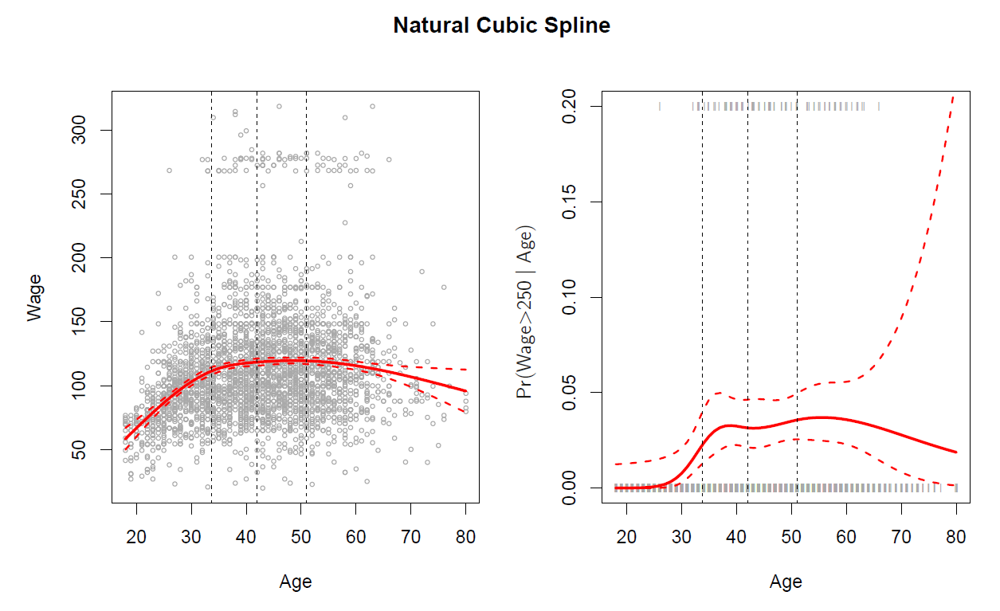
**图7.5** *一个具有四个自由度的自然立方样条函数拟合于 `Wage` 数据。左图：样条拟合工资（以千美元为单位）与年龄的关系。右图：使用逻辑回归模型拟合二元事件`wage>250`与年龄的关系，展示了工资超过25万美元的后验概率拟合值。虚线表示节点位置。*

图7.5展示了一个关于 Wage 数据的例子。与图7.4类似，我们拟合了一个具有三个节点的自然立方样条，不过这次节点位置是自动选择的，分别为年龄的第25、第50和第75百分位。这是通过指定四个自由度来实现的。关于四个自由度如何对应三个内部节点的解释稍显技术性。

我们应该使用多少个节点，或者说样条应该包含多少个自由度？一种选择是尝试不同数量的节点，看看哪种曲线看起来最好。一种更客观的方法是使用交叉验证，这在第5章和第6章中讨论过。使用该方法时，我们移除部分数据（比如10%），用剩余的数据拟合一个具有特定数量节点的样条，然后使用样条对被移除的部分进行预测。我们多次重复这个过程，直到每个观测值都被移除过一次，然后计算总体的交叉验证残差平方和（RSS）。这一过程可以针对不同数量的节点 $K$ 重复进行。最终选择能使 RSS 最小的 $K$ 值。

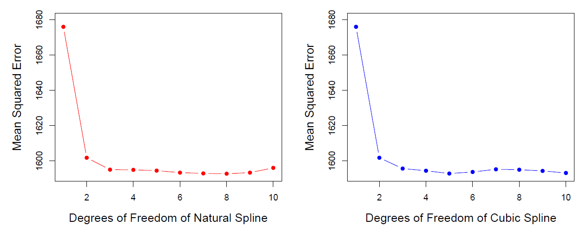
**图7.6** *十折交叉验证均方误差，用于选择在 `Wage` 数据上拟合样条时的自由度。响应变量为工资（wage），预测变量为年龄（age）。左图：自然立方样条。右图：立方样条。*

图7.6展示了在 Wage 数据上对不同自由度样条进行拟合的十折交叉验证均方误差（MSE）。左图对应自然立方样条，右图对应立方样条。这两种方法的结果几乎相同，并且明确表明一度拟合（线性回归）不够充分。两条曲线迅速趋于平稳，表明自然样条使用三个自由度、立方样条使用四个自由度已足够。
在第7.7节中，我们同时对多个变量拟合加性样条模型。这可能需要为每个变量选择自由度。在这种情况下，我们通常采用更务实的方法，为所有项统一设定一个固定的自由度，例如四个自由度。

### 7.4.5 Comparison to Polynomial Regression
图7.7比较了在 Wage 数据集上使用 15 自由度的自然立方样条与 15 次多项式。多项式的额外灵活性在边界处产生了不理想的结果，而自然立方样条仍然对数据提供了合理的拟合。回归样条通常比多项式回归产生更好的结果。这是因为多项式为了实现灵活的拟合，必须使用高次（例如 $X^{15}$ 的最高幂次项），而样条通过增加节点数量来引入灵活性，同时保持次数固定。通常，这种方法能产生更稳定的估计。此外，样条允许在函数 $f$ 变化迅速的区域放置更多节点，从而增加灵活性，而在 $f$ 较稳定的区域放置更少节点。
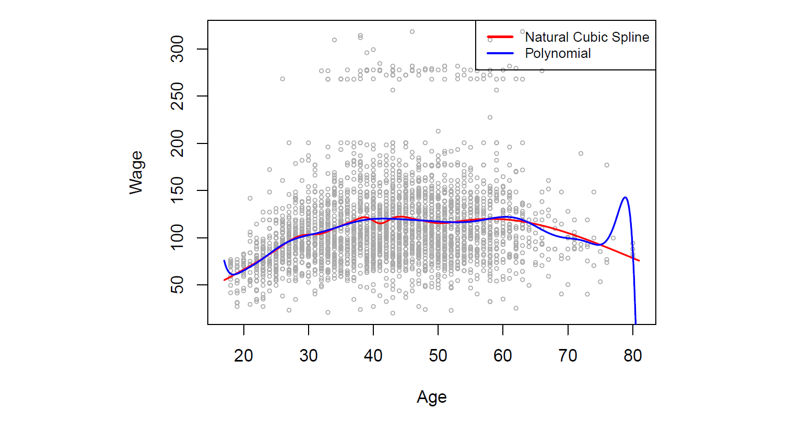
**图7.7** *在 Wage 数据集中比较了具有 15 自由度的自然立方样条和 15 次多项式。多项式可能表现出剧烈的波动，尤其是在尾部区域。*

## 7.5 Smoothing Splines
在上一节中，我们讨论了回归样条，其通过指定一组节点生成一系列基函数，然后使用最小二乘法估计样条系数。现在，我们将介绍一种稍有不同的方法，它同样可以生成样条。
### 7.5.1 An Overview of Smoothing Splines
在为一组数据拟合平滑曲线时，我们的目标是找到一个函数，例如 $g(x)$，使其能够很好地拟合观察到的数据：也就是说，我们希望残差平方和 $\text{RSS} = \sum_{i=1}^n (y_i - g(x_i))^2$ 尽可能小。然而，这种方法存在一个问题：如果对 $g(x)$ 没有任何约束，我们总能通过选择 $g$ 使其插值所有的 $y_i$ 来让 RSS 等于零。然而，这样的函数会严重过拟合数据——它会显得过于灵活。我们真正想要的是一个能够让 RSS 较小，同时保持平滑的函数 $g$。

那么，如何确保 $g$ 是平滑的呢？有多种方法可以实现这一点。一种自然的方式是找到能够最小化以下表达式的函数 $g$：  
$$
\sum_{i=1}^n (y_i - g(x_i))^2 + \lambda \int \left(g''(t)\right)^2 dt \quad(7.11)
$$  
其中，$\lambda$ 是一个非负的调节参数。能够最小化该表达式的函数 $g$ 被称为 **平滑样条（smoothing spline）**。

公式 (7.11) 的含义是什么？公式 (7.11) 采用了类似于第6章中岭回归（ridge regression）和套索回归（lasso）中提到的“损失+惩罚”形式。其中，$\sum_{i=1}^n (y_i - g(x_i))^2$ 是 **损失函数(loss function)**，用于鼓励 $g$ 能很好地拟合数据；而 $\lambda \int g''(t)^2 dt$ 是惩罚项，用于惩罚 $g$ 中的变化性。符号 $g''(t)$ 表示函数 $g$ 的二阶导数。  

一阶导数 $g'(t)$ 测量的是函数在 $t$ 处的斜率，二阶导数对应的是斜率变化的程度。因此，从广义上讲，函数的二阶导数可以看作其“粗糙度”（roughness）的度量：如果 $g(t)$ 在 $t$ 附近的波动很大，二阶导数的绝对值会很大；如果 $g(t)$ 较为平稳，二阶导数则接近于零。（直线的二阶导数为零，说明直线是完全平滑的。）

符号 $\int$ 表示积分，可以将其理解为对 $t$ 的整个范围内进行的求和。换句话说，$\int g''(t)^2 dt$ 是对 $g'(t)$ 的总变化的度量。如果 $g$ 非常平滑，那么 $g'(t)$ 将接近常数，从而 $\int g''(t)^2 dt$ 的值会很小。相反，如果 $g$ 波动较大且变化显著，那么 $\int g''(t)^2 dt$ 的值会很大。  

因此，在公式 (7.11) 中，$\lambda \int g''(t)^2 dt$ 鼓励 $g$ 保持平滑。值越大，函数 $g$ 就会越平滑。

当 $\lambda = 0$ 时，公式 (7.11) 中的惩罚项不起作用，因此函数 $g$ 将会非常不平滑，完全插值训练观测点。当 $\lambda \to \infty$ 时，$g$ 将会完全平滑——它会成为一条尽可能接近训练点的直线。实际上，在这种情况下，$g$ 就是线性最小二乘拟合的直线，因为公式 (7.11) 中的损失函数等价于最小化残差平方和。当 $\lambda$ 取一个中间值时，$g$ 会近似拟合训练观测点，同时保持一定的平滑性。可以看出，$\lambda$ 控制了平滑样条中的偏差-方差权衡。

可以证明，最小化公式 (7.11) 的函数 $g(x)$ 具有一些特殊的性质：它是一个分段三次多项式，节点位于 $x_1, x_2, \ldots, x_n$ 的唯一取值处，并且在每个节点处具有连续的一阶和二阶导数。此外，在最外侧节点范围之外的区域，$g(x)$ 是线性的。换句话说，最小化公式 (7.11) 的函数 $g(x)$ 是一个以 $x_1, x_2, \ldots, x_n$ 为节点的自然三次样条！然而，它并不是 7.4.3 节中描述的使用基函数方法生成的自然三次样条，而是这种自然三次样条的收缩版本，其中公式 (7.11) 中调节参数 $\lambda$ 的值控制了收缩的程度。

### 7.5.2 Choosing the Smoothing Parameter $\lambda$
我们已经看到，平滑样条实际上就是一个自然三次样条，节点位于每个唯一的 $x_i$ 值处。看起来平滑样条的自由度可能太多，因为在每个数据点上都有一个节点，这提供了极大的灵活性。但调节参数 $\lambda$ 控制着平滑样条的粗糙度，因此控制了 **有效自由度(effective degrees of freedom)**。可以证明，随着 $\lambda$ 从 0 增加到 $\infty$，有效自由度（我们写作 $df_\lambda$）从 $n$ 下降到 2。

在平滑样条的背景下，为什么我们讨论的是有效自由度，而不是普通的自由度？通常，自由度指的是自由参数的数量，比如在多项式或三次样条中拟合的系数数量。尽管平滑样条有 $n$ 个参数，因此有 $n$ 个名义自由度，但这些 $n$ 个参数受到强约束或收缩。因此，$df_\lambda$ 是平滑样条灵活性的度量——它越大，平滑样条越灵活（偏差较低，但方差较高）。有效自由度的定义有些技术性。我们可以写成：

$$
\hat{g}_\lambda = S_\lambda y, \tag{7.12}
$$

其中 $\hat{g}_\lambda$ 是公式 (7.11) 对于特定选择的 $\lambda$ 的解——即，它是一个包含训练点 $x_1, \ldots, x_n$ 上平滑样条拟合值的 $n$-维向量。公式 (7.12) 表示，应用平滑样条拟合数据时，拟合值的向量可以写成一个 $n \times n$ 矩阵 $S_\lambda$（它有一个公式）乘以响应向量 $y$。然后，有效自由度定义为：

$$
df_\lambda = \sum_{i=1}^{n} \{S_\lambda\}_{ii}, \tag{7.13}
$$

即矩阵 $S_\lambda$ 的对角线元素之和。

在拟合平滑样条时，我们不需要选择节点的数量或位置——每个训练观察点 $x_1, \ldots, x_n$ 都会有一个节点。相反，我们面临另一个问题：我们需要选择 $\lambda$ 的值。毫不奇怪，这个问题的一种可能解决方案是交叉验证。换句话说，我们可以找到使交叉验证的RSS最小化的 $\lambda$ 值。事实证明，平滑样条的留一交叉验证误差（LOOCV）可以非常高效地计算，几乎与计算单次拟合的成本相同，使用以下公式：

$$
\text{RSS}_{cv}(\lambda) = \sum_{i=1}^{n} (y_i - \hat{g}_{\lambda}^{(-i)}(x_i))^2 = \sum_{i=1}^{n} \left[ \frac{y_i -\hat{g}_{\lambda}(x_i)}{1 - \{S_\lambda\}_{ii}} \right]^2
$$

符号 $\hat{g}_{\lambda}^{(-i)}(x_i)$ 表示对平滑样条的拟合值，该拟合在除第 $i$ 个观察值 $(x_i, y_i)$ 以外的所有训练观察值上进行评估。相比之下，$\hat{g}_\lambda(x_i)$ 表示在所有训练观察值上拟合的平滑样条函数，并在 $x_i$ 处进行评估。这个惊人的公式表明，我们可以使用 $\hat{g}_\lambda$，即原始的全数据拟合，来计算每一个留一交叉验证拟合！我们在第5章的第205页中有一个非常相似的公式 (5.2)，用于最小二乘线性回归。使用 (5.2)，我们可以非常快速地执行该章节之前讨论的回归样条的LOOCV，也可以用于使用任意基函数的最小二乘回归。

图7.8显示了拟合平滑样条到工资数据的结果。红色曲线表示通过预先指定希望平滑样条具有16个有效自由度而得到的拟合。蓝色曲线是通过使用LOOCV选择 $\lambda$ 时得到的平滑样条；在这种情况下，选择的 $\lambda$ 值导致了6.8个有效自由度（使用公式 (7.13) 计算）。对于这组数据，两个平滑样条之间几乎没有可察觉的差异，除了具有16个自由度的曲线看起来稍微有些波动。由于这两种拟合之间几乎没有差异，因此具有6.8个自由度的平滑样条拟合更可取，因为通常情况下，除非数据提供证据支持更复杂的模型，否则较简单的模型更好。

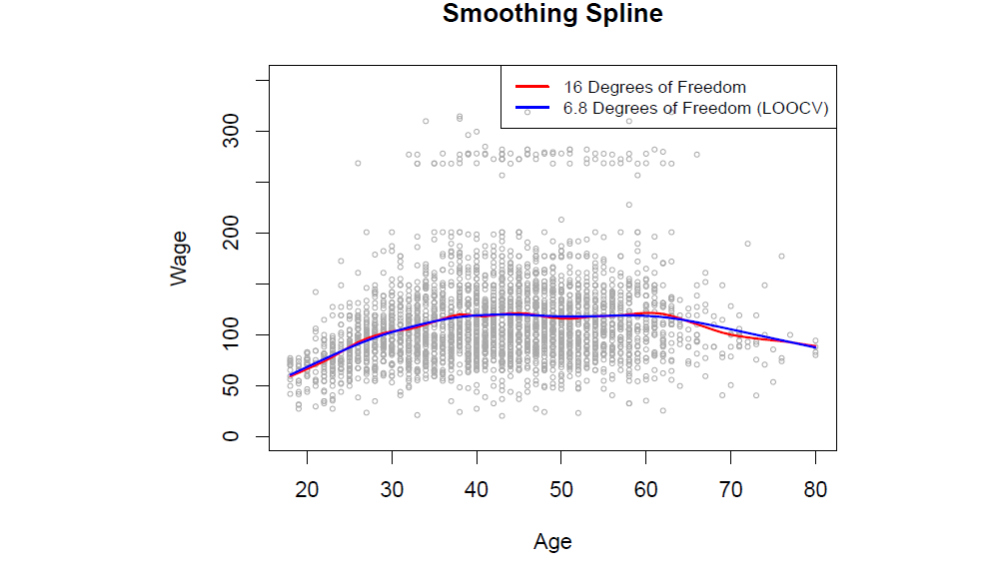
**图7.8**. *平滑样条拟合到工资数据。红色曲线是通过指定16个有效自由度得到的结果。蓝色曲线是通过留一交叉验证自动找到 $\lambda$ 后得到的拟合结果，最终结果为6.8个有效自由度。*

## 7.6 Local Regression
**局部回归(Local Regression)** 是一种拟合灵活非线性函数的不同方法，它涉及在目标点 $x_0$ 处仅使用附近的训练观察值来计算拟合。图 7.9 说明了这一思想，展示了一些模拟数据，其中一个目标点位于 0.4 附近，另一个位于 0.05 的边界附近。在该图中，蓝色线表示生成数据的函数 $f(x)$，而浅橙色线对应于局部回归估计 $\hat{f}(x)$。局部回归在算法 7.1 中进行了描述。

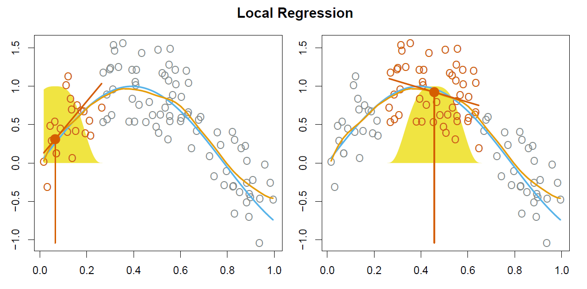
**图 7.9** *局部回归在一些模拟数据上的示例，其中蓝色曲线表示生成数据的函数 $f(x)$，而浅橙色曲线对应于局部回归估计 $\hat{f}(x)$。橙色点是相对于目标点 $x_0$ 的，目标点由橙色垂直线表示。叠加在图上的黄色钟形曲线表示分配给每个点的权重，随着距离目标点的增加而减小至零。在 $x_0$ 处的拟合 $\hat{f}(x_0)$ 是通过拟合加权线性回归（橙色线段）获得的，并使用在 $x_0$ 处的拟合值（橙色实心点）作为估计 $\hat{f}(x_0)$。*

**算法 7.1 $X = x_0$ 处的局部回归**

1. 收集与 $x_0$ 最近的训练点的比例 $s = k/n$。
2. 为该邻域内的每个点分配权重 $K_{i0} = K(x_i, x_0)$，使得距离 $x_0$ 最远的点权重为零，最近的点权重最高。除了这 $k$ 个最近邻以外的所有点权重均为零。
3. 使用上述权重，对 $y_i$ 和 $x_i$ 进行加权最小二乘回归，找到 $\hat{\beta}_0$ 和 $\hat{\beta}_1$ 以最小化 

$$
\sum_{i=1}^{n} K_{i0}(y_i - \beta_0 - \beta_1 x_i)^2. \tag{7.14}
$$

4. 在 $x_0$ 处的拟合值为 $\hat{f}(x_0) = \hat{\beta}_0 + \hat{\beta}_1 x_0$。

请注意，在算法 7.1 的第 3 步中，权重 $K_{i0}$ 对于每个 $x_0$ 的值会有所不同。换句话说，为了在新点处获得局部回归拟合，我们需要通过最小化 (7.14) 来拟合一个新的加权最小二乘回归模型，并使用一组新的权重。局部回归有时被称为基于记忆的过程，因为与最近邻方法类似，每次我们希望计算预测时都需要所有的训练数据。我们在这里避免深入局部回归的技术细节——关于这一主题有许多专门的书籍。

为了执行局部回归，需要做出一些选择，比如如何定义权重函数 $K$，以及在第 3 步中是拟合线性、常数还是二次回归。（公式 7.14 对应于线性回归。）虽然所有这些选择都会产生一些差异，但最重要的选择是跨度 $s$，它是用于计算 $x_0$ 处局部回归的点的比例，如上面第 1 步所定义。跨度的作用类似于平滑样条中的调节参数 $\lambda$：它控制非线性拟合的灵活性。$s$ 的值越小，拟合就越局部且波动越大；相反，$s$ 的值非常大将导致使用所有训练观察值对数据进行全局拟合。我们可以再次使用交叉验证来选择 $s$，或者直接指定它。图 7.10 显示了在 `Wage` 数据上的局部线性回归拟合，使用了两个 $s$ 的值：0.7 和 0.2。正如预期的那样，使用 $s = 0.7$ 得到的拟合比使用 $s = 0.2$ 得到的拟合更平滑。

局部回归的思想可以通过多种方式进行推广。在多特征 $X_1, X_2, \ldots, X_p$ 的设置中，一个非常有用的推广涉及拟合一个在某些变量上是全局的线性回归模型，而在另一些变量（例如时间）上是局部的。这种变系数模型是一种有效的方法，用于将模型适应于最近收集的数据。当我们希望拟合在一对变量 $X_1$ 和 $X_2$ 上局部的模型时，局部回归也非常自然地推广。我们可以简单地使用二维邻域，并利用临近每个目标点的观察值在二维空间中拟合双变量线性回归模型。从理论上讲，相同的方法可以在更高维度中实现，使用拟合到 $p$ 维邻域的线性回归。然而，当 $p$ 远大于 3 或 4 时，局部回归的表现可能会很差，因为通常会有很少的训练观察值靠近 $x_0$。第 3 章讨论的最近邻回归在高维情况下也会遇到类似的问题。

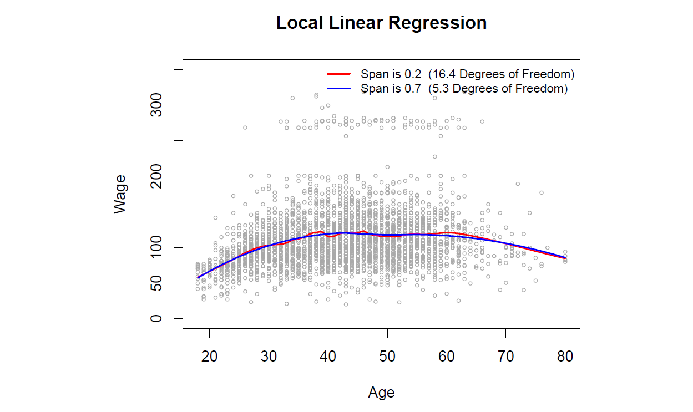
**图 7.10** *Wage 数据的局部线性拟合。跨度指定用于计算每个目标点拟合的数据的比例。*

## 7.7 Generalized Additive Models
在第 7.1–7.6 节中，我们介绍了多种基于单个预测变量 $X$ 灵活预测响应 $Y$ 的方法。这些方法可以视为简单线性回归的扩展。在这里，我们探讨基于多个预测变量 $X_1, \ldots, X_p$ 灵活预测 $Y$ 的问题。这相当于对多元线性回归的扩展。

**广义加性模型（GAMs）** 提供了一种扩展标准线性模型的通用框架，通过允许每个变量的非线性函数，同时保持 **可加性(additivity)**。与线性模型一样，GAMs 可以用于定量和定性响应。我们首先在第 7.7.1 节中研究定量响应的 GAMs，然后在第 7.7.2 节中研究定性响应的 GAMs。

### 7.7.1 GAMs for Regression Problems
一种自然的方式来扩展多元线性回归模型

$$
y_i = \beta_0 + \beta_1 x_{i1} + \beta_2 x_{i2} + \cdots + \beta_p x_{ip} + \epsilon_i
$$

以允许每个特征与响应之间的非线性关系，是将每个线性分量 $\beta_j x_{ij}$ 替换为一个（光滑的）非线性函数 $f_j(x_{ij})$。我们可以将模型写为

$$
y_i = \beta_0 + \sum_{j=1}^{p} f_j(x_{ij}) + \epsilon_i  \\
= \beta_0 + f_1(x_{i1}) + f_2(x_{i2}) + \cdots + f_p(x_{ip}) + \epsilon_i. \tag{7.15}
$$
这就是广义加性模型（GAM）的一个例子。它被称为加性模型，因为我们为每个 $X_j$ 计算一个单独的 $f_j$，然后将它们的所有贡献相加。

在第 7.1–7.6 节中，我们讨论了许多拟合单个变量函数的方法。GAM 的美在于我们可以将这些方法作为构建块来拟合加性模型。事实上，对于我们在本章中迄今为止看到的大多数方法，这可以相当简单地实现。例如，考虑自然样条，并考虑在 Wage 数据上拟合以下模型：

$$
\text{wage} = \beta_0 + f_1(\text{year}) + f_2(\text{age}) + f_3(\text{education}) + \epsilon. \tag{7.16}
$$

这里，year 和 age 是定量变量，而变量 education 是具有五个水平的定性变量：<HS、HS、<Coll、Coll、>Coll，指的是个体完成的高中或大学教育的程度。我们使用自然样条拟合前两个函数。我们通过第 3.3.1 节中的常规虚拟变量方法，为每个水平拟合第三个函数，使用各自的常数。

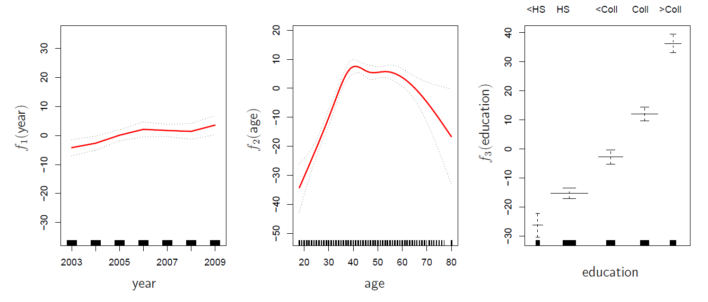
**图 7.11** *对于 Wage 数据，展示了拟合模型 (7.16) 中每个特征与响应工资之间的关系图。每个图展示了拟合函数和逐点标准误差。前两个函数是年份和年龄的自然样条，分别具有四个和五个自由度。第三个函数是一个阶跃函数，拟合于定性变量教育。*

图 7.11 显示了使用最小二乘法拟合模型 (7.16) 的结果。这很简单，因为正如第 7.4 节所讨论的，自然样条可以使用适当选择的一组基函数构造。因此，整个模型实际上就是一个大型回归，回归于样条基变量和虚拟变量，所有这些都被打包成一个大的回归矩阵。

图 7.11 的解读也很简单。左侧面板表明，在固定年龄和教育水平的情况下，工资随着年份的增加而略有上升；这可能是由于通货膨胀造成的。中间面板显示，在固定教育和年份的情况下，工资在中间年龄值时最高，而在非常年轻和非常老的人群中最低。右侧面板表明，在固定年份和年龄的情况下，工资随着教育水平的提高而增加：一个人的受教育程度越高，平均工资越高。这些发现都是直观的。

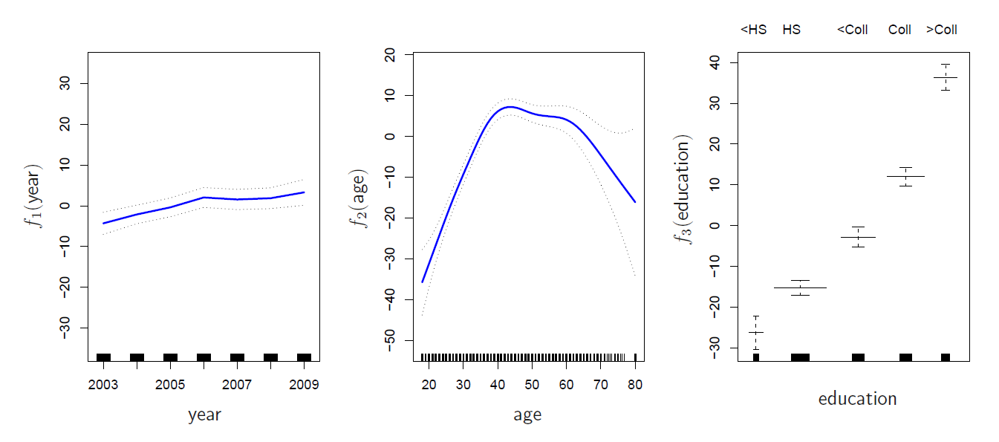
**图 7.12**。*细节与图 7.11 相同，但现在 $f_1$ 和 $f_2$ 是分别具有四个和五个自由度的平滑样条。*

图 7.12 显示了类似的三幅图，但这次 $f_1$ 和 $f_2$ 分别是具有四个和五个自由度的平滑样条。使用平滑样条拟合 GAM 并不像使用自然样条那么简单，因为在平滑样条的情况下，无法使用最小二乘法。然而，像 Python 包 `pygam` 这样的标准软件可以通过一种称为 **反拟合（backfitting）** 的方法来使用平滑样条拟合 GAM。这种方法涉及多个预测变量的模型，通过依次更新每个预测变量的拟合，并保持其他变量固定，来进行拟合。这种方法的优点在于，每次我们更新一个函数时，只需将该变量的拟合方法应用于一个部分残差。

图 7.11 和图 7.12 中的拟合函数看起来非常相似。在大多数情况下，使用平滑样条与自然样条获得的 GAM 之间的差异很小。

我们不必使用样条作为广义加性模型（GAM）的构建块：我们同样可以使用局部回归、多项式回归或本章前面看到的任何方法的组合来创建 GAM。GAM 在本章末的实验中将得到进一步的探讨。

#### GAM 的优缺点

在继续之前，让我们总结一下 GAM 的优点和局限性。

- **优点**：
  - GAM 允许我们为每个 $X_j$ 拟合非线性函数 $f_j$，从而自动建模标准线性回归无法捕捉到的非线性关系。这意味着我们不需要手动尝试对每个变量单独进行多种不同的变换。
  - 非线性拟合可能会为响应 $Y$ 提供更准确的预测。
  - 由于模型是可加的，我们可以在保持其他变量固定的情况下，单独检查每个 $X_j$ 对 $Y$ 的影响。
  - 对于变量 $X_j$ 的函数 $f_j$ 的平滑性可以通过自由度进行总结。

- **局限性**：
  - GAM 的主要限制是模型被限制为加性。对于许多变量，重要的交互作用可能会被忽视。然而，与线性回归一样，我们可以通过包含额外的预测变量形式 $X_j \times X_k$ 手动将交互项添加到 GAM 模型中。此外，我们还可以将低维交互函数 $f_{jk}(X_j, X_k)$ 添加到模型中；这些项可以使用二维平滑方法，如局部回归或二维样条进行拟合（这里未涉及）。

对于完全通用的模型，我们需要寻找更加灵活的方法，如第 8 章中描述的随机森林和提升法。GAM 在线性模型和完全非参数模型之间提供了一个有用的折中。

### 7.7.2 GAMs for Classification Problems
GAM 也可以用于响应 $Y$ 为定性的情况。为简单起见，这里我们假设 $Y$ 取值为 0 或 1，并令 $p(X) = \Pr(Y = 1 | X)$ 为给定预测变量时响应等于 1 的条件概率。回顾逻辑回归模型 (4.6)：

$$
\log\left(\frac{p(X)}{1 - p(X)}\right) = \beta_0 + \beta_1 X_1 + \beta_2 X_2 + \cdots + \beta_p X_p. \tag{7.17}
$$

左侧是 $P(Y = 1 | X)$ 与 $P(Y = 0 | X)$ 的赔率的对数，而 (7.17) 将该赔率表示为预测变量的线性函数。扩展 (7.17) 以允许非线性关系的自然方法是使用模型：

$$
\log\left(\frac{p(X)}{1 - p(X)}\right) = \beta_0 + f_1(X_1) + f_2(X_2) + \cdots + f_p(X_p). \tag{7.18}
$$

公式 7.18 是一个逻辑回归的 GAM。它具有与前一节中讨论的定量响应相同的优缺点。

我们对 `Wage` 数据拟合一个 GAM，以预测个体收入超过 $250,000 每年的概率。我们拟合的 GAM 形式为：

$$
\log\left(\frac{p(X)}{1 - p(X)}\right) = \beta_0 + \beta_1 \times \text{year} + f_2(\text{age}) + f_3(\text{education}), \tag{7.19}
$$

其中

$$
p(X) = \Pr(\text{wage} > 250 | \text{year}, \text{age}, \text{education}).
$$

再次，$f_2$ 使用具有五个自由度的平滑样条进行拟合，$f_3$ 作为阶跃函数拟合，通过为每个教育水平创建虚拟变量。得到的拟合结果如图 7.13 所示。最后一个面板看起来可疑，因为 <HS 的置信区间非常宽。实际上，该类别下没有响应值等于 1：没有受过高中教育以下的人每年收入超过 $250,000。因此，我们重新拟合 GAM，排除没有高中教育的个体。得到的模型如图 7.14 所示。如同图 7.11 和 7.12，所有三个面板具有相似的纵坐标尺度。这使我们能够直观评估每个变量的相对贡献。我们观察到，年龄和教育对高收入者的概率影响远大于年份。

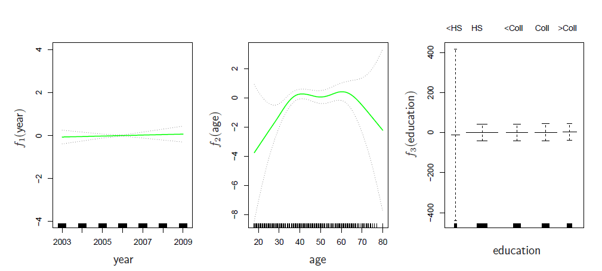
**图 7.13**。*对于 `Wage` 数据，逻辑回归 GAM (7.19) 被拟合到二元响应 $I(\text{wage} > 250)$。每个图展示了拟合函数和逐点标准误差。第一个函数是年份的线性函数，第二个函数是年龄的五个自由度的平滑样条，第三个函数是教育的阶跃函数。教育的第一水平 <HS 的标准误差非常宽。*
