# 8 Tree Based Methods
树方法

**原书：An Introduction to Statistical Learning_ with Applications in Python (Springer Texts in Statistics)-Springer (2023)**

[原书链接](https://www.statlearning.com/)

[课程配套网课（油管链接）](https://www.youtube.com/watch?v=LvySJGj-88U&list=PLoROMvodv4rPP6braWoRt5UCXYZ71GZIQ)，b站也有搬运视频可以自行搜索

**翻译：GPT，校对：Iridescence-ovo**

--------

在本章中，我们将介绍用于回归和分类的树基方法。这些方法通过将预测变量空间划分或分割成若干简单区域来实现。对于给定观测值的预测，通常使用该观测值所属区域内训练数据的平均值或众数作为预测值。由于用于分割预测变量空间的规则集可以用树的形式概括，因此这类方法被称为**决策树方法**。

树基方法简单且具有良好的解释性。然而，在预测精度方面，它们通常无法与第6章和第7章介绍的最佳监督学习方法相竞争。因此，本章还介绍了**袋装法**（bagging）、**随机森林**（random forests）、**提升法**（boosting）和**贝叶斯加性回归树**（Bayesian additive regression trees）。这些方法都涉及生成多个决策树，并将其结合以产生单一的综合预测。我们将看到，结合大量树的方法通常能够显著提高预测精度，但会以一定的解释性损失为代价。

## 8.1 The Basics of Decision Trees
决策树可以应用于回归和分类问题。我们首先讨论回归问题，然后再介绍分类问题。

### 8.1.1 Regression Trees
为了引入**回归树(regression tree)**，我们从一个简单的例子开始。

#### 使用回归树预测棒球运动员的薪水
我们使用`Hitters`数据集，根据球员的`Years`（他在大联盟打球的年数）和`Hits`（他在前一年打击的次数）来预测球员的薪水。我们首先去除缺失薪水值的观测值，并对薪水进行对数转换，使其分布更接近典型的钟形曲线（请记住，薪水是以千美元为单位测量的）。

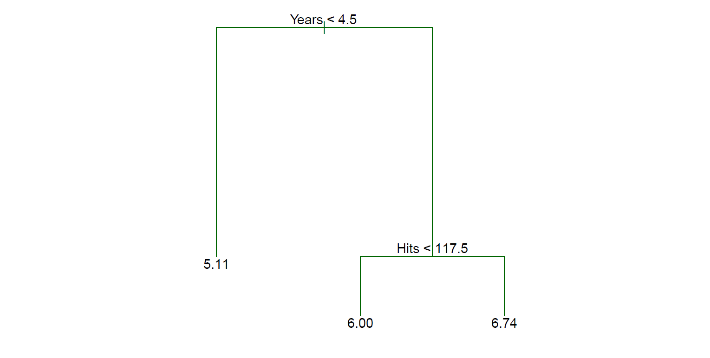
**图8.1** *对于Hitters数据集，基于球员在大联盟打球的年数和前一年打击的次数，预测球员对数薪水的回归树。在给定的内部节点上，标签（形式为 $X_j < t_k$）表示该分割的左分支，而右分支对应于 $X_j < t_k$。例如，树顶的分割结果形成两个大分支。左分支对应于 $Years < 4.5$，右分支对应于 $Years \geq 4.5$。该树有两个内部节点和三个终端节点（或叶子节点）。每个叶子节点中的数字是落在该节点上的观测值的响应均值。*

图8.1展示了一个拟合该数据的回归树。它由一系列的分割规则组成，从树的顶部开始。顶部的分割规则将`Years < 4.5`的观测值分配到左侧分支。对于这些球员，预测的薪水是该数据集中所有`Years < 4.5`球员的平均响应值。对于这类球员，薪水的对数平均值为 $5.107$，因此我们为这些球员预测的薪水是 $e^{5.107}$ 千美元，即 $165,174$。对于`Years >= 4.5`的球员，他们被分配到右侧分支，然后该组被进一步按Hits细分。总体而言，树将球员的预测空间分为三个区域：打了四年或更少的球员，打了五年或更多且去年打击次数少于118的球员，以及打了五年或更多且去年打击次数至少为118的球员。这三个区域可以写作：$R_1 =\{X | \text{Years} < 4.5\}$，$R_2 =\{X | \text{Years} \geq 4.5, \text{Hits} < 117.5\}$，$R_3 =\{X | \text{Years} \geq 4.5, \text{Hits} \geq 117.5\}$。图8.2展示了这些区域在“Years”和“Hits”上的函数关系。这三组的预测薪水分别为：$1,000×e^{5.107} = $165,174，$1,000×e^{5.999} = $402,834，$1,000×e^{6.740} = $845,346。

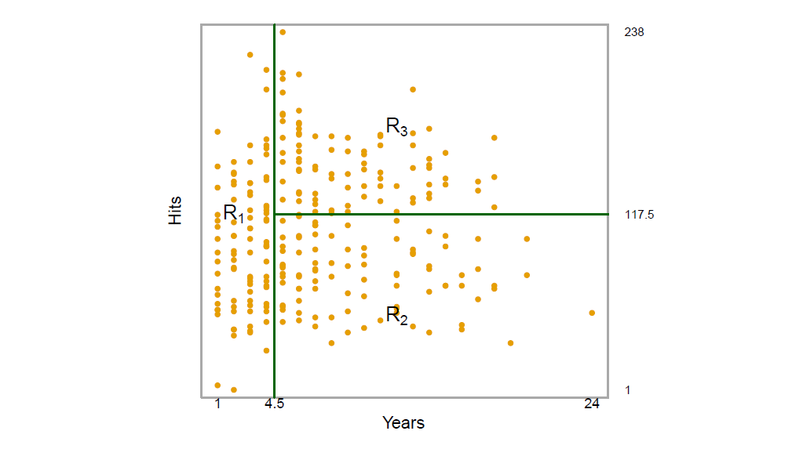
**图 8.2** *来自图 8.1 中回归树的 Hitters 数据集的三区域划分。*

遵循树的类比，$R_1$、$R_2$ 和 $R_3$ 被称为树的 **终端节点(terminal nodes)** 或 **叶子(leaves)**。正如图8.1所示，决策树通常是倒着绘制的，意味着叶子节点位于树的底部。树中分割预测空间的点被称为 **内部节点(internal nodes)**。在图8.1中，两个内部节点分别由文本 $\text{Years} < 4.5$ 和 $\text{Hits} < 117.5$ 表示。我们将连接这些节点的树的部分称为 **分支(branch)**。

我们可以将图8.1中显示的回归树解释如下：Years是决定薪水的最重要因素，经验较少的球员比经验更多的球员赚得少。考虑到一个球员经验较少，他在前一年打击的次数似乎对薪水影响不大。但在那些打了五年或更多的大联盟球员中，前一年打击的次数确实会影响薪水，去年打击更多的球员薪水也往往更高。图8.1中显示的回归树可能是Hits、Years和薪水之间真实关系的过度简化。然而，相较于其他类型的回归模型（如第3章和第6章中的模型），它具有更容易解释的优势，并且具有良好的图形表示。

#### Prediction via Stratification of the Feature Space
我们现在讨论构建回归树的过程。大致来说，有两个步骤。

我们将预测变量空间——也就是可能值的集合 \(X_1, X_2, \ldots, X_p\)——划分为 \(J\) 个不同且不重叠的区域 \(R_1, R_2, \ldots, R_J\)。对于每个落入区域 \(R_j\) 的观察值，我们做出相同的预测，这个预测值只是区域 \(R_j\) 内训练观察值响应值的均值。例如，假设在步骤 1 中我们获得了两个区域 \(R_1\) 和 \(R_2\)，并且第一个区域内训练观察值的响应均值为 10，而第二个区域内训练观察值的响应均值为 20。那么对于给定的观察值 \(X = x\)，如果 \(x \in R_1\)，我们将预测值为 10；如果 \(x \in R_2\)，我们将预测值为 20。

现在我们详细说明上述步骤 1。我们如何构建区域 \(R_1, \ldots, R_J\)？从理论上讲，这些区域可以具有任何形状。然而，为了简化和方便解释所得到的预测模型，我们选择将预测变量空间划分为高维矩形或盒子。目标是找到盒子 \(R_1, \ldots, R_J\)，使得残差平方和 (RSS) 最小化，该RSS由以下公式给出：

\[
\sum_{j=1}^{J} \sum_{i \in R_j} (y_i - \hat{y}_{R_j})^2 \tag{8.1}
\]

其中 \(\hat{y}_{R_j}\) 是第 \(j\) 个盒子内训练观察值的均值。遗憾的是，考虑特征空间的每一种可能划分为 \(J\) 个盒子在计算上是不可行的。因此，我们采取一种自上而下的贪婪方法，称为 **递归二元分割(recursive binary splitting)**。该方法之所以称为自上而下，是因为它从树的顶部开始（此时所有观察值都属于一个区域），然后不断地划分预测变量空间；每次分割通过树上的两个新分支进一步指示。它之所以称为贪婪，是因为在树构建过程的每一步中，都是在该特定步骤中进行最佳分割，而不是向前看并选择在某个未来步骤中能导致更好树的分割。

为了执行递归二元分割，我们首先选择预测变量 \(X_j\) 和切分点 \(s\)，使得将预测变量空间划分为区域 \(\{X \mid X_j < s\}\) 和 \(\{X \mid X_j \geq s\}\) 能够实现最大的残差平方和 (RSS) 降低。（符号 \(\{X \mid X_j < s\}\) 表示预测变量空间中 \(X_j\) 取值小于 \(s\) 的区域。）也就是说，我们考虑所有预测变量 \(X_1, \ldots, X_p\) 及其每个可能的切分点 \(s\)，然后选择使得生成的树具有最低 RSS 的预测变量和切分点。

更详细地，对于任意的 \(j\) 和 \(s\)，我们定义一对半平面：

\[
R_1(j, s) = \{X \mid X_j < s\} \quad \text{和} \quad R_2(j, s) = \{X \mid X_j \geq s\} \tag{8.2}
\]

我们寻求能够最小化以下公式的 \(j\) 和 \(s\) 的值：

\[
\sum_{i: x_i \in R_1(j,s)} (y_i - \hat{y}_{R_1})^2 + \sum_{i: x_i \in R_2(j,s)} (y_i - \hat{y}_{R_2})^2 \tag{8.3}
\]

其中 \(\hat{y}_{R_1}\) 是区域 \(R_1(j, s)\) 内训练观察值的均值，\(\hat{y}_{R_2}\) 是区域 \(R_2(j, s)\) 内训练观察值的均值。寻找能够最小化 (8.3) 的 \(j\) 和 \(s\) 的值可以相当快速地完成，特别是当特征数量 \(p\) 不太大时。

接下来，我们重复这个过程，寻找最佳的预测变量和最佳的切分点，以进一步划分数据，从而最小化每个生成区域内的 RSS。然而这一次，我们不再划分整个预测变量空间，而是划分之前识别出的两个区域之一。我们现在有三个区域。再次，我们寻找进一步划分这三个区域中的一个，以最小化 RSS。这个过程继续进行，直到达到停止标准；例如，我们可以继续直到没有区域包含超过五个观察值。

一旦区域 \(R_1, \ldots, R_J\) 被创建，我们就可以使用该区域内训练观察值的均值来预测给定测试观察值的响应。

该方法的一个五区域示例如图 8.3 所示。

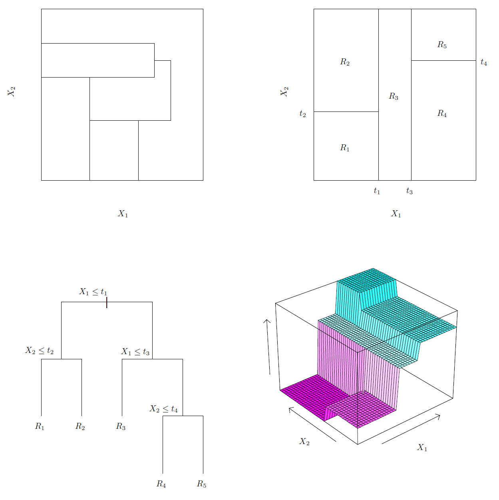
**图 8.3** *左上：一个二维特征空间的划分，该划分无法通过递归二元分割得到。右上：在一个二维示例上递归二元分割的结果。左下：与右上面板中的划分对应的树。右下：与该树对应的预测表面的透视图。*

#### Tree Pruning
上述过程可能在训练集上产生良好的预测，但很可能会导致过拟合，从而在测试集上表现不佳。这是因为生成的树可能过于复杂。一个较小的树，具有更少的分割（即更少的区域 \(R_1, \ldots, R_J\)），可能会有较低的方差和更好的解释能力，尽管代价是稍微增加一些偏差。上述过程的一个可能替代方案是，仅在每次分割所带来的 RSS 降低超过某个（较高）阈值时才构建树。这种策略将导致较小的树，但过于短视，因为树早期看似无价值的分割可能会被随后一个非常好的分割所跟随，即一个在后面带来较大 RSS 降低的分割。

因此，更好的策略是先构建一棵非常大的树 \(T_0\)，然后进行 **修剪(prune)** 以获得一个 **子树(subtree)**。我们如何确定最佳的修剪方式？直观上，我们的目标是选择一个导致最低测试误差率的子树。给定一个子树，我们可以使用交叉验证或验证集方法来估计其测试误差。然而，估计每个可能子树的交叉验证误差将是非常繁琐的，因为可能的子树数量极其庞大。因此，我们需要一种方法来选择一个小的子树集合进行考虑。

**成本复杂度修剪(Cost complexity pruning)**——也称为 **最弱环修剪(weakest link pruning)**——为我们提供了一种实现这一点的方法。我们不再考虑每个可能的子树，而是考虑由一个非负调节参数 \(\alpha\) 指定的一系列树。对于每个 \(\alpha\) 的值，都对应着一个子树 \(T \subset T_0\)，使得以下公式尽可能小：

\[
|T| \sum_{m=1}^{M} \sum_{i: x_i \in R_m} (y_i - \hat{y}_{R_m})^2 + \alpha |T| \tag{8.4}
\]

这里 \(|T|\) 表示树 \(T\) 的终端节点数量，\(R_m\) 是与第 \(m\) 个终端节点对应的矩形（即预测变量空间的子集），而 \(\hat{y}_{R_m}\) 是与 \(R_m\) 相关的预测响应，即在 \(R_m\) 中训练观察值的均值。调节参数 \(\alpha\) 控制子树的复杂性与其对训练数据拟合之间的权衡。当 \(\alpha = 0\) 时，子树 \(T\) 将等于 \(T_0\)，因为此时 (8.4) 仅测量训练误差。然而，随着 \(\alpha\) 的增加，树中终端节点较多将付出代价，因此 (8.4) 的值将倾向于在较小的子树上最小化。公式 (8.4) 让人想起第 6 章中的套索 (6.7)，在该章节中使用了类似的公式来控制线性模型的复杂性。

实际上，当我们将 \(\alpha\) 从零逐渐增加时，树的分支会以嵌套和可预测的方式被修剪，因此获取整个子树序列作为 \(\alpha\) 的函数是很简单的。我们可以使用验证集或交叉验证选择一个 \(\alpha\) 的值。然后我们返回到完整的数据集，并获得与 \(\alpha\) 对应的子树。这个过程在算法 8.1 中进行了总结。

**算法 8.1** 构建回归树

1. 使用递归二元分割在训练数据上构建一棵大树，仅在每个终端节点的观察值少于某个最小数量时停止。
2. 对大树应用成本复杂度修剪，以获得一系列最佳子树，作为 \(\alpha\) 的函数。
3. 使用 K 折交叉验证选择 \(\alpha\)。即，将训练观察值分成 K 份。对于每个 \(k = 1, \ldots, K\)：
   (a) 在除了第 \(k\) 份的训练数据上重复步骤 1 和 2。
   (b) 评估在被遗留的第 \(k\) 份数据上的均方预测误差，作为 \(\alpha\) 的函数。
   对每个 \(\alpha\) 的值平均结果，并选择使平均误差最小的 \(\alpha\)。
4. 返回步骤 2 中与所选 \(\alpha\) 值对应的子树。

图 8.4 和 8.5 显示了在 `Hitters` 数据上拟合和修剪回归树的结果，使用了九个特征。首先，我们将数据集随机分为两半，得到 132 个观察值在训练集，131 个观察值在测试集中。然后，我们在训练数据上构建了一棵大回归树，并在公式 (8.4) 中变化 \(\alpha\)，以创建具有不同终端节点数量的子树。最后，我们进行了六折交叉验证，以估计树的交叉验证均方误差 (MSE) 作为 \(\alpha\) 的函数。（我们选择进行六折交叉验证，因为 132 恰好是六的倍数。）未修剪的回归树如图 8.4 所示。图 8.5 中的绿色曲线显示了交叉验证误差与叶节点数量的关系，而橙色曲线表示测试误差。同时还显示了估计误差周围的标准误差条。作为参考，训练误差曲线以黑色显示。交叉验证误差是测试误差的合理近似：交叉验证误差在三节点树时达到最小值，而测试误差在三节点树时也有所下降（尽管在十节点树时达到最低值）。包含三个终端节点的修剪树如图 8.1 所示。

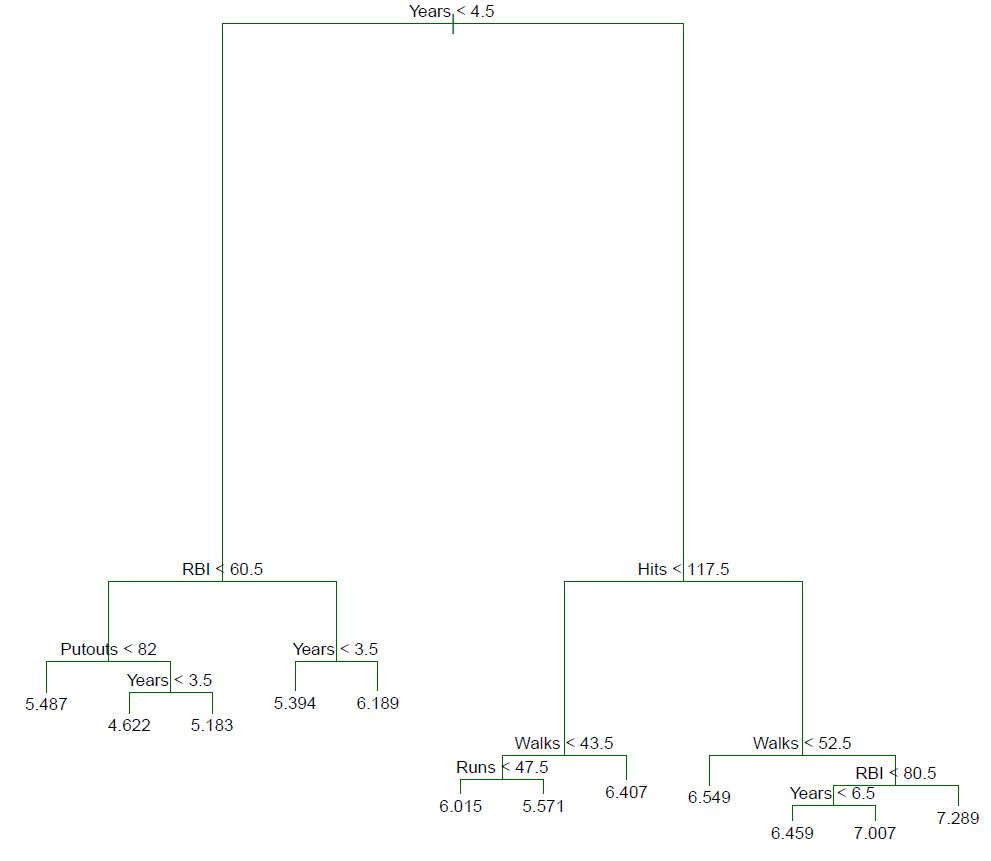
**图 8.4** *`Hitters`数据的回归树分析。显示了在训练数据上通过自上而下的贪婪分割得到的未修剪树。*

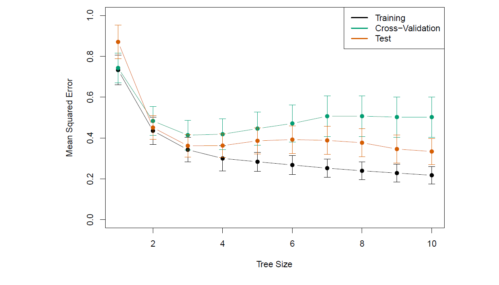
**图 8.5** *`Hitters`数据的回归树分析。显示了训练、交叉验证和测试均方误差 (MSE) 随修剪树的终端节点数量的变化。显示了标准误差带。交叉验证误差的最小值出现在树的大小为三时。*

### 8.1.2 Classification Trees
**分类树(classification tree)** 与回归树非常相似，区别在于它用于预测定性响应而不是定量响应。回顾回归树，对于一个观测值，预测的响应是属于同一终端节点的训练观测值的均值。相比之下，对于分类树，我们预测每个观测值属于其所属区域中最常见的训练观测值类别。在解释分类树的结果时，我们通常不仅对与特定终端节点区域对应的类别预测感兴趣，还对落入该区域的训练观测值的类别比例感兴趣。

生长分类树的任务与生长回归树的任务非常相似。与回归设置中一样，我们使用递归二元分割来生长分类树。然而，在分类设置中，无法使用RSS（残差平方和）作为二元分割的标准。一个自然的替代方法是**分类错误率(classification error rate)**。由于我们计划将某一给定区域的观测值分配给该区域中最常见的训练观测值类别，分类错误率即为该区域内不属于最常见类别的训练观测值的比例：
\[
E = 1 - \max_k \hat{p}_{mk} \quad(8.5)
\]
其中，\(\hat{p}_{mk}\)表示第\(m\)个区域内，属于第\(k\)类的训练观测值的比例。然而，事实证明，分类错误率对于树的生长不够敏感，实际上两种其他度量标准更为优选。

**Gini指数**的定义为：

\[
G = \sum_{k=1}^{K} \hat{p}_{mk}(1 - \hat{p}_{mk}) \quad(8.6)
\]

它是对所有 \(K\) 类的总体方差的度量。如果所有的 \(\hat{p}_{mk}\) 接近于 0 或 1，则 Gini 指数的值会较小。因此Gini 指数被称为节点 **纯度(purity)** 的度量——值越小表示节点主要包含来自单一类别的观测值。

一个替换Gini指数的方式，**熵（Entropy）** 定义为：

\[
D = - \sum_{k=1}^{K} \hat{p}_{mk} \log \hat{p}_{mk} \quad(8.7)
\]

由于 \(0 \leq \hat{p}_{mk} \leq 1\)，因此 \(0 \leq -\hat{p}_{mk} \log \hat{p}_{mk}\)。熵的值会在所有 \(\hat{p}_{mk}\) 接近于 0 或 1 时接近于零。因此，与 Gini 指数类似，熵在 \(m\) 节点纯度高时会取较小的值。事实上，Gini 指数和熵在数值上非常相近。

在构建分类树时，通常使用 Gini 指数或熵来评估特定划分的质量，因为与分类错误率相比，这两种方法对节点纯度更为敏感。在修剪树时，这三种方法都可以使用，但如果目标是提升最终修剪树的预测准确性，则分类错误率更为优选。

图 8.6展示了一个基于 `Heart` 数据集的案例。该数据集包含 303 名胸痛患者的二元结果变量 HD。结果值为 “Yes” 表示基于冠状动脉造影测试存在心脏病，而“No”表示没有心脏病。数据集中有 13 个预测变量，包括 `Age`（年龄）、`Sex`（性别）、`Chol`（胆固醇测量值）以及其他心肺功能测量值。通过交叉验证，得到了一个具有六个终端节点的决策树。

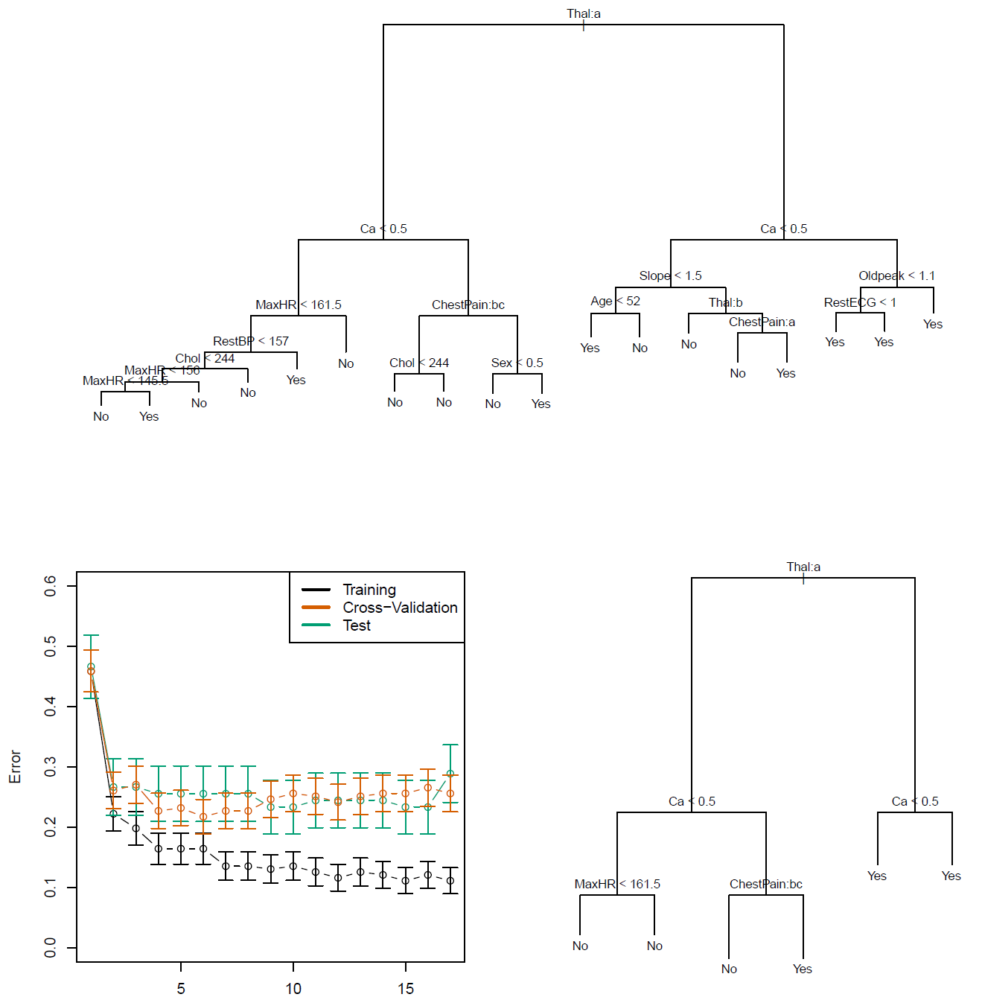
**图 8.6** *`Heart`数据集。顶部：未修剪的树。左下：交叉验证误差、训练误差和测试误差，分别对应不同大小的修剪树。右下：对应最小交叉验证误差的修剪树。*

在前面的讨论中，我们假设预测变量是连续的。然而，即使在预测变量是定性变量的情况下，也可以构建决策树。例如，在心脏数据集中，一些预测变量（如 `Sex`、`Thal`（铊负荷试验）和 `ChestPain`（胸痛））是定性的。因此，对这些变量进行分裂相当于将某些定性值分配到一条分支，而将其余的分配到另一条分支。在图 8.6 中，一些内部节点对应于对定性变量的分裂。例如，顶部的内部节点对应于对 `Thal` 变量的分裂。文本 `Thal:a` 表示从该节点分出的左分支由 `Thal` 变量的第一个值（正常）对应的观测点组成，而右分支对应其余的观测点（固定缺陷或可逆缺陷）。左侧树中向下第二层的文本 `ChestPain:bc` 表示从该节点分出的左分支由 `ChestPain` 变量的第二和第三个值对应的观测点组成，其中 `ChestPain` 的可能值包括典型心绞痛、非典型心绞痛、非心绞痛性疼痛和无症状。

图 8.6 中有一个令人惊讶的特性：某些分裂产生的两个终端节点具有相同的预测值。例如，考虑未修剪树右下角的分裂 `RestECG<1`。无论 `RestECG` 的值如何，这些观测点的预测响应值都是 `Yes`。那么，为什么要执行这样的分裂呢？原因是这种分裂提高了节点的纯度。也就是说，右叶节点中对应的所有 9 个观测点的响应值均为 `Yes`，而左叶节点中 11 个观测点中有 7 个的响应值为 `Yes`。

为什么节点纯度很重要？假设我们有一个测试观测点属于右叶节点对应的区域，那么我们几乎可以确定它的响应值是 `Yes`。相比之下，如果测试观测点属于左叶节点对应的区域，则其响应值可能是 `Yes`，但我们不太确定。尽管 `RestECG<1` 的分裂没有减少分类错误率，但它改善了 **Gini 指数** 和 **熵**，而这两个指标对节点纯度更为敏感。

### 8.1.3 Trees Versus Linear Models
回归树和分类树与第三章和第四章中介绍的更经典的回归与分类方法有着非常不同的特点。特别地，线性回归假设模型的形式如下：  
\[
f(X) = \beta_0 + \sum_{j=1}^{p} X_j \beta_j \quad(8.8)
\]
而回归树假设模型的形式为：  
\[
f(X) = \sum_{m=1}^{M} c_m \cdot 1(X \in R_m) \quad(8.9   )
\]
其中，\(R_1, \dots, R_M\) 表示特征空间的一个划分，如图 8.3 所示。  

哪种模型更好？这取决于具体的问题。如果特征与响应之间的关系可以通过线性模型（如公式 8.8）很好地近似，那么像线性回归这样的方法可能表现良好，并优于回归树这类无法利用线性结构的方法。  
相反，如果特征与响应之间存在高度非线性和复杂的关系（如公式 8.9 所示），决策树可能会优于经典方法。图 8.7 展示了一个说明性示例。  

可以通过估计测试误差来评估基于树的方法和经典方法的相对性能，例如使用交叉验证或验证集方法（详见第 5 章）。  

当然，在选择统计学习方法时，除了测试误差之外，还有其他考虑因素。例如，在某些情况下，为了易于解释和可视化，可能会更倾向于使用树模型进行预测。

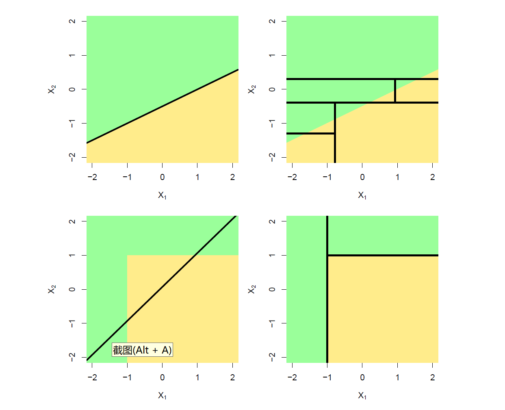
**图 8.7** *上排：一个二维分类示例，其中真实的决策边界是线性的，用阴影区域表示。假设线性边界的经典方法（左图）将优于沿坐标轴平行切分的决策树方法（右图）。下排：此处的真实决策边界是非线性的。线性模型无法捕捉到真实的决策边界（左图），而决策树则能够成功地捕捉到（右图）。*

### 8.1.4 Advantages and Disadvantages of Trees

用于回归和分类的决策树相比第 3 章和第 4 章中讨论的经典方法，有以下优点：  

- 树非常容易向他人解释。事实上，它们甚至比线性回归更容易解释！  
- 一些人认为，决策树比前面章节提到的回归和分类方法更接近人类的决策过程。  
- 树可以以图形方式展示，即使是非专业人士也能轻松理解（特别是当树较小时）。  
- 树能够轻松处理定性预测变量，而无需创建哑变量。

然而，决策树也存在以下缺点：  

- 预测准确性通常不如本书中其他回归和分类方法。 
- 树的鲁棒性较差。换句话说，数据中的细微变化可能会导致最终生成的树发生显著变化。  

然而，通过使用集成多棵决策树的方法（例如袋装法、随机森林和提升法），树的预测性能可以得到显著提高。在下一节中，我们将介绍这些概念。

## 8.2 Bagging, Random Forests, Boosting, and Bayesian Additive Regression Trees

**集成方法(ensemble)** 是一种通过结合多个简单的“构建模块”模型来获得单一且可能非常强大的模型的技术。这些简单的构建模块模型有时被称为 **弱学习器(weak learners)**，因为它们单独使用时可能只能产生平庸的预测结果。  

接下来，我们将讨论袋装法（bagging）、随机森林（random forests）、提升法（boosting）以及贝叶斯加性回归树（Bayesian additive regression trees）。这些都是以回归树或分类树为基础的集成方法。

### 8.2.1 Bagging 袋装法
**自助法**（Bootstrap），在第5章中介绍，是一个极为强大的概念。它常用于无法直接计算某个感兴趣数量的标准差的场景。这里我们看到，自助法可以在一个完全不同的背景下使用，以改进统计学习方法，例如决策树。

第8.1节讨论的决策树存在**高方差**问题。这意味着如果我们将训练数据随机分成两部分，并对每部分分别拟合决策树，得到的结果可能会有很大差异。相比之下，低方差的方法在对不同数据集多次应用时会产生较为相似的结果；例如，当样本量\(n\)与特征数\(p\)的比值适中时，线性回归通常具有低方差。**自助聚合**（Bootstrap Aggregating，或称**Bagging**）是一种减少统计学习方法方差的通用方法；我们在此介绍它，因为它在决策树的背景下特别有用且常用。

回忆一下，给定\(n\)个独立观测值\(Z_1, Z_2, \dots, Z_n\)，每个的方差为\(\sigma^2\)，则这些观测值的均值\(\bar{Z}\)的方差为\(\sigma^2 / n\)。换句话说，对一组观测值取平均可以降低方差。因此，一种自然的减少方差并提高统计学习方法测试集准确率的方法是从总体中取出许多训练集，使用每个训练集构建一个单独的预测模型，然后对结果预测取平均。也就是说，我们可以用\(B\)个不同的训练集计算\(\hat{f}_1(x), \hat{f}_2(x), \dots, \hat{f}_B(x)\)，然后对它们取平均以获得单一的低方差统计学习模型：

\[
\hat{f}_{\text{avg}}(x) = \frac{1}{B} \sum_{b=1}^B \hat{f}_b(x)。
\]

当然，这种方法通常不可行，因为我们通常无法获得多个训练集。相反，我们可以采用**自助法**，即从（单个）训练数据集中重复抽样。具体而言，我们生成\(B\)个不同的自助训练集，然后在第\(b\)个自助训练集上训练我们的方法以得到\(\hat{f}_b^*(x)\)，最后对所有预测取平均：

\[
\hat{f}_{\text{bag}}(x) = \frac{1}{B} \sum_{b=1}^B \hat{f}_b^*(x)。
\]

这被称为**Bagging**（自助聚合）。

尽管**Bagging**（自助聚合）可以改进许多回归方法的预测效果，但它对决策树特别有用。将Bagging应用于回归树时，我们只需利用\(B\)个自助训练集构建\(B\)个回归树，并对所得的预测结果进行平均。这些树的构建深度很高，并且**不进行剪枝**。因此，每棵单独的树虽然具有高方差，但偏差较低。对这\(B\)棵树的预测结果取平均能够有效降低方差。研究表明，通过将数百甚至数千棵树结合成一个单一的方法，Bagging可以显著提高预测准确率。

到目前为止，我们讨论的Bagging过程适用于回归问题，即预测一个定量结果\(Y\)。那么如何将Bagging扩展到\(Y\)为定性变量的分类问题呢？对于分类问题，有几种可能的方案，但最简单的做法如下：对于给定的测试样本，我们记录\(B\)棵树中每棵树预测的类别，并采取**多数投票法(majority vote)**：最终的预测结果是这\(B\)次预测中出现频率最高的类别。

**图8.8**展示了对`Heart`数据集应用Bagging树的结果，其中测试错误率作为\(B\)（由自助训练数据集构建的树的数量）的函数进行显示。从图中可以看到，Bagging的测试错误率在这种情况下比单棵树的测试错误率略低。对于Bagging来说，树的数量\(B\)并不是一个关键参数；即便使用非常大的\(B\)值，也不会导致过拟合。在实际应用中，我们选择一个足够大的\(B\)，以确保错误率已趋于稳定。在此示例中，使用\(B=100\)已经足以实现良好的性能。

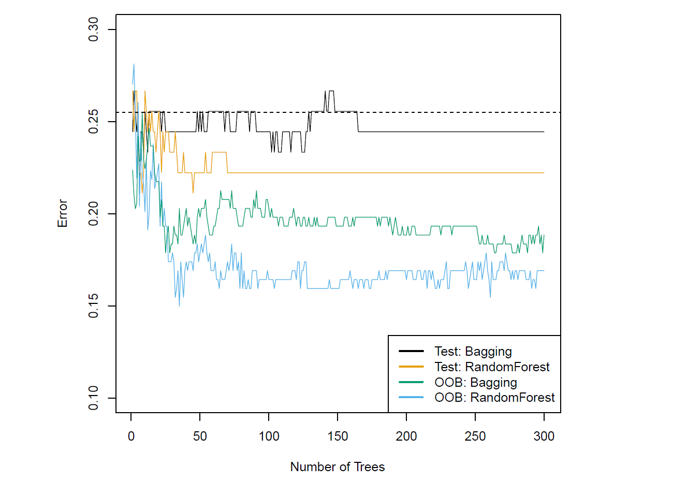
**图 8.8** *`Heart` 数据集的 Bagging 和随机森林结果。测试错误率（黑色和橙色）作为 \(B\)（使用的自助训练集数量）的函数显示。随机森林在 \(m = \sqrt{p}\) 的条件下应用。虚线表示单个分类树产生的测试错误率。绿色和蓝色的曲线表示袋外错误率（OOB error），在该例中，袋外错误率偶然显著低于测试错误率。*

#### Out-of-Bag Error Estimation
事实证明，有一种非常直接的方法可以估计袋装模型的测试误差，而不需要执行交叉验证或验证集方法。回想一下，袋装的关键在于树模型被重复拟合到观察值的自助子集。可以证明，平均而言，每棵袋装树会使用大约三分之二的观察值。剩下的三分之一未被用来拟合特定袋装树的观察值被称为**袋外观察值（Out-Of-Bag, OOB）**。我们可以使用每棵在该观察值为袋外的树来预测该观察值的响应。这将为该观察值生成大约 \(B/3\) 个预测。为了得到该观察值的单一预测，我们可以对这些预测响应进行平均（如果目标是回归）或进行多数投票（如果目标是分类）。这样就得到了该观察值的单一OOB预测。可以通过这种方式为每个 \(n\) 个观察值获得一个OOB预测，进而计算出整体的OOB均方误差（对于回归问题）或分类错误率（对于分类问题）。最终得到的OOB误差是袋装模型测试误差的有效估计，因为每个观察值的响应是使用未包含该观察值的树来预测的。图8.8显示了在Heart数据集上的OOB误差。可以证明，当 \(B\) 足够大时，OOB误差几乎等同于留一交叉验证误差。对于大数据集，尤其是当交叉验证的计算开销较大时，OOB方法估计测试误差非常方便。

#### Variable Importance Measures
正如我们所讨论的，袋装法（bagging）通常会比使用单棵树的预测准确性更高。然而，不幸的是，解释所得到的模型可能会很困难。请记住，决策树的一个优点是生成的图形既美观又容易解释，例如图 8.1 所示的那种。然而，当我们袋装大量树时，便无法再用单棵树来表示所得到的统计学习过程，也不再清楚哪些变量对该过程最重要。因此，袋装法在提高预测准确性的同时，牺牲了可解释性。

尽管袋装树的集合比单棵树更难以解释，但我们可以使用 RSS（对于袋装回归树）或基尼指数（对于袋装分类树）来获得每个预测变量重要性的总体总结。在袋装回归树的情况下，我们可以记录由于在给定预测变量上的分割而导致的 RSS（8.1）减少的总量，并在所有 \(B\) 棵树上进行平均。较大的值表示重要的预测变量。类似地，在袋装分类树的上下文中，我们可以计算在给定预测变量上的分割导致的基尼指数（8.6）减少的总量，并在所有 \(B\) 棵树上进行平均。

图 8.9 显示了 `Heart` 数据中 **变量重要性(Variable Importance)** 的图形表示。我们可以看到每个变量的基尼指数的平均减少量，相对于最大的减少量。基尼指数平均减少量最大的变量是 Thal、Ca 和 ChestPain。

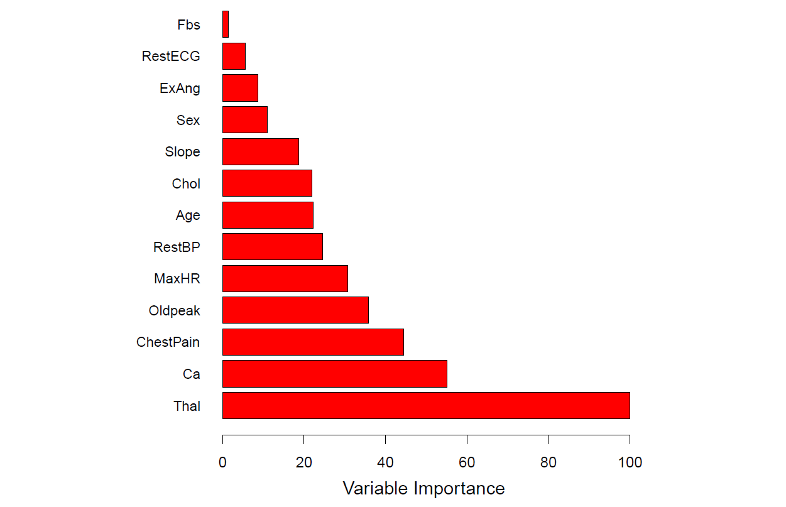
**图 8.9** *Heart 数据的变量重要性图。变量重要性是通过基尼指数的平均减少量计算得出的，并相对于最大值进行表达。*

### 8.2.2 Random Forests

**随机森林(random forest)** 通过一些小调整来改善袋装树的方法，从而使树之间的相关性降低。与袋装方法相同，我们在自助抽样的训练样本上构建多个决策树。但在构建这些决策树时，每当考虑在树中进行划分时，会从全部 \( p \) 个预测变量中随机选择一个大小为 \( m \) 的子集作为划分候选变量。该划分只允许使用这 \( m \) 个变量中的一个。在每次划分时都会取一个新的 \( m \) 个预测变量的样本，通常我们选择 \( m \approx \sqrt{p} \)——即在每次划分时考虑的预测变量数量大约等于总预测变量数量的平方根（例如，对于心脏数据集，13 个变量中选取 4 个）。

换句话说，在构建随机森林时，在树的每次划分中，算法甚至不允许考虑大多数可用的预测变量。这听起来可能很疯狂，但背后有其巧妙的理由。假设数据集中有一个非常强的预测变量，以及其他一些中等强度的预测变量。那么在袋装树的集合中，大多数或所有树都会在顶部划分中使用这个强预测变量。因此，所有的袋装树看起来会非常相似，从而导致它们的预测高度相关。不幸的是，平均许多高度相关的量并不会像平均许多不相关的量那样显著降低方差。特别是，这意味着在这种情况下，袋装方法不会显著降低单棵树的方差。

随机森林通过强制每次划分仅考虑预测变量的一个子集来解决这个问题。因此，平均而言，\((p - m)/p\) 的划分甚至不会考虑强预测变量，从而使其他预测变量有更多机会。我们可以将这个过程视为使树之间不相关，从而使得结果树的平均值更少变化，因而更可靠。

袋装法和随机森林之间的主要区别在于预测变量子集的大小 \( m \) 的选择。例如，如果使用 \( m = p \) 构建随机森林，那么这实际上就相当于袋装法。在心脏数据集上，使用 \( m = \sqrt{p} \) 的随机森林在测试误差和 OOB 误差上都优于袋装法（见图 8.8）。

在构建随机森林时使用较小的 \( m \) 值通常在我们拥有大量相关预测变量时会有所帮助。我们将随机森林应用于一个高维生物数据集，该数据集包含对 349 名患者的组织样本中 4,718 个基因的表达测量。人类大约有 20,000 个基因，各个基因在特定细胞、组织和生物条件下具有不同的活性或表达水平。在该数据集中，每个患者样本都有一个定性标签，共有 15 个不同级别：正常或 14 种不同类型的癌症之一。我们的目标是利用随机森林根据在训练集中方差最大的 500 个基因预测癌症类型。

我们随机将观察值分为训练集和测试集，并对训练集应用随机森林，测试不同数量的划分变量 \( m \)。结果如图 8.10 所示。单棵树的错误率为 45.7%，而空模型的错误率为 75.4%。我们看到，使用 400 棵树足以提供良好的性能，并且在这个例子中，选择 \( m = \sqrt{p} \) 相对于袋装法（\( m = p \)）在测试误差上有小幅改善。与袋装法一样，如果我们增加 \( B \)，随机森林不会过拟合，因此在实践中，我们使用一个足够大的 \( B \) 值，以确保错误率稳定。

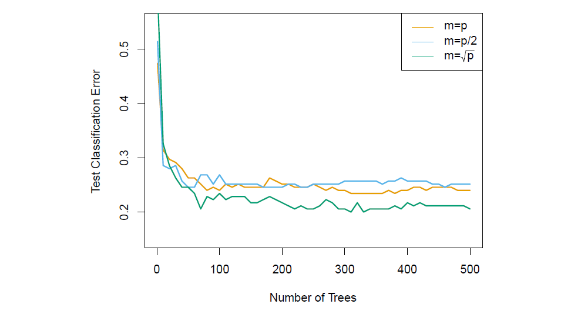
**图 8.10** *随机森林在 15 类基因表达数据集（\( p = 500 \) 个预测变量）上的结果。测试误差作为树的数量的函数展示。每条彩色线对应于不同的 \( m \) 值，即每个内部树节点可用于划分的预测变量数量。随机森林（\( m < p \)）相较于袋装法（\( m = p \)）略有改善。单棵分类树的错误率为 45.7%。*

### 8.2.3 Boosting
我们现在讨论 **提升（boosting）**，这是一种改善决策树预测结果的另一种方法。与袋装法类似，提升是一种通用的方法，可以应用于许多统计学习方法的回归或分类。在这里，我们将讨论提升在决策树上下文中的应用。

回顾一下，袋装法涉及使用自助抽样创建多个原始训练数据集的副本，为每个副本拟合一棵单独的决策树，然后将所有树结合在一起，以创建一个单一的预测模型。值得注意的是，每棵树都是在一个自助抽样数据集上构建的，与其他树独立。提升的工作方式类似，但树是顺序生长的：每棵树的生长都使用之前生长的树的信息。提升不涉及自助抽样；相反，每棵树是在原始数据集的修改版本上拟合的。

首先考虑回归场景。与袋装法一样，提升涉及结合大量的决策树 \( \hat{f}_1, \ldots, \hat{f}_B \)。提升的过程如算法 8.2 所述。

这个过程背后的思想是什么？与将单棵大的决策树拟合到数据上（这可能导致过拟合）不同，提升的方法是逐步学习。给定当前模型，我们拟合一棵决策树到模型的残差上。也就是说，我们使用当前的残差而不是结果 \( Y \) 作为响应来拟合树。然后，我们将这棵新的决策树添加到拟合的函数中，以更新残差。每棵树都可以相当小，仅有几个终端节点，具体由算法中的参数 \( d \) 决定。通过将小树拟合到残差上，我们能够逐步改善在表现不佳的区域的 \( \hat{f} \)。收缩参数 \( \lambda \) 进一步减缓这一过程，使得更多且形状各异的树能够对残差进行处理。

一般而言，学习速度较慢的统计学习方法往往表现良好。需要注意的是，在提升中，与袋装法不同，每棵树的构建强烈依赖于已经生长的树。

我们刚刚描述了提升回归树的过程。提升分类树的过程类似，但稍微复杂，具体细节在这里省略。

**算法 8.2 提升回归树**

1. 对于训练集中的所有 \( i \)，设置 \( \hat{f}(x) = 0 \) 和 \( r_i = y_i \) 。
2. 对于 \( b = 1, 2, \ldots, B \)，重复以下步骤：
   (a) 对训练数据 \( (X, r) \) 拟合一棵具有 \( d \) 次划分（\( d+1 \) 个终端节点）的树 \( \hat{f}_b \)。
   (b) 通过添加新的树的收缩版本来更新 \( \hat{f} \)：
   \[
   \hat{f}(x) \leftarrow \hat{f}(x) + \lambda \hat{f}_b(x). \tag{8.10}
   \]
   (c) 更新残差：
   \[
   r_i \leftarrow r_i - \lambda \hat{f}_b(x_i). \tag{8.11}
   \]
3. 输出提升模型：
   \[
   \hat{f}(x) = \sum_{b=1}^{B} \lambda \hat{f}_b(x). \tag{8.12}
   \]

提升有三个调优参数：

1. **树的数量 \( B \)**：与袋装法和随机森林不同，如果 \( B \) 太大，提升可能会过拟合，尽管这种过拟合通常会缓慢发生（如果发生的话）。我们使用交叉验证来选择 \( B \)。

2. **收缩参数 \( \lambda \)**，一个小的正数。它控制提升学习的速率。典型值为 0.01 或 0.001，具体选择取决于问题。非常小的 \( \lambda \) 可能需要使用非常大的 \( B \) 值才能达到良好的性能。

3. **每棵树的划分次数 \( d \)**，控制提升集成的复杂度。通常 \( d = 1 \) 表现良好，这种情况下每棵树是一个 **树桩(stump)**，仅包含一次划分。在这种情况下，提升集成拟合的是一个加性模型，因为每个项仅涉及一个变量。更一般地说，\( d \) 是 **交互深度(interaction depth)**，控制提升模型的交互阶数，因为 \( d \) 次划分最多可以涉及 \( d \) 个变量。

在图 8.11 中，我们将提升应用于 15 类癌症基因表达数据集，以开发一个能够区分正常类别和 14 种癌症类别的分类器。我们将测试误差作为树的总数和交互深度 \( d \) 的函数进行展示。我们看到，如果包含足够多的简单树桩（交互深度为 1），其表现良好。该模型的表现优于深度为 2 的模型，且两者都优于随机森林。这突显了提升和随机森林之间的一项区别：在提升中，由于特定树的生长考虑了已经生长的其他树，因此较小的树通常就足够了。使用较小的树也有助于可解释性；例如，使用树桩会导致一个加性模型。

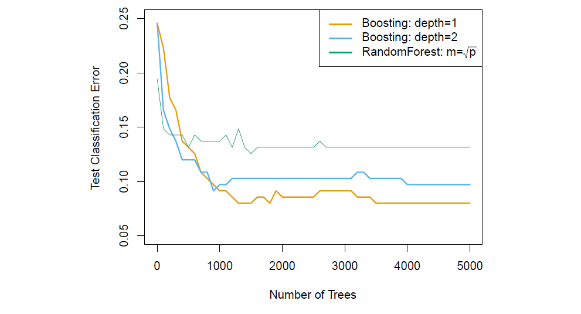
**图 8.11** *在 15 类基因表达数据集上进行提升和随机森林的结果，用于预测癌症与正常类别。测试误差作为树的数量的函数进行展示。对于两个提升模型，\( \lambda = 0.01 \)。深度为 1 的树稍微优于深度为 2 的树，且两者都优于随机森林，尽管标准误差约为 0.02，使得这些差异都不显著。单棵树的测试错误率为 24%。*

### 8.2.4 Bayesian Additive Regression Trees

### 8.2.5 Summary of Tree Ensemble Methods
树是集成方法中一种吸引人的弱学习器选择，原因有很多，包括它们的灵活性和处理混合类型预测变量（即定性和定量）的能力。我们现在已经看到四种拟合树的集成方法：袋装法、随机森林、提升法和 BART。

- 在袋装法中，树是在观察值的随机样本上独立生长的。因此，这些树往往彼此相似。因此，袋装法可能会陷入局部最优，并无法彻底探索模型空间。
- 在随机森林中，树再次在观察值的随机样本上独立生长。然而，每棵树的每次分割都是使用特征的随机子集来执行的，从而使树之间去相关化，并相对于袋装法导致模型空间的更全面探索。
- 在提升法中，我们仅使用原始数据，而不抽取任何随机样本。树是逐步生长的，采用“慢速”学习的方法：每棵新树都是拟合前面树留下的信号，并在使用前进行缩减。
- 在 BART 中，我们再次仅使用原始数据，并逐步生长树。然而，每棵树都会被扰动，以避免局部最小值，并实现更全面的模型空间探索。