# 9 Support Vector Machines 支持向量机

**原书：An Introduction to Statistical Learning_ with Applications in Python (Springer Texts in Statistics)-Springer (2023)**

[原书链接](https://www.statlearning.com/)

[课程配套网课（油管链接）](https://www.youtube.com/watch?v=LvySJGj-88U&list=PLoROMvodv4rPP6braWoRt5UCXYZ71GZIQ)，b站也有搬运视频可以自行搜索

**翻译：GPT，校对：Iridescence-ovo**

--------

本章将讨论**支持向量机（Support Vector Machine, SVM）**，这是一种在20世纪90年代由计算机科学界开发的分类方法，自那以来其流行度不断上升。研究表明，SVM在多种场景下表现出色，常被认为是最优秀的“开箱即用”分类器之一。  

支持向量机是对一种简单直观的分类器——**最大间隔分类器(maximal margin classifier)** 的推广，我们将在第9.1节中介绍该分类器。尽管最大间隔分类器优雅而简单，但我们会看到，由于它要求类可以通过线性边界完全分离，因此无法应用于大多数数据集。在第9.2节中，我们将介绍**支持向量分类器**，这是最大间隔分类器的扩展，能够适用于更广泛的情况。第9.3节将进一步介绍**支持向量机**，该方法在支持向量分类器的基础上进行了扩展，能够处理非线性分类边界问题。支持向量机主要针对二分类场景（即仅有两个类别），在第9.4节中，我们将讨论支持向量机在处理多分类问题上的扩展。在第9.5节，我们将探讨支持向量机与其他统计方法（如逻辑回归）的紧密联系。  

人们通常将**最大间隔分类器**、**支持向量分类器**和**支持向量机**统称为“支持向量机”。为了避免混淆，本章将仔细区分这三种概念。

## 9.1 Maximal Margin Classifier 最大间隔分类器
在本节中，我们将定义 **超平面(hyperplane)** 并引入**最优分隔超平面**的概念。

### 9.1.1 What Is a Hyperplane? 什么是超平面？
在一个p维空间中，超平面是一个维度为p - 1的平坦仿射子空间。例如，在二维空间中，超平面是一个平坦的一维子空间——换句话说，就是一条直线。在三维空间中，超平面是一个平坦的二维子空间——即一个平面。在p > 3的维度中，虽然很难直观地想象超平面，但(p - 1)维的平坦子空间的概念依然适用。

超平面的数学定义非常简单。在二维空间中，超平面由以下方程定义：
\[
\beta_0 + \beta_1 X_1 + \beta_2 X_2 = 0 \tag{9.1}
\]
其中参数为 $\beta_0$，$\beta_1$ 和 $\beta_2$。当我们说(9.1)“定义”超平面时，我们的意思是，对于任何满足(9.1)的 $X = (X_1, X_2)^T$，X都是超平面上的一点。请注意，(9.1)实际上就是一条直线的方程，因为在二维空间中，超平面就是一条直线。

方程(9.1)可以很容易地扩展到p维空间：
\[
\beta_0 + \beta_1 X_1 + \beta_2 X_2 + \cdots + \beta_p X_p = 0 \tag{9.2}
\]
定义了一个p维的超平面，同样的意思是，如果一个点X = (X₁, X₂, ..., Xₚ)ᵀ位于p维空间中（即一个长度为p的向量），并且满足(9.2)，那么X位于超平面上。

现在，假设X不满足(9.2)，而是满足：
\[
\beta_0 + \beta_1 X_1 + \beta_2 X_2 + \cdots + \beta_p X_p > 0 \tag{9.3}
\]
那么这表示X位于超平面的某一侧。另一方面，如果满足：
\[
\beta_0 + \beta_1 X_1 + \beta_2 X_2 + \cdots + \beta_p X_p < 0 \tag{9.4}
\]
那么X位于超平面的另一侧。因此，我们可以将超平面看作是将p维空间分成两半。通过简单计算(9.2)左侧的符号，就可以轻松确定一个点位于超平面的哪一侧。图9.1展示了一个二维空间中的超平面。

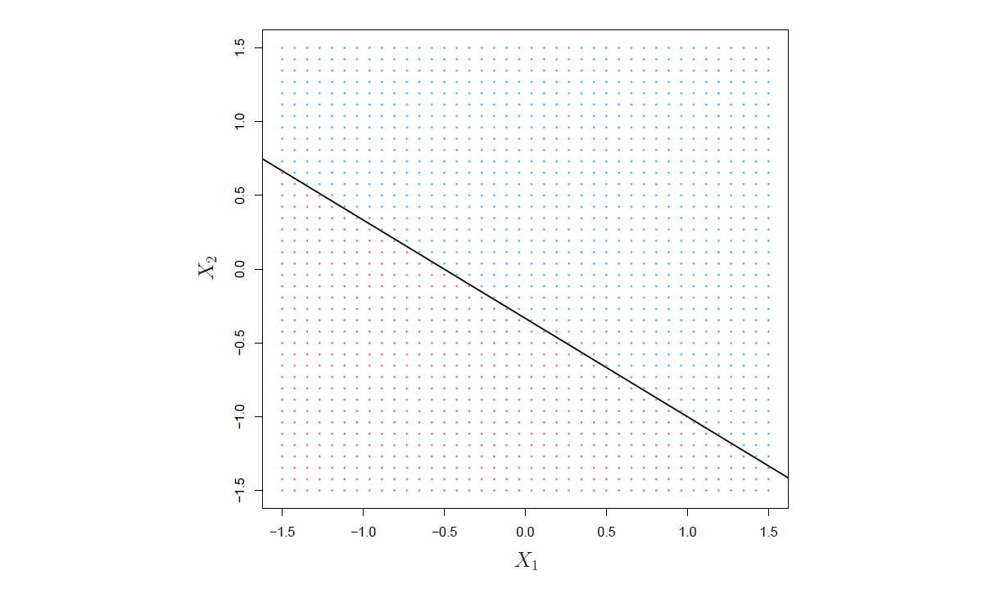
**图9.1** *显示了超平面 \( 1 + 2X_1 + 3X_2 = 0 \)。蓝色区域是满足 \( 1 + 2X_1 + 3X_2 > 0 \) 的点集，紫色区域是满足 \( 1 + 2X_1 + 3X_2 < 0 \) 的点集。*

### 9.1.2 Classification Using a Separating Hyperplane 使用分离超平面分类

现在假设我们有一个n × p的数据矩阵X，包含n个训练样本，这些样本位于p维空间中：

\[
x_1 =
\begin{pmatrix}
x_{11} \\
\vdots \\
x_{1p}
\end{pmatrix}, \dots, x_n =
\begin{pmatrix}
x_{n1} \\
\vdots \\
x_{np}
\end{pmatrix}, \tag{9.5}
\]
并且这些样本属于两类——即\(y_1, \dots, y_n \in \{-1, 1\}\)，其中-1代表一类，1代表另一类。我们还有一个测试样本，它是一个p维的观测特征向量：\(x^* = (x_1^* \text{ }\cdots \text{ }x_p^*)^T\)。我们的目标是基于训练数据开发一个分类器，使用该分类器能够根据测试样本的特征测量值正确地对其进行分类。我们已经看到了一些用于这个任务的方法，例如第4章中的线性判别分析和逻辑回归，以及第8章中的分类树、bagging和boosting方法。接下来，我们将看到基于 **分隔超平面(separating hyperplane)** 概念的一种新方法。

假设可以构造一个超平面，该超平面能够根据训练样本的类别标签将其完美地分开。图9.2左侧面板中显示了三个这样的分隔超平面的示例。我们可以将蓝色类别的样本标记为\(y_i = 1\)，紫色类别的样本标记为\(y_i = -1\)。然后，分隔超平面具有以下性质：

\[
\beta_0 + \beta_1 x_{i1} + \beta_2 x_{i2} + \cdots + \beta_p x_{ip} > 0 \text{  如果}y_i = 1, \tag{9.6}
\]
以及
\[
\beta_0 + \beta_1 x_{i1} + \beta_2 x_{i2} + \cdots + \beta_p x_{ip} < 0 \text{  如果}y_i = -1. \tag{9.7}
\]
等价地，分隔超平面具有以下性质，对于所有\(i = 1, \dots, n\)：

\[
y_i (\beta_0 + \beta_1 x_{i1} + \beta_2 x_{i2} + \cdots + \beta_p x_{ip}) > 0 \tag{9.8}
\]

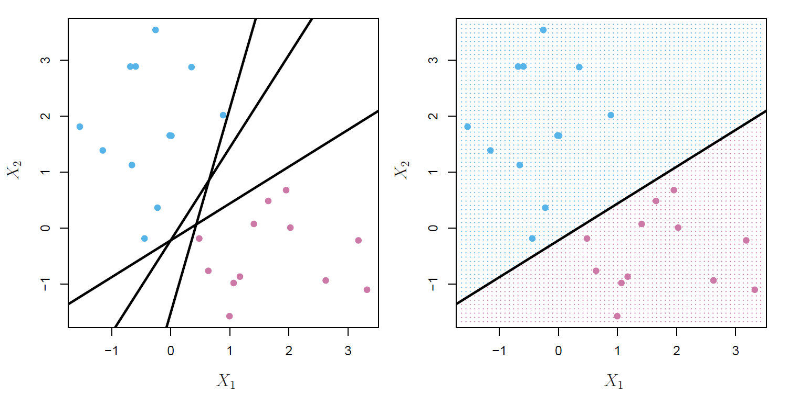
**图9.2** *左：有两类观察值，分别用蓝色和紫色表示，每类观察值都有两个变量的测量值。图中展示了三条分离超平面（黑色），这些是众多可能的分离超平面中的一部分。右：展示了一个分离超平面（黑色）。蓝色和紫色的网格表示基于该分离超平面的分类器所做的决策规则：落在蓝色部分的测试观察值将被分配到蓝色类，而落在紫色部分的测试观察值将被分配到紫色类。*

如果存在一个分离超平面，我们可以利用它构造一个非常自然的分类器：测试观察值根据其位于超平面的哪一侧来分配类。图9.2的右侧面板展示了这样的分类器示例。即，我们根据 \( f(x^*) = \beta_0 + \beta_1x^*_1 + \beta_2x^*_2 + \cdots + \beta_px^*_p \) 的符号来对测试观察值 \( x^* \) 进行分类。如果 \( f(x^*) \) 为正，则我们将测试观察值分配到类1，如果 \( f(x^*) \) 为负，则将其分配到类-1。我们还可以利用 \( f(x^*) \) 的大小。如果 \( f(x^*) \) 离零很远，这意味着 \( x^* \) 离超平面很远，因此我们可以对 \( x^* \) 的类别分配有较高的信心。另一方面，如果 \( f(x^*) \) 接近零，那么 \( x^* \) 位于超平面附近，因此我们对 \( x^* \) 的类别分配的信心较低。不出所料，正如我们在图9.2中看到的，基于分离超平面的分类器会导致一个线性决策边界。

### 9.1.3 The Maximal Margin Classifier 最大间隔分类器

一般来说，如果我们的数据可以通过一个超平面完美地分开，那么实际上将存在无数个这样的超平面。这是因为给定的分离超平面通常可以稍微上下移动，或者旋转，而不会与任何观察值接触。图9.2的左侧面板展示了三个可能的分离超平面。为了基于分离超平面构建一个分类器，我们必须有一种合理的方式来决定使用无数个可能的分离超平面中的哪个。

一个自然的选择是 **最大间隔超平面(maximal margin hyperplane)**（也称为 **最优分离超平面(optimal separating hyperplane)**），它是与训练观察值距离最远的分离超平面。也就是说，我们可以计算每个训练观察值到给定分离超平面的（垂直）距离；最小的这样的距离是观察值到超平面的最小距离，称为间隔。最大间隔超平面是 **间隔(margin)** 最大的分离超平面——也就是，它是距离训练观察值最远的超平面。然后，我们可以根据测试观察值位于最大间隔超平面的哪一侧来对其进行分类。这就是 **最大间隔分类器(maximal margin classifier)**。我们希望一个在训练数据上具有大间隔的分类器在测试数据上也会有较大的间隔，因此能正确分类测试观察值。虽然最大间隔分类器通常能成功，但在p较大的情况下，它也可能导致过拟合。

如果 \( \beta_0, \beta_1, \dots, \beta_p \) 是最大间隔超平面的系数，那么最大间隔分类器基于以下公式的符号来分类测试观察值 \( x^* \)：

\[
f(x^*) = \beta_0 + \beta_1 x_1^* + \beta_2 x_2^* + \dots + \beta_p x_p^*
\]

图9.3展示了图9.2数据集上的最大间隔超平面。将图9.2的右侧面板与图9.3进行比较，我们可以看到图9.3中的最大间隔超平面确实在观察值和分离超平面之间产生了更大的最小距离——也就是更大的间隔。从某种意义上讲，最大间隔超平面代表了我们可以在两个类之间插入的最宽“板”的中线。

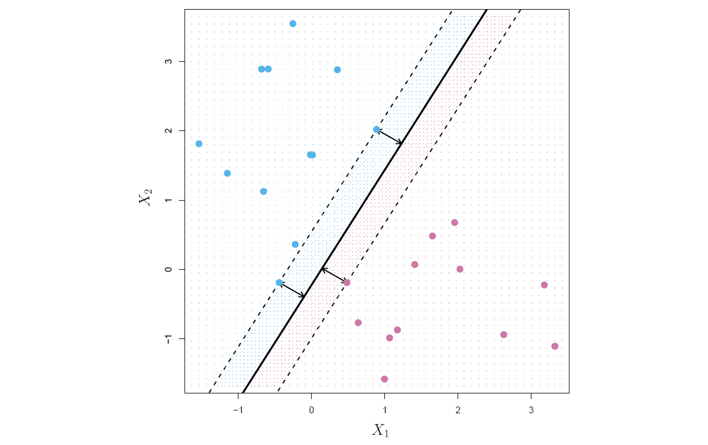
**图9.3** *有两类观察值，分别用蓝色和紫色表示。最大间隔超平面以实线显示。间隔是从实线到任一虚线的距离。位于虚线上两个蓝色点和一个紫色点是支持向量，它们到超平面的距离由箭头表示。紫色和蓝色网格表示基于该分离超平面的分类器所做的决策规则。*

通过观察图9.3，我们看到三个训练观察值与最大间隔超平面等距，并位于虚线所示的间隔宽度上。这三个观察值被称为 **支持向量(support vector)**，因为它们是p维空间中的向量（在图9.3中，p = 2），并且它们“支持”最大间隔超平面，意思是如果这些点稍微移动，最大间隔超平面也会随之移动。有趣的是，最大间隔超平面直接依赖于支持向量，而不依赖于其他观察值：只要其他观察值的移动不会导致它越过由间隔设定的边界，超平面就不会受到影响。最大间隔超平面仅依赖于少数几个观察值的事实是一个重要特性，这一点将在本章稍后讨论支持向量分类器和支持向量机时体现出来。

### 9.1.4 Construction of the Maximal Margin Classifier 构建最大间隔分类器

现在我们来探讨如何基于一组 \( n \) 个训练观测值 \( x_1, \ldots, x_n \in \mathbb{R}^p \) 和对应的类别标签 \( y_1, \ldots, y_n \in \{-1, 1\} \) 构造最大间隔超平面。简而言之，最大间隔超平面是以下优化问题的解：

\[
    \max_{\beta_0, \beta_1, \dots, \beta_p, M}M \quad(9.9)\\
\text{subject to}
\sum_{j=1}^p \beta_j^2 = 1, \quad(9.10) \\
y_i (\beta_0 + \beta_1 x_{i1} + \beta_2 x_{i2} + \cdots + \beta_p x_{ip}) \geq M \quad \forall i = 1, \ldots, n. \quad(9.11)
\]

这个优化问题（9.9）–（9.11）实际上比看起来更简单。首先，条件（9.11）：

\[
y_i (\beta_0 + \beta_1 x_{i1} + \beta_2 x_{i2} + \cdots + \beta_p x_{ip}) \geq M \quad \forall i = 1, \ldots, n
\]

保证了每个观测值都位于超平面的正确一侧，前提是 \( M > 0 \)。实际上，要使每个观测值位于正确的一侧，只需满足 \( y_i (\beta_0 + \beta_1 x_{i1} + \beta_2 x_{i2} + \cdots + \beta_p x_{ip}) > 0 \)。然而，条件（9.11）要求每个观测值不仅在超平面的正确一侧，还需留有一定的“缓冲区”，这也需要 \( M > 0 \)。

其次，注意条件（9.10）并非对超平面的限制，因为如果 \( \beta_0 + \beta_1 x_{i1} + \beta_2 x_{i2} + \cdots + \beta_p x_{ip} = 0 \) 定义了一个超平面，那么 \( k(\beta_0 + \beta_1 x_{i1} + \beta_2 x_{i2} + \cdots + \beta_p x_{ip}) = 0 \) （对于任意 \( k \neq 0 \)）同样定义了一个超平面。然而，条件（9.10）为条件（9.11）赋予了实际意义：可以证明，在满足（9.10）的情况下，第 \( i \) 个观测值到超平面的垂直距离为：

\[
y_i (\beta_0 + \beta_1 x_{i1} + \beta_2 x_{i2} + \cdots + \beta_p x_{ip}).
\]

因此，约束条件（9.10）和（9.11）确保了每个观测值都位于超平面的正确一侧，并且至少与超平面有距离 \( M \)。由此，\( M \) 表示我们超平面的间隔，而优化问题的目标是选择 \( \beta_0, \beta_1, \ldots, \beta_p \) 来最大化 \( M \)。这正是最大间隔超平面的定义！

虽然可以高效地解决优化问题（9.9）–（9.11），但本书不会涉及这些优化细节。

### 9.1.5 The Non-separable Case 无法被分离的情况

最大间隔分类器是一种非常自然的分类方法，如果存在分离超平面的话。然而，正如我们提到的，在许多情况下，并不存在分离超平面，因此也就没有最大间隔分类器。在这种情况下，优化问题 (9.9)–(9.11) 在 \( M > 0 \) 时无解。例如，图 9.4 就展示了这种情况。在这里，我们无法完全分离两个类别。然而，如下一节所述，我们可以扩展分离超平面的概念，构造一个几乎可以分离类别的超平面，称为**软间隔（soft margin）**。将最大间隔分类器推广到不可分情况的这一方法被称为**支持向量分类器（support vector classifier）**。

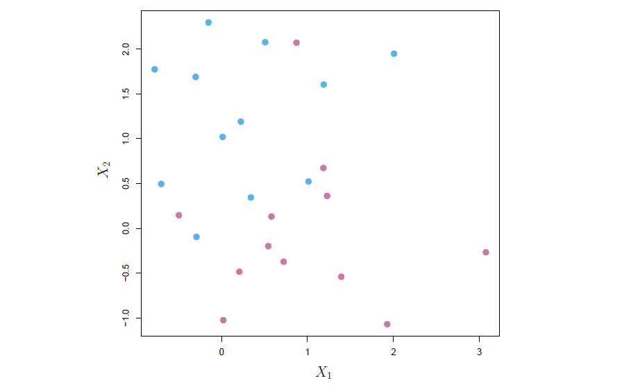
**图 9.4** *图中有两类观测点，分别用蓝色和紫色表示。在这种情况下，这两类点无法通过一个超平面分隔，因此无法使用最大间隔分类器。*

## 9.2 Support Vector Classifiers 支持向量分类器
### 9.2.1 Overview of the Support Vector Classifier 支持向量分类器概述

在图 9.4 中，我们可以看到属于两个类别的观测点不一定能被超平面分离。事实上，即使存在分离超平面，也有某些情况下基于分离超平面的分类器可能并不理想。基于分离超平面的分类器必然会对所有训练观测点进行完全分类，这可能导致对个别观测点的过度敏感。例如，图 9.5 的右图展示了这一情况：仅仅增加了一个观测点，就导致最大间隔超平面发生了显著的变化。由此得到的最大间隔超平面并不令人满意——一方面，它的间隔非常小。正如前面所讨论的，观测点与超平面的距离可以看作是我们对观测点分类正确性的信心度量。而最大间隔超平面对单个观测点变化的极度敏感性表明，它可能过度拟合了训练数据。

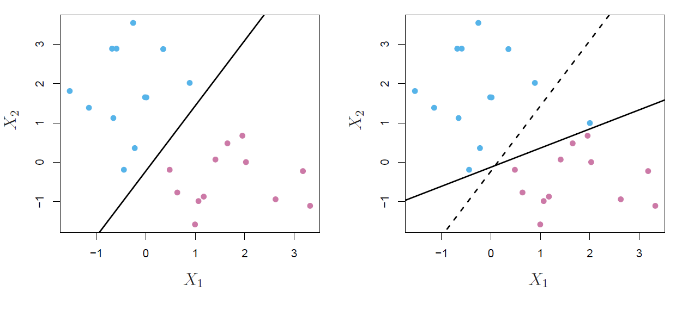
**图 9.5** *左图：显示了两个类别的观测点，分别用蓝色和紫色表示，并标出了最大间隔超平面。右图：增加了一个额外的蓝色观测点，导致最大间隔超平面发生了剧烈变化，实线表示新的最大间隔超平面。虚线表示在没有该额外点的情况下得到的最大间隔超平面。*

在这种情况下，我们可能愿意考虑基于一个不能完全分离两个类别的超平面的分类器，这样可以带来以下好处：  
- 对个别观测点更具鲁棒性
- 更好地分类大部分训练观测点 

换句话说，允许对少数训练观测点进行错误分类可能是值得的，因为这样可以更好地对其余观测点进行分类。

**支持向量分类器(support vector classifier)**，有时称为 **软间隔分类器(soft margin classifier)**，正是这样做的。与其寻求最大可能的间隔，使得每个观测不仅位于超平面的正确侧面，还位于间隔的正确侧面，我们反而允许一些观测位于间隔的错误侧面，甚至是超平面的错误侧面。（间隔是软的，因为它可以被一些训练观测违反。）左图 9.6 显示了一个例子。大多数观测位于间隔的正确侧面。然而，一小部分观测位于间隔的错误侧面。

一个观测不仅可以位于间隔的错误侧面，也可以位于超平面的错误侧面。实际上，当没有可分的超平面时，这种情况是不可避免的。位于超平面错误侧面的观测对应于被支持向量分类器误分类的训练观测。右图 9.6 说明了这种情形。

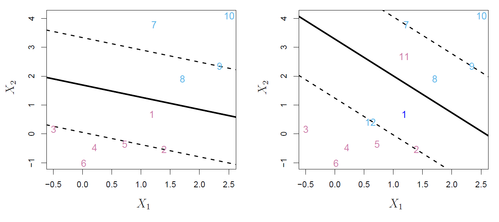
**图 9.6** *左图：一个支持向量分类器被拟合到一个小的数据集。超平面用实线表示，间隔用虚线表示。紫色观测：观测 3、4、5 和 6 位于间隔的正确侧面，观测 2 位于间隔上，观测 1 位于间隔的错误侧面。蓝色观测：观测 7 和 10 位于间隔的正确侧面，观测 9 位于间隔上，观测 8 位于间隔的错误侧面。没有观测位于超平面的错误侧面。右图：与左图相同，但增加了两个观测点，11 和 12。这两个观测位于超平面的错误侧面和间隔的错误侧面。*

### 9.2.2 Details of the Support Vector Classifier 支持向量分类器的细节

支持向量分类器根据测试观测点位于超平面的哪一侧来进行分类。超平面选择的目的是正确地将大多数训练观测点分为两类，但可能会错误分类少数观测点。它是优化问题的解：

\[
\max_{\beta_0, \beta_1, \dots, \beta_p, \epsilon_1, \dots, \epsilon_n, M} M \quad(9.12) \\
\text{subject to} \quad \sum_{j=1}^p \beta_j^2 = 1, \quad(9.13) \\
y_i (\beta_0 + \beta_1 x_{i1} + \beta_2 x_{i2} + \cdots + \beta_p x_{ip}) \geq M(1 - \epsilon_i), \quad(9.14) \\
\epsilon_i \geq 0, \quad \sum_{i=1}^n \epsilon_i \leq C, \quad(9.15)
\]

其中 \( C \) 是一个非负的调节参数。与 (9.11) 中一样，\( M \) 是间隔的宽度；我们寻求尽可能将这个量做大。在 (9.14) 中，\( \epsilon_1, \dots, \epsilon_n \) 是**松弛变量(slack variables)**，允许个别观测点位于间隔或超平面的错误侧；我们稍后将详细解释这些变量。一旦我们解出了 (9.12)–(9.16)，我们就像之前一样通过确定测试观测点位于超平面的哪一侧来进行分类。也就是说，我们根据以下公式的符号来对测试观测点进行分类：

\[
f(x^*) = \beta_0 + \beta_1 x_1^* + \cdots + \beta_p x_p^*. 
\]

问题 (9.12)–(9.16) 看起来复杂，但通过一系列简单的观察可以理解它的行为。首先，松弛变量 \( \epsilon_i \) 告诉我们第 \( i \) 个观测点相对于超平面和相对于间隔的位置。如果 \( \epsilon_i = 0 \)，则第 \( i \) 个观测点位于间隔的正确侧，如我们在第 9.1.4 节中所看到的。如果 \( \epsilon_i > 0 \)，则第 \( i \) 个观测点位于间隔的错误侧，我们说第 \( i \) 个观测点违反了间隔。如果 \( \epsilon_i > 1 \)，则它位于超平面的错误侧。

我们现在考虑调节参数 \(C\) 的作用。在 (9.15) 中，\(C\) 限制了所有 \( \epsilon_i \) 的总和，因此它决定了我们能够容忍的对间隔（以及超平面）的违反的数量和严重性。我们可以将 \(C\) 看作是一个 **预算**，表示 \(n\) 个观测点对间隔的违反量。如果 \(C = 0\)，则没有违反间隔的预算，必须满足 \( \epsilon_1 = \dots = \epsilon_n = 0 \)，在这种情况下，(9.12)–(9.15) 就变成了最大间隔超平面优化问题 (9.9)–(9.11)。当然，只有当两类是可分的时，才存在最大间隔超平面。对于 \(C > 0\)，不超过 \(C\) 个观测点可以位于超平面的错误侧，因为如果某个观测点位于超平面的错误侧，则 \( \epsilon_i > 1 \)，而 (9.15) 要求 \( \sum_{i=1}^n \epsilon_i \leq C \)。随着预算 \(C\) 的增加，我们对违反间隔的容忍度增加，因此间隔会变宽。相反，当 \(C\) 减小时，我们对违反间隔的容忍度降低，因此间隔会变窄。图 9.7 给出了一个例子。

在实践中，\(C\) 被视为一个调节参数，通常通过交叉验证来选择。与我们在本书中看到的其他调节参数一样，\(C\) 控制统计学习方法的偏差-方差权衡。当 \(C\) 较小时，我们寻求较窄的间隔，这样违反间隔的情况很少发生；这相当于一个高度拟合数据的分类器，可能具有较低的偏差但较高的方差。另一方面，当 \(C\) 较大时，间隔较宽，我们允许更多的违反；这意味着对数据的拟合较弱，得到的分类器可能具有较高的偏差，但方差较低。

优化问题 (9.12)–(9.15) 有一个非常有趣的性质：事实证明，只有那些位于间隔上或违反间隔的观测点会影响超平面，从而影响得到的分类器。换句话说，严格位于间隔正确侧的观测点不会影响支持向量分类器！只要这些观测点的位置保持在间隔的正确侧，改变它们的位置不会改变分类器。直接位于间隔上或位于其类的间隔错误侧的观测点被称为支持向量。这些观测点确实会影响支持向量分类器。

只有支持向量会影响分类器这一事实与我们之前的论断一致，即 \(C\) 控制着支持向量分类器的偏差-方差权衡。当调节参数 \(C\) 较大时，间隔较宽，许多观测点违反了间隔，因此有许多支持向量。在这种情况下，许多观测点参与了超平面的确定。图 9.7 左上方的面板展示了这一设置：该分类器具有较低的方差（因为许多观测点是支持向量），但可能具有较高的偏差。相比之下，如果 \(C\) 较小，则支持向量较少，因此得到的分类器将具有较低的偏差但较高的方差。图 9.7 右下方的面板展示了这种设置，只有八个支持向量。

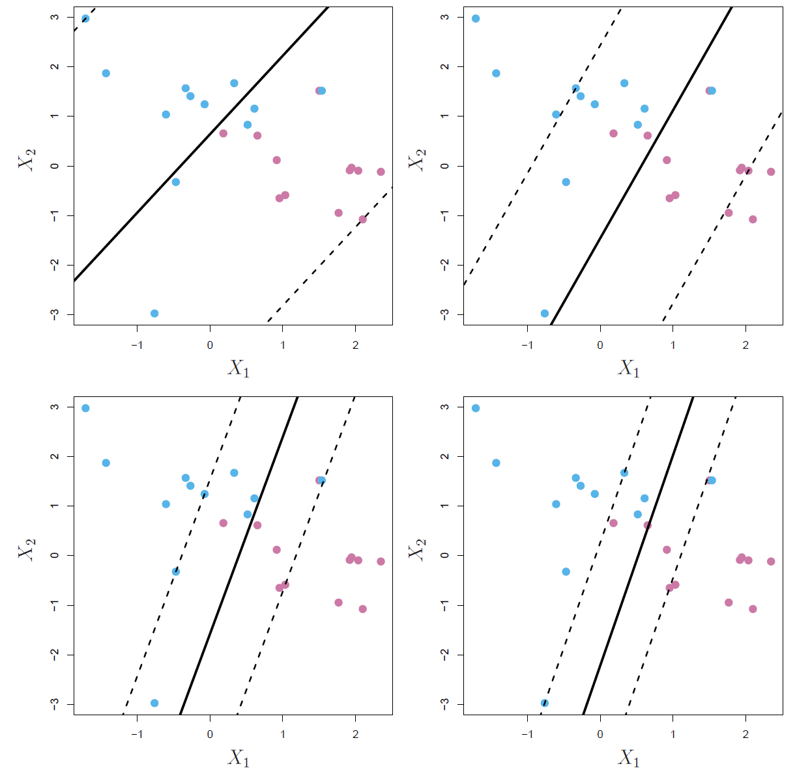
**图 9.7** *使用四个不同的调节参数 \(C\) 值拟合了支持向量分类器，参数 \(C\) 在 (9.12)–(9.15) 中定义。最大的 \(C\) 值用于左上方的面板，较小的值分别用于右上方、左下方和右下方的面板。当 \(C\) 较大时，分类器对观测点位于间隔错误侧的容忍度较高，因此间隔较大。随着 \(C\) 减小，对观测点位于间隔错误侧的容忍度降低，间隔变窄。*

支持向量分类器的决策规则仅基于训练数据中可能很小的一部分观测值（即支持向量），这意味着它对于远离超平面的观测值的行为具有较强的鲁棒性。这一特性与我们在前几章中看到的其他分类方法不同，例如线性判别分析（LDA）。回想一下，LDA分类规则依赖于每个类别中所有观测值的均值，以及使用所有观测值计算的类别内协方差矩阵。相比之下，逻辑回归与LDA不同，对远离决策边界的观测值的敏感度非常低。事实上，我们将在第9.5节中看到，支持向量分类器和逻辑回归有着密切的关系。

## 9.3 Support Vector Machines 支持向量机

我们首先讨论将线性分类器转化为产生非线性决策边界的一般机制。然后，我们介绍支持向量机，它以自动化的方式实现这一转化。

### 9.3.1 Classification with Non-Linear Decision Boundaries 非线性决策边界的分类
支持向量分类器在两类分类问题中是一个自然的选择，当两类之间的边界是线性时。然而，在实际应用中，我们有时会面临非线性的类别边界。例如，考虑图9.8左侧面板中的数据。显然，在这种情况下，支持向量分类器或任何线性分类器的表现都会很差。事实上，图9.8右侧面板中的支持向量分类器在这里是无用的。

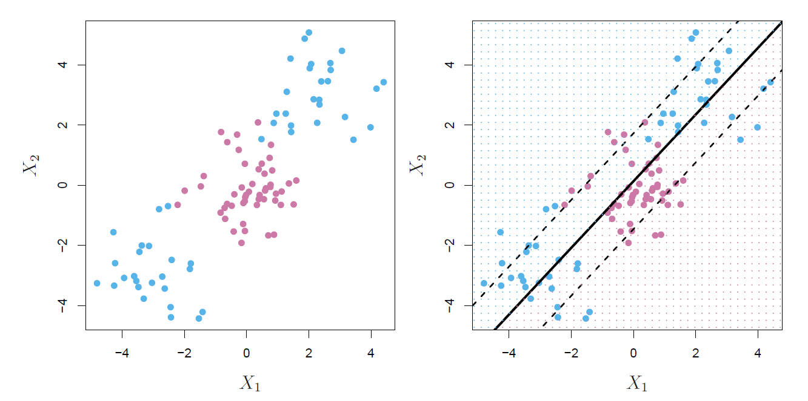
**图 9.8** *左图：观测点分为两个类别，类别之间具有非线性边界。右图：支持向量分类器试图找到一个线性边界，因此表现非常差。*

在第七章中，我们遇到了类似的情况。我们看到，当预测变量与结果之间存在非线性关系时，线性回归的表现可能会受到影响。在那种情况下，我们考虑使用预测变量的函数（如二次项和三次项）来扩大特征空间，以解决这种非线性问题。

在支持向量分类器的情况下，我们可以通过类似的方式来解决非线性边界问题，即通过扩大特征空间，使用预测变量的二次项、三次项甚至更高次的多项式函数。例如，假设我们用 \( p \) 个特征
$$
X_1, X_2, \dots, X_p
$$
来拟合支持向量分类器，我们可以改用 \( 2p \) 个特征：
\[
X_1, X_1^2, X_2, X_2^2, \dots, X_p, X_p^2
\]

然后，(9.12)–(9.15) 将变为：

\[
\max_{\beta_0, \beta_{11}, \beta_{12}, \dots, \beta_{p1}, \beta_{p2}, \epsilon_1, \dots, \epsilon_n, M} \quad M \quad (9.16) \\
\text{subject to} \quad 
y_i \left( \beta_0 + \sum_{j=1}^{p} \beta_{j1} x_{ij} + \sum_{j=1}^{p} \beta_{j2} x_{ij}^2 \right) \geq M(1 - \epsilon_i) \\
\sum_{i=1}^{n} \epsilon_i \leq C, \quad \epsilon_i \geq 0, \quad \sum_{j=1}^{p} \sum_{k=1}^{2} \beta_{jk}^2 = 1
\]

为什么这会导致一个非线性的决策边界呢？在扩展的特征空间中，(9.16) 所得到的决策边界实际上是线性的。但在原始特征空间中，决策边界的形式为 \( q(x) = 0 \)，其中 \( q \) 是一个二次多项式，它的解通常是非线性的。我们可能还希望通过高次多项式项，或者像 \( X_j X_{j'} \) 这样的交互项来扩展特征空间。或者，也可以考虑其他预测变量的函数，而不是多项式。显而易见，扩展特征空间有许多可能的方式，并且如果我们不小心，可能会得到大量的特征，从而导致计算变得难以管理。接下来我们将介绍的支持向量机方法，能够让我们以高效的方式扩展支持向量分类器使用的特征空间。

### 9.3.2 The Support Vector Machine

**支持向量机（SVM）** 是支持向量分类器的扩展，通过使用 **核（kernels）** 以特定方式扩大特征空间。我们将讨论这一扩展的思想，尽管其细节较为复杂并超出了本书的范围。然而，其核心概念如 9.3.1 节所述：为了容纳类别之间的非线性边界，我们可能需要扩大特征空间。这里描述的核方法只是实现这一想法的一种高效计算手段。

我们尚未详细讨论如何计算支持向量分类器，因为细节会变得相当技术化。然而，支持向量分类器问题 (9.12)–(9.15) 的解实际上仅依赖于观测值之间的内积（而不是观测值本身）。两个 r 维向量 \( a \) 和 \( b \) 的内积定义为：

\[
\langle a, b \rangle = \sum_{i=1}^r a_i b_i
\]

因此，两个观测值 \( x_i \) 和 \( x_{i'} \) 的内积定义为：

\[
\langle x_i, x_{i'} \rangle = \sum_{j=1}^p x_{ij} x_{i'j}. \tag{9.17}
\]

可以证明以下几点：

- 线性支持向量分类器可以表示为：
  \[
  f(x) = \beta_0 + \sum_{i=1}^n \alpha_i \langle x, x_i \rangle, \tag{9.18}
  \]
  其中包含 \( n \) 个参数 \( \alpha_i \)（每个训练观测对应一个），\( i = 1, \dots, n \)。

- 为了估计参数 \( \alpha_1, \dots, \alpha_n \) 和 \( \beta_0 \)，我们只需要所有训练观测对之间的 \( \binom{n}{2} \) 个内积 \( \langle x_i, x_{i'} \rangle \)。
  （记号 \( \binom{n}{2} \) 表示 \( n(n-1)/2 \)，即从 \( n \) 个项目中选出所有可能的两两组合的数量。）

请注意，在式 (9.18) 中，为了计算函数 \( f(x) \)，需要计算新样本点 \( x \) 和每个训练样本 \( x_i \) 之间的内积。然而，最终解中只有支持向量对应的 \( \alpha_i \) 是非零的，也就是说，如果一个训练样本不是支持向量，其 \( \alpha_i \) 就等于零。因此，如果我们用 \( S \) 表示这些支持向量的索引集合，式 (9.18) 可以重写为：

\[
f(x) = \beta_0 + \sum_{i \in S} \alpha_i \langle x, x_i \rangle, \tag{9.19}
\]

这通常涉及的项数比 (9.18) 中的要少得多。

总的来说，在表示线性分类器 \( f(x) \) 时，以及在计算其系数时，我们仅需使用样本间的内积。

现在假设，每当式 (9.18) 中出现内积 \( \langle x_i, x_i' \rangle \)，或者在计算支持向量分类器解时，我们都将其替换为以下形式的一种内积的 **推广(generalization)**：

\[
K(x_i, x_i'), \tag{9.20}
\]

其中 \( K \) 是一个我们称为**核函数**的函数，用于量化两个样本之间的相似性。例如，我们可以简单地选取：

\[
K(x_i, x_i') = \sum_{j=1}^p x_{ij} x_{i'j}, \tag{9.21}
\]

这会得到原来的支持向量分类器。式 (9.21) 被称为**线性核函数**，因为支持向量分类器在特征上是线性的。线性核函数本质上使用皮尔逊（标准）相关系数来量化一对样本的相似性。

然而，我们也可以选择另一种形式。例如，可以将 \( \sum_{j=1}^p x_{ij} x_{i'j} \) 替换为以下表达式：

\[
K(x_i, x_i') = \left( 1 + \sum_{j=1}^p x_{ij} x_{i'j} \right)^d. \tag{9.22}
\]

这被称为**多项式核**（polynomial kernel），其阶数为 \(d\)，其中 \(d\) 是一个正整数。与使用标准线性核（公式 (9.21)）相比，在支持向量分类器算法中采用 \(d > 1\) 的多项式核可以实现更加灵活的决策边界。这本质上相当于在一个包含 \(d\) 次多项式的更高维空间中拟合支持向量分类器，而不是在原始特征空间中进行拟合。当支持向量分类器与类似于公式 (9.22) 的非线性核结合使用时，所得的分类器被称为**支持向量机**（SVM）。此时，分类函数的形式为：

\[
f(x) = \beta_0 + \sum_{i \in S} \alpha_i K(x, x_i)。 \tag{9.23}
\]

图 9.9 的左侧面板展示了一个应用多项式核的 SVM 对图 9.8 中非线性数据的拟合。与线性支持向量分类器相比，拟合效果有了显著提升。当 \(d = 1\) 时，SVM 退化为本章前面讨论的支持向量分类器。

公式 (9.22) 中的多项式核是可能的非线性核的一种例子，但还有许多其他选择。另一种常用的非线性核是**径向基核**（radial kernel），其形式为：

\[
K(x_i, x_i') = \exp\left(-\gamma \sum_{j=1}^p (x_{ij} - x_{i'j})^2\right)。 \tag{9.24}
\]

在公式 (9.24) 中，\(\gamma\) 是一个正常数。图 9.9 的右侧面板展示了一个应用径向基核的 SVM 对此非线性数据的拟合，同样在区分两个类别方面表现良好。

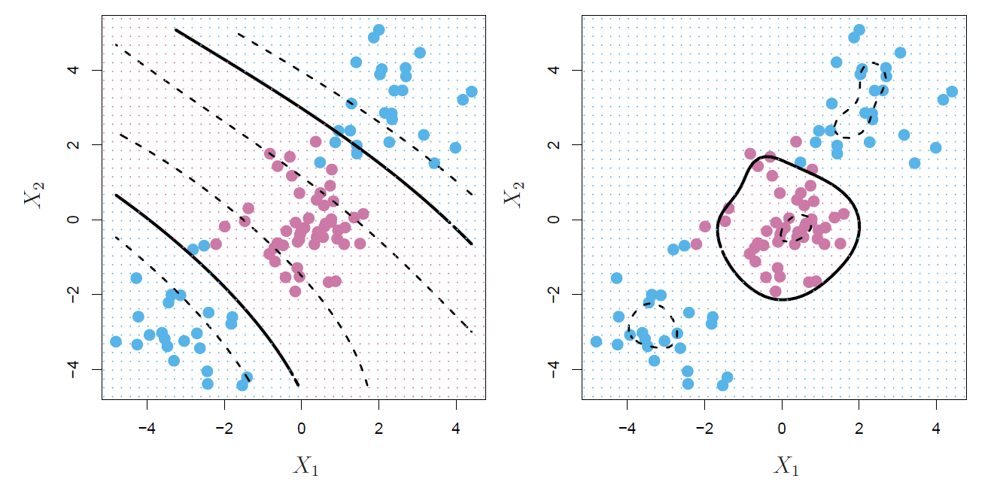

**图 9.9** *左图：对图 9.8 的非线性数据应用三次多项式核的 SVM，生成了更适合的决策规则。右图：对相同数据应用径向核的 SVM。在此示例中，两种核都能够捕获决策边界。*

径向核（公式 9.24）究竟是如何工作的呢？如果某个测试观测点 \( x^* = (x^*_1, \dots, x^*_p)^T \) 在欧几里得距离上远离某个训练观测点 \( x_i \)，则 \( \sum_{j=1}^p (x^*_j - x_{ij})^2 \) 会很大，因此 \( K(x^*, x_i) = \exp(-\gamma \sum_{j=1}^p (x^*_j - x_{ij})^2) \) 将会非常小。这意味着在公式 (9.23) 中，\( x_i \) 对于 \( f(x^*) \) 的贡献几乎可以忽略不计。回想一下，测试观测点 \( x^* \) 的预测类别标签是基于 \( f(x^*) \) 的符号确定的。换句话说，远离 \( x^* \) 的训练观测点对 \( x^* \) 的预测类别几乎没有影响。这表明，径向核具有非常局部的性质，因为只有与测试点邻近的训练观测点才会影响其类别预测。

使用核而不是直接通过原始特征的函数来扩展特征空间（如公式 9.16 所示）有什么优势？一个重要的优势是计算效率。这归因于这样一个事实：使用核时，只需要计算 \( K(x_i, x'_i) \) 对于所有 \( \binom{n}{2} \) 个不同的训练观测对 \( i, i' \)。这些计算可以在不显式进入扩展特征空间的情况下完成。这一点非常重要，因为在许多 SVM 应用中，扩展特征空间可能非常大，以至于计算变得不可行。而对于某些核（例如径向核，公式 9.24），特征空间是隐式的且是无限维的，因此即便想在特征空间中进行计算也无法完成！

### 9.3.3 An Application to the Heart Disease Data
在第 8 章中，我们对 `Heart` 数据集应用了决策树及相关方法，其目标是利用 13 个预测变量（例如 `Age`、`Sex` 和 `Chol`）预测个体是否患有心脏病。现在，我们探讨 SVM 与 LDA 在该数据集上的表现差异。在剔除 6 条缺失值后，数据集中包含 297 个样本，我们将其随机分为 207 个训练样本和 90 个测试样本。

我们首先对训练数据拟合了 LDA 和支持向量分类器。需要注意的是，支持向量分类器等价于使用多项式核（\(d = 1\)）的 SVM。图 9.10 的左侧面板显示了 LDA 和支持向量分类器对训练集预测结果的 ROC 曲线（详见第 4.4.2 节）。两种分类器都会为每个观测点计算形如 \(\hat{f}(X) = \hat{\beta}_0 + \hat{\beta}_1 X_1 + \hat{\beta}_2 X_2 + \cdots + \hat{\beta}_p X_p\) 的得分。对于任意给定的阈值 \(t\)，若 \(\hat{f}(X) < t\)，则观测点被分类为无心脏病；若 \(\hat{f}(X) \geq t\)，则分类为有心脏病。通过对一系列阈值 \(t\) 计算假阳性率和真阳性率，可以绘制 ROC 曲线。理想的分类器的 ROC 曲线会贴近图的左上角。在本例中，LDA 和支持向量分类器的表现都较好，但支持向量分类器似乎略胜一筹。

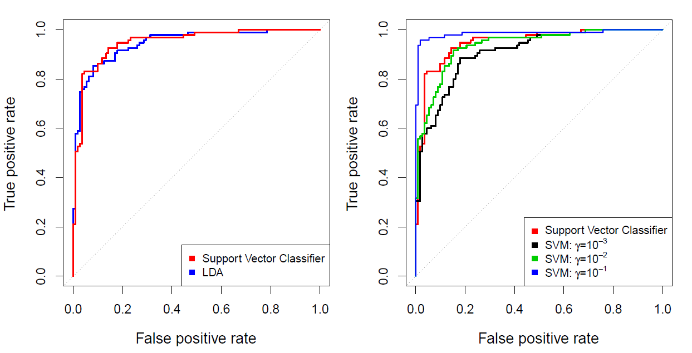
**图 9.10** *Heart 数据集训练集的 ROC 曲线。左图：支持向量分类器与 LDA 的比较。右图：支持向量分类器与使用径向基核（\(\gamma = 10^{-3}\)、\(10^{-2}\) 和 \(10^{-1}\)）的 SVM 的比较。*

图 9.10 的右侧面板显示了使用径向核（不同 \(\gamma\) 值）的 SVM 的 ROC 曲线。随着 \(\gamma\) 的增加，模型变得更加非线性，ROC 曲线表现也得到改善。使用 \(\gamma = 10^{-1}\) 似乎产生了接近完美的 ROC 曲线。然而，这些曲线基于训练误差率，可能对新测试数据的表现具有误导性。

图 9.11 显示了在 90 个测试样本上计算的 ROC 曲线。与训练 ROC 曲线相比，我们观察到了一些差异。在图 9.11 的左侧面板中，支持向量分类器似乎略优于 LDA（尽管这些差异在统计上并不显著）。在右侧面板中，尽管 \(\gamma = 10^{-1}\) 的 SVM 在训练数据上表现最佳，但在测试数据上却表现最差。这再次表明，尽管更灵活的方法通常会降低训练误差率，但这并不一定会改善测试数据的表现。使用 \(\gamma = 10^{-2}\) 和 \(\gamma = 10^{-3}\) 的 SVM 表现与支持向量分类器相当，且三者都优于 \(\gamma = 10^{-1}\) 的 SVM。

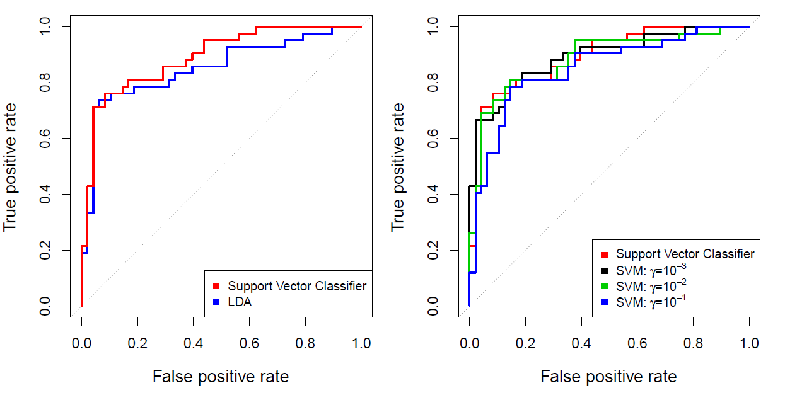
**图9.11** *心脏数据测试集的ROC曲线。左图：比较支持向量分类器和LDA。右图：比较支持向量分类器和使用径向基核的SVM，γ分别为 \(10^{-3}\)、\(10^{-2}\) 和 \(10^{-1}\)*。

## 9.4 SVMs with More than Two Classes 超过两类的SVM方法

到目前为止，我们的讨论仅限于二分类问题：即在两类情况下的分类。那么，如何将SVM扩展到具有任意数量类别的更一般的情况呢？事实证明，SVM所依赖的分隔超平面概念并不自然地适用于超过两个类别的情况。尽管已经提出了许多将SVM扩展到K类问题的方案，但最受欢迎的两种方法是 **“一对一”（one-versus-one）** 和 **“一对多”（one-versus-all）** 方法。我们将在这里简要讨论这两种方法。

### 9.4.1 One-Versus-One Classification 一对一分类

假设我们想使用SVM进行分类，并且有K > 2个类别。一个 **一对一(one-versus-one)** 或 **全部配对(all-pairs)** 的方法构建了\(\binom{K}{2}\)个SVM，每个SVM比较一对类别。例如，一个这样的SVM可能比较第k类（编码为+1）与第k'类（编码为-1）。我们使用每个\(\binom{K}{2}\)个分类器对测试样本进行分类，并统计测试样本被分配到每个K类的次数。最终的分类是通过将测试样本分配给在这\(\binom{K}{2}\)次配对分类中最常被分配的类别来完成的。

### 9.4.2 One-Versus-All Classification 一对多分类
**一对多(one-versus-all)** 方法（也称为 **一对其余(one-versus-rest)** 方法）是将SVM应用于K > 2类别的另一种程序。我们拟合K个SVM，每次比较K个类别中的一个类别与剩下的K-1个类别。设\(\beta_{0k}, \beta_{1k}, \dots, \beta_{pk}\)表示拟合比较第k类（编码为+1）与其他类别（编码为-1）时得到的参数。设\(x^*\)表示一个测试样本。我们将该样本分配给\(\beta_{0k} + \beta_{1k}x^*_1 + \beta_{2k}x^*_2 + \dots + \beta_{pk}x^*_p\)值最大的类别，因为这意味着测试样本属于第k类的信心高于属于其他任何类别的信心。

## 9.5 Relationship to Logistic Regression 与逻辑回归的关系 (选)

